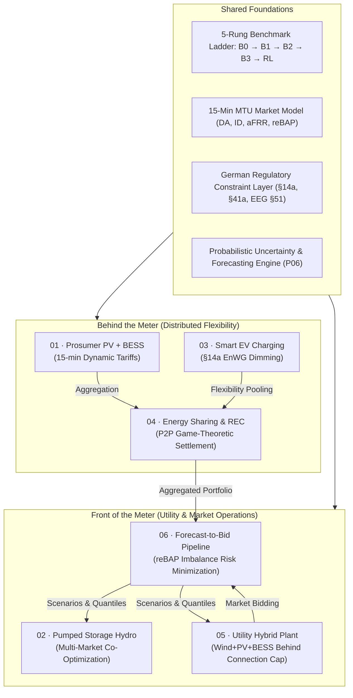

# ⚡ AI for Renewable Energy Systems: Applied Research Portfolio

> Six production-grade engineering research projects applying **reinforcement learning, model predictive control, mathematical optimization (MILP), and probabilistic forecasting** to European power systems: strictly grounded in actual German/Austrian market designs, grid codes, and regulatory frameworks.

[](https://www.python.org/downloads/)
[-brightgreen.svg)](tests/)
[](docs/05-tech-stack.md)
[](LICENSE)

**Author:** Murat Kus · Dipl.-Ing. Mechanical Engineering · M.Sc. Sustainable Energy Systems (in progress) · B.Sc. Artificial Intelligence (in progress)  
**Domain:** Power System Economics, Energy Market Optimization, Sequential Decision-Making under Uncertainty  
**Focus Markets:** Germany / Austria (DE-LU / AT bidding zones), EPEX SPOT Day-Ahead / Intraday (SDAC/SIDC), `regelleistung.net` Balancing (FCR/aFRR), and German **reBAP** Imbalance Settlement.

---

## 🎯 60-Second Executive Quickstart

Run the master interactive showcase dashboard to simulate live benchmarks across all 6 projects:

```bash
# Clone and install all 6 packages in editable mode
git clone https://github.com/muratkus01/Portfolio.git
cd Portfolio
pip install -e projects/01-prosumer-pv-bess-mpc-rl -e projects/02-pumped-storage-rl-multimarket -e projects/03-smart-ev-charging-14a -e projects/04-energy-sharing-rec -e projects/05-utility-hybrid-plant-dispatch -e projects/06-probabilistic-forecast-to-bid

# Run the Master Showcase Runner
python showcase.py

# Run all 199 unit tests across the portfolio
pytest -v
```

---

## 🚀 The 6 Portfolio Projects

Each project is a fully structured Python package with clean modular `src/`, reproducible unit test suite in `tests/`, and CLI execution tools:



---

### Project Breakdown & CLI Quickstarts

| # | Project Dossier | Core Method | Asset / Scale | Regulatory Framework | Quickstart Command |
|:---:|---|---|---|---|---|
| **01** | [**Prosumer PV+BESS Energy Management**](projects/01-prosumer-pv-bess-mpc-rl/) | Rolling-horizon MILP-MPC + SAC RL | 8.9 kWh BESS, 5.5 kW Inverter | `§14a / §41a EnWG`, EEG 2023 | `python -m prosumer.cli ladder` |
| **02** | [**Pumped-Storage Hydro Multi-Market**](projects/02-pumped-storage-rl-multimarket/) | Multi-Market MILP + Multi-Objective PPO | 300 MW / 2,400 MWh PSH | FCR/aFRR, `§118(6) EnWG` Exemptions | `python -m psw.cli ladder` |
| **03** | [**Smart EV Charging Hub Control**](projects/03-smart-ev-charging-14a/) | Constrained MILP + Priority Dimming | 40-Connector Depot / 250 kW Limit | `§14a EnWG` Modules 1–3, Dimming | `python -m evc.cli ladder` |
| **04** | [**Energy Sharing in RECs**](projects/04-energy-sharing-rec/) | Mechanism Design + Cooperative Game Theory | 20-Member Community / 100 kW PV | EU RED II Art. 22, `§42b EnWG` | `python -m rec.cli mechanisms` |
| **05** | [**Utility Hybrid Wind+PV+BESS Plant**](projects/05-utility-hybrid-plant-dispatch/) | Co-located MILP + Battery Arbitrage | 50 MW Wind, 30 MW PV, 40 MWh BESS | EEG §51 Negative Price Rules | `python -m hybrid.cli ladder` |
| **06** | [**Probabilistic Forecast-to-Bid**](projects/06-probabilistic-forecast-to-bid/) | Quantile Regression + Newsvendor Fractile | 300 MW Portfolio | SIDC Intraday, German **reBAP** | `python -m f2b.cli policies` |

---

## 🏛️ Autonomous AI Skill Architecture (Dual-Assistant Governance)

This workspace integrates a **2-tier autonomous skill ecosystem** shared between **Antigravity (Google DeepMind)** and **Claude Pro / Code (Anthropic)**:

1. **Executive Governance Layer:**
   - [`portfolio-manager`](file:///c:/Users/murat/Documents/.agents/skills/portfolio-manager/SKILL.md) — 5-Pillar 100-point project completeness & benchmark auditor.
   - [`portfolio-idea-generator`](file:///c:/Users/murat/Documents/.agents/skills/portfolio-idea-generator/SKILL.md) — R&D ideation engine for emerging energy paradigms (Electrolyzers, VPPs, Heat Pumps).
   - [`portfolio-data-fetcher`](file:///c:/Users/murat/Documents/.agents/skills/portfolio-data-fetcher/SKILL.md) — Automated ingestion for ENTSO-E, OPSD, SMARD.de, NREL, and ERA5.
   - [`portfolio-showcase-builder`](file:///c:/Users/murat/Documents/.agents/skills/portfolio-showcase-builder/SKILL.md) — Presentation engine, dashboard builder, and recruiter asset generator.
2. **Project Lead Specialists:**
   - [`project-prosumer-bess`](file:///c:/Users/murat/Documents/.agents/skills/project-prosumer-bess/SKILL.md), [`project-pumped-storage`](file:///c:/Users/murat/Documents/.agents/skills/project-pumped-storage/SKILL.md), [`project-smart-ev-charging`](file:///c:/Users/murat/Documents/.agents/skills/project-smart-ev-charging/SKILL.md), [`project-energy-sharing-rec`](file:///c:/Users/murat/Documents/.agents/skills/project-energy-sharing-rec/SKILL.md), [`project-hybrid-dispatch`](file:///c:/Users/murat/Documents/.agents/skills/project-hybrid-dispatch/SKILL.md), [`project-probabilistic-forecasting`](file:///c:/Users/murat/Documents/.agents/skills/project-probabilistic-forecasting/SKILL.md).

---

## 📐 Methodological Spine: The 5-Rung Benchmark Ladder

Every project enforces the same rigorous evaluation protocol:

| Rung | Controller | Purpose & Criterion |
|:---:|---|---|
| **B0** | Historical / Status-Quo | Baseline uncoordinated or unhedged reference. |
| **B1** | Rule-Based Expert Baseline | Industry-standard heuristic (e.g. greedy self-consumption, threshold shaving). |
| **B2** | Perfect-Foresight MILP | Theoretical performance ceiling over the entire simulation horizon. |
| **B3** | Rolling-Horizon MILP-MPC | **The deployable classical benchmark** operating under imperfect lookahead. |
| **RL** | Learned Policy (PPO / SAC / TFT) | **Must beat B3 on out-of-sample data** to justify algorithmic deployment. |

---

## 📂 Repository Structure

```
Portfolio/
├── pyproject.toml                     ← Global multi-project test runner configuration
├── showcase.py                        ← Master terminal showcase dashboard
├── README.md                          ← You are here
├── HANDOFF.md                         ← Durable session state & dual-assistant memory
├── CLAUDE.md                          ← Assistant instructions & quickstart guide
├── datakit/                           ← Shared market data loaders & spot price connectors
├── docs/                              ← Energy market primers, regulatory guides & math
└── projects/
    ├── 01-prosumer-pv-bess-mpc-rl/    ← Package: prosumer (75 tests, 67 passing, 8 skipped)
    ├── 02-pumped-storage-rl-multimarket/ ← Package: psw (27 tests passing)
    ├── 03-smart-ev-charging-14a/      ← Package: evc (20 tests passing)
    ├── 04-energy-sharing-rec/         ← Package: rec (37 tests passing)
    ├── 05-utility-hybrid-plant-dispatch/ ← Package: hybrid (26 tests passing)
    └── 06-probabilistic-forecast-to-bid/ ← Package: f2b (22 tests passing)
```

---

## 📜 Citation & License

This project is licensed under the [MIT License](LICENSE).  
If you use this portfolio or its formulations in academic research, please cite using [CITATION.cff](CITATION.cff).
