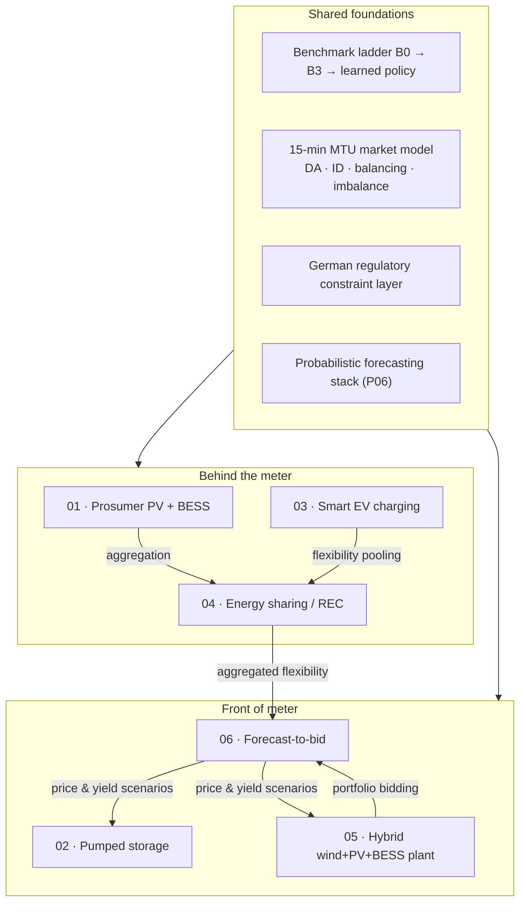

# AI for Renewable Energy Systems — Applied Research Portfolio

> Six engineering research projects applying reinforcement learning, model predictive
> control and probabilistic forecasting to the German electricity system — each grounded
> in the actual market design, grid codes and regulatory framework it would have to
> operate under.

**Author:** Murat Kus · Mechanical Engineer (Dipl.-Ing.) · M.Sc. Sustainable Energy Systems (in progress) · B.Sc. Artificial Intelligence (in progress)
**Domain:** Power system operation, energy market optimisation, sequential decision making under uncertainty
**Focus market:** Germany / Central European bidding zone (DE-LU), SDAC / SIDC, `regelleistung.net` balancing platforms

---

## Why this repository exists

Most public "AI for energy" work stops at a clean benchmark: an hourly time series, a
perfect price forecast, a battery with no degradation, and a reward function that quietly
assumes the plant is allowed to do whatever the agent decides. Real assets in Germany
operate inside a dense envelope of constraints — `§14a EnWG` curtailment of controllable
loads, Redispatch 2.0 obligations, balancing-group (*Bilanzkreis*) responsibility priced at
15-minute resolution, EEG remuneration rules that switch off during negative prices, and
prequalification requirements before a single MW of aFRR capacity can be offered.

This portfolio takes the opposite starting point: **the regulation is part of the
environment specification, not an afterthought.** Every project below states the legal and
market context first, derives the optimisation or MDP formulation from it, and only then
selects a method.

A second common gap is that learned controllers are compared against a strawman. Every
project here uses the same **benchmark ladder** (see
[`docs/03-methodology-benchmark-ladder.md`](docs/03-methodology-benchmark-ladder.md)): a
learned policy must beat a *deployable classical optimum* — a rolling-horizon MILP-MPC
controller running on the same imperfect forecasts — not merely a rule-based heuristic or a
do-nothing baseline.

---

## Project portfolio

| # | Project | Core method | Asset / actor | Key German framework |
|---|---------|-------------|---------------|----------------------|
| 01 | [Prosumer PV + BESS energy management at 15-min resolution](projects/01-prosumer-pv-bess-mpc-rl/) | Rolling-horizon MILP-MPC (1–3 d) + RL (SAC) | Residential / small commercial PV, battery, heat pump, wallbox | `§14a EnWG`, `§41a EnWG` dynamic tariffs, EEG 2023 feed-in, MsbG / iMSys |
| 02 | [Pumped-storage hydro plant multi-market RL dispatch](projects/02-pumped-storage-rl-multimarket/) | Multi-objective RL (PPO/SAC) + MILP benchmark | Pumped-storage power plant (PSW), 100–1000 MW class | Balancing markets (FCR/aFRR/mFRR), `§13 EnWG` system services, Redispatch 2.0 |
| 03 | [Smart EV charging, load sharing and grid-orientated control](projects/03-smart-ev-charging-14a/) | Constrained RL + safety layer (OPF projection) | Depot / workplace / apartment-block charging hubs | `§14a EnWG` Modules 1–3, LSV, AFIR, THG-Quote, OCPP 2.0.1 / EEBUS |
| 04 | [Energy sharing and allocation in Renewable Energy Communities](projects/04-energy-sharing-rec/) | Cooperative multi-agent RL + mechanism design | Energy community, `§42b EnWG` building supply, Mieterstrom | RED II Art. 22, `§42b EnWG`, `§21 EEG` Mieterstrom, `§3 Nr. 15 EEG` |
| 05 | [Utility-scale hybrid wind + PV + BESS plant dispatch](projects/05-utility-hybrid-plant-dispatch/) | Benchmark ladder B0→B3 + RL | Co-located hybrid plant behind one grid connection point | EEG direct marketing, negative-price rule, `§9 EEG` remote control, Redispatch 2.0 |
| 06 | [Probabilistic forecast-to-bid for intraday trading](projects/06-probabilistic-forecast-to-bid/) | Distributional forecasting + decision-focused learning | VPP / renewable portfolio balancing responsible party | SIDC continuous intraday, 15-min MTU, reBAP imbalance settlement |

Each project directory contains a self-contained dossier: background, regulatory context,
scope and objectives, research questions, system architecture, a full data requirements
table with sources and licences, the formal problem statement, evaluation protocol,
deliverables and a phased roadmap.

---

## How the projects relate



The portfolio is deliberately layered. Projects 01, 03 and 04 build upward from the
low-voltage grid connection point; projects 02, 05 and 06 work downward from the wholesale
and balancing markets. Project 06 is the shared uncertainty engine — the scenario and
quantile forecasts it produces are the inputs the other five controllers consume.

---

## Methodological spine

Every project is evaluated against the same ladder, so results are comparable across the
portfolio:

| Rung | Controller | What it establishes |
|------|-----------|---------------------|
| **B0** | Historical / status-quo operation | The real-world reference the asset achieved |
| **B1** | Rule-based replica of the incumbent controller | Validates that the digital model reproduces reality |
| **B2** | Perfect-foresight MILP over the full horizon | Theoretical ceiling — the value of the flexibility itself |
| **B3** | Rolling-horizon MILP-MPC on realistic forecasts | The **deployable classical optimum** — the bar to beat |
| **RL** | Learned policy (PPO / SAC / distributional variants) | Must beat **B3**, not B2, to justify itself |

Reported headline metric is the **B3-gap closure**: `(RL − B3) / (B2 − B3)`, i.e. what
fraction of the remaining theoretical headroom the learned policy recovers. A learned
controller that does not clear B3 on out-of-sample data is reported as a negative result,
not tuned until it wins.

Full definition: [`docs/03-methodology-benchmark-ladder.md`](docs/03-methodology-benchmark-ladder.md).
Evaluation and reproducibility rules: [`docs/04-evaluation-protocol.md`](docs/04-evaluation-protocol.md).

---

## Repository map

```
ai-renewables-portfolio/
├── README.md                        ← you are here
├── docs/
│   ├── 01-german-market-regulatory-primer.md   Legal & market framework used across projects
│   ├── 02-data-sources.md                      Vetted data catalogue with licences & access
│   ├── 03-methodology-benchmark-ladder.md      The B0–B3 + RL evaluation ladder
│   ├── 04-evaluation-protocol.md               Metrics, splits, statistics, reproducibility
│   ├── 05-tech-stack.md                        Tooling, solvers, MLOps conventions
│   ├── 06-idea-backlog.md                      Vetted but not-yet-started project concepts
│   ├── 07-glossary.md                          DE ↔ EN energy & market terminology
│   └── 08-milp-to-rl-roadmap.md                Converting an existing MILP into MPC + RL
├── projects/
│   ├── 01-prosumer-pv-bess-mpc-rl/
│   ├── 02-pumped-storage-rl-multimarket/
│   ├── 03-smart-ev-charging-14a/
│   ├── 04-energy-sharing-rec/
│   ├── 05-utility-hybrid-plant-dispatch/
│   └── 06-probabilistic-forecast-to-bid/
├── templates/project-template/      Standard layout every project implementation follows
├── CONTRIBUTING.md
├── CITATION.cff
└── LICENSE
```

---

## Status

This repository is a **research and design portfolio**. Each project is documented to the
level of a fundable work package: problem, prior art, formal specification, data plan,
architecture, evaluation protocol and milestones. Implementations are being developed
project by project; the status table below is the single source of truth.

| Project | Design dossier | Data | Digital model | Baselines | Learned policy | Tests |
|---------|:--------------:|:----:|:-------------:|:---------:|:--------------:|:-----:|
| 01 Prosumer PV + BESS | ✅ | ✅ measured weeks + DE-LU prices | ✅ validated vs. thesis MILP | ✅ B1/B2/B3 | ◐ env + SAC run | 23 |
| 02 Pumped storage | ✅ | ✅ real 2024 prices | ✅ | ✅ B1/B2/B3 | ◐ env built | 13 |
| 03 Smart EV charging | ✅ | ◐ real prices, synthetic sessions | ✅ | ◐ B0/B1/B3 | ○ | 14 |
| 04 Energy sharing / REC | ✅ | ◐ synthetic profiles | ✅ | ✅ 4 mechanisms | ○ | 19 |
| 05 Utility hybrid plant | ✅ | ✅ real 2024 wind/PV/prices | ✅ | ✅ B0/B1/B2/B3 | ○ | 11 |
| 06 Forecast-to-bid | ✅ | ✅ fully open data | ✅ | ✅ 5 policies | ○ | 14 |

`✅ complete · ◐ in progress · ○ not started` — **94 tests passing across the portfolio.**

Shared open-data access lives in [`datakit/`](datakit/) (4/4 endpoints verified live).
The MILP→MPC→RL conversion method is documented in
[`docs/08-milp-to-rl-roadmap.md`](docs/08-milp-to-rl-roadmap.md).

### Bugs the invariants caught

Every project asserts a structural invariant at runtime, and each one caught a real defect
that would otherwise have produced a plausible-looking but wrong result. They are documented
in the project READMEs rather than quietly fixed, because *which* invariant caught *what* is
the most transferable thing here:

| Project | Invariant | What it caught |
|---|---|---|
| 01 | B2 ≤ B3 ≤ B1; zero violations under random actions | Terminal value priced stored energy at full retail import, so MPC bought from the grid at every horizon end |
| 01 | — | Concatenating four scattered measured weeks before resampling fabricated 11 months of data |
| 02 | Zero violations under random actions | Reservoir bounds overrode the ramp limit (fixed by adding spill); ramp was defined on signed net power rather than per mode |
| 03 | Departure guarantee | Per-connector feasibility is insufficient — the price-aware policy missed *more* departures (108) than doing nothing (53) until the EDF aggregate floor was added |
| 05 | Every rung ≤ perfect foresight | EEG monthly market value was derived from the plant's own export, so correct curtailment cut its own premium and B2 scored below do-nothing |
| 06 | Ceiling dominates all policies | "Perfect foresight" was not an upper bound at all — signed imbalance means deviating can pay |
| 06 | — | Calibration metric was structurally biased; a test fixture used a stateful RNG so the forecast store was scored against a different realisation than it was built from |

No result numbers appear anywhere in this repository that were not produced by a run that
is reproducible from the committed code and a documented data snapshot. Placeholders are
written as `[X]` and are intentionally unfilled.

---

## Background

I come to this from the plant side rather than from the model side. A degree in mechanical
engineering and work on hydro and thermal generation gave me the physical asset intuition;
the M.Sc. in Sustainable Energy Systems added the power-system and market-design layer; the
B.Sc. in Artificial Intelligence supplies the learning and sequential-decision-making
methods. The through-line of this portfolio is the belief that the binding constraint on
deploying learned controllers in energy is not model capacity — it is faithful environment
specification, honest baselines, and constraint satisfaction you can defend to a grid
operator.

---

## Contact

Issues and discussion are welcome via the repository's issue tracker. For collaboration or
data-partnership enquiries relating to any individual project, see the *Collaboration*
section at the bottom of that project's README.

## Licence

Documentation in this repository is licensed under
[CC BY 4.0](https://creativecommons.org/licenses/by/4.0/); code, where present, under the
MIT Licence. See [`LICENSE`](LICENSE).
