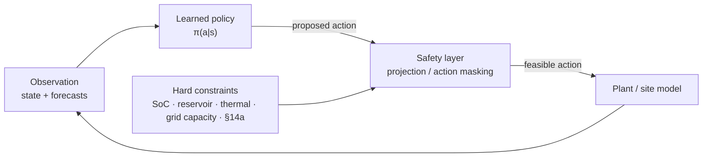

# Methodology: The Benchmark Ladder

The single most common failure mode in applied RL-for-energy work is a **weak baseline**.
A learned policy that beats a naive rule set has demonstrated nothing: classical
optimisation has solved dispatch problems in this domain for decades, and any credible claim
must be made against that state of practice. This document defines the evaluation ladder
used identically across all six projects.

---

## The ladder

| Rung | Name | Information available | Role |
|------|------|----------------------|------|
| **B0** | Historical reality | — (observed) | What the asset/site actually did. The commercial reference. |
| **B1** | Rule-based replica | Same signals as the incumbent controller | **Model validation.** Reproduces the incumbent logic inside the digital model. |
| **B2** | Perfect-foresight MILP | Full horizon known exactly | **Theoretical ceiling.** Values the flexibility itself, not the controller. |
| **B3** | Rolling-horizon MILP-MPC | Realistic forecasts, re-solved each step | **Deployable classical optimum.** The bar a learned policy must clear. |
| **RL** | Learned policy | Same observations as B3 | Must beat **B3** out of sample. |


---

## B0 — Historical reality

The realised operation and realised economics of the asset over the study period,
recomputed with a consistent accounting model so it is comparable with the simulated rungs.
Where no historical operation exists (a greenfield design study), B0 is omitted and B1
becomes the reference — stated explicitly rather than silently.

## B1 — Rule-based replica: the validation gate

B1 exists to answer one question: **does the digital model reproduce the real asset?** It
implements the incumbent control logic (a hydro plant's dispatch rules, a home energy
management system's self-consumption priority, a depot's first-come-first-served charging)
inside the simulation and compares the result against B0.

**Acceptance criteria** (project-specific thresholds, stated in each project README):

| Check | Typical target |
|-------|----------------|
| Energy balance error over study period | < 1 % |
| State trajectory (SoC / reservoir level) RMSE | < 3 % of usable range |
| Economic KPI deviation vs. B0 | < 5 % |
| No systematic bias in residuals | Residual mean ≈ 0, no trend |

**If B1 does not pass, no result from B2, B3 or RL may be reported.** A controller optimising
inside a model that does not reproduce reality produces numbers, not findings. This gate is
the reason the ladder starts where it does.

## B2 — Perfect-foresight MILP: the ceiling

A single mixed-integer linear program over the whole evaluation horizon with exact knowledge
of prices, generation and demand. B2 is **not achievable** and is not a controller — it
measures the value of the *flexibility asset* under ideal information.

Its purpose is to normalise: an RL policy that earns 3 % more than B3 means something very
different when the total headroom `B2 − B3` is 4 % versus 40 %.

MILP formulation conventions used throughout: linearised efficiency curves via SOS2 or
piecewise-linear segments, binary commitment and mode variables (charge/discharge, pump/turbine)
with mutual exclusion, minimum up/down times, ramp constraints, and cyclic or terminal-value
boundary conditions on storage state.

## B3 — Rolling-horizon MILP-MPC: the real competitor

The same MILP, but solved repeatedly in receding-horizon fashion on the **same imperfect
forecasts the learned policy sees**:

```
for each decision step t (every 15 min, or every market gate):
    1. observe the true system state x(t)
    2. obtain forecasts over horizon H  (prices, generation, demand, availability)
    3. solve MILP over [t, t+H] with terminal value function on storage state
    4. apply only the first control action u(t)
    5. advance the true system one step; discard the rest of the plan
```

Design choices that must be reported, because they determine how strong B3 is:

- **Horizon H.** Projects here use 1–3 days (96–288 steps at 15 min). Longer horizons value
  storage better but cost solve time and depend on forecasts that are worse.
- **Terminal value.** Without one, the controller empties the storage at the horizon end.
  Options: cyclic constraint, a fitted terminal value function, or a shadow price on end-state.
- **Re-solve frequency.** Every step is the honest configuration; less frequent re-solving
  weakens the baseline.
- **Forecast parity.** B3 and the RL policy **must** consume forecasts from the same model
  with the same issue times. Giving B3 worse forecasts is the most common way an RL result is
  accidentally faked.

**B3 is deliberately made as strong as is practical.** Tuning it is part of the work, and
its configuration is reported in full.

## RL — the learned policy

Motivated only where B3 has structural weaknesses that learning can exploit:

1. **Distributional value.** MILP-MPC optimises against a point forecast (or a small scenario
   tree). A learned policy can internalise the full predictive distribution and the
   asymmetric cost of errors — this is the dominant effect where imbalance prices are
   heavy-tailed (Projects 02, 05, 06).
2. **Non-convexity and non-linearity.** Degradation, efficiency surfaces, comfort models and
   behavioural response are approximated away in a MILP. A learned policy is not restricted
   to the linearisation.
3. **Computation at decision time.** A trained policy evaluates in milliseconds; a 288-step
   MILP with binaries may not close in the gate time of a continuous intraday market.
4. **Latent structure.** Recurring, unmodelled patterns (site behaviour, local congestion,
   counterparty behaviour) that a hand-built model does not encode.

If none of these apply to a given problem, the honest conclusion is that MPC is the right
answer and the project reports that. **Two of the six projects explicitly include "MPC wins"
as an acceptable outcome.**

---

## Headline metric: B3-gap closure

```
                      J_RL − J_B3
    gap closure  =  ─────────────────
                      J_B2 − J_B3
```

- `= 0` — the learned policy matches the deployable classical optimum.
- `∈ (0, 1)` — it recovers that fraction of the remaining theoretical headroom.
- `< 0` — it is worse than MPC. **Reported as such.**

Absolute KPIs (€/a, €/MWh, self-sufficiency %, constraint violations) are always reported
alongside, because gap closure alone hides whether the headroom was economically meaningful.

---

## Constraint handling: the safety layer

Hard physical and legal constraints are **never** encoded as reward penalties. Penalty-based
constraint handling allows a policy to trade a violation against profit, which is exactly the
property that makes a controller unfit for a real asset. Instead:



Implementation options, chosen per project: action masking for discrete decisions, clipping
to feasible bounds for box constraints, and projection onto the feasible set (a small QP or
LP) where constraints couple actions. Soft objectives — comfort, degradation, smoothness —
remain in the reward, where trade-offs *are* legitimate.

Violations are then reported as **exactly zero by construction**, and the interesting metric
becomes how much economic performance the safety layer costs.

---

## Guarding against the standard failure modes

| Failure mode | Guard applied |
|--------------|---------------|
| Look-ahead bias | Forecasts reconstructed at their true issue times; no future information in any feature |
| Weak baseline | B3 tuned and reported in full; forecast parity enforced |
| Test-set overfitting | Chronological split; hyperparameters selected on validation only; test run once |
| Single-seed luck | ≥ 5 seeds; median and IQR reported, never the best run |
| Cherry-picked period | Evaluation across multiple regimes (high/low volatility, high/low renewable years) |
| Unreported infeasibility | Constraint violations counted and published, even when zero |
| Reward hacking | Safety layer + audit of the top-earning episodes for exploit behaviour |

Details and statistical procedure: [`04-evaluation-protocol.md`](04-evaluation-protocol.md).
