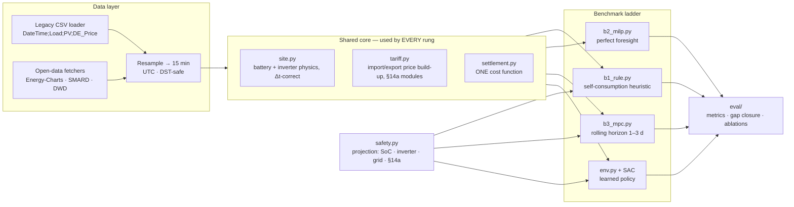

# From MILP to RL: A Detailed Conversion Roadmap

**A step-by-step plan for turning the existing hourly PuLP battery-scheduling MILP
(`smart_weekly.py`) into a 15-minute, rolling-horizon MPC plus a reinforcement learning
controller — via the benchmark ladder, without ever losing the ability to check the new
against the old.**

This document is keyed to the actual source. It is not generic advice: every phase names what
in the existing code changes, what must not change, and what test proves the change was
correct.

---

## 0. Where the code is today

`smart_weekly.py` — 161 lines, PuLP, hourly, one week, solved day by day.

```python
T     = 24      # hours per optimisation
DAYS  = 7       # solved sequentially, SOC handed over between days
E_bess = 8.9    SOC ∈ [0.884, 7.956] kWh     P_inv = 5.51 kW
eta_c = eta_d = 0.95
E_max = 28.288  # kWh throughput cap per day
P_from_grid_max = 6.4668 kW      P_to_grid_max = 20.345 kW
```

**Objective** (line 56):
```python
max Σ_t  EP[t]·(P_dc[t] − P_ch[t])  −  (P_dc[t] + P_ch[t])·C_load        # C_load = 0
```

**Constraints** (lines 59–72): SOC recursion, charge/discharge mutual exclusion via binaries,
grid import/export bounds, the site power balance
```python
(P_from_grid[t] − P_to_grid[t]) − (−P_prosumer[t] + P_ch[t] − P_dc[t]) == 0
```
with `P_prosumer = PV − Load`, and a daily throughput cap `Σ(P_ch + P_dc) ≤ E_max`.

**Data**: `<tag>.csv`, `;`-separated, ISO-8859-1, columns
`DateTime;Day;Hour;Load;PV;DE_Price`. Prices are €/kWh, powers kW, hourly.

**Outputs**: hourly CSV, daily summary CSV, an `.xlsx` with both sheets, and a plain-text
total-revenue/total-bill report.

### The existing structure is good, and worth saying so

Three things in this code are already right and are preserved throughout the conversion:

- **Sequential solve with SOC handover** (`SOC_0 = SOC[T-1].varValue`, line 143) — this is a
  primitive rolling horizon. It is the seed of B3.
- **Binary mutual exclusion** of charge/discharge (lines 65–67) — needed, and correctly done
  with big-M linking to the power bounds.
- **An explicit power-balance equality** rather than implicit netting — makes the site model
  auditable.

---

## 1. Six defects to fix before anything else

These are found by reading the code against the physics and the German tariff structure. Each
must be fixed **before** the RL work, because every rung of the ladder inherits them — an RL
agent trained against a wrong environment learns a wrong policy, and the comparison against
MPC becomes meaningless.

### D1 — No Δt in the energy balance (blocks the 15-minute move)

```python
SOC[t] == SOC[t-1] + eta_c*P_ch[t] - P_dc[t]/eta_d          # line 61/63
```
`P_ch` is a **power** (kW), `SOC` an **energy** (kWh). The recursion is only dimensionally
correct because Δt = 1 h makes the conversion factor 1. **At Δt = 0.25 h every stored energy
is overstated by 4×.** This is the single highest-priority fix, and it is the reason the
15-minute migration cannot be a one-line change to the resampling.

```python
SOC[t] == SOC[t-1] + (eta_c*P_ch[t] - P_dc[t]/eta_d) * DT   # DT = 0.25
```

Same for the throughput cap (line 72), which must become `Σ(P_ch + P_dc)·DT ≤ E_max`.

### D2 — Import and export are priced identically

The objective prices battery energy at `EP[t]` in both directions. For a German prosumer this
is wrong in the way that matters most:

```
import price  =  spot + supplier margin + network charge + levies + electricity tax + VAT
export price  =  feed-in tariff (EEG) or market value − direct-marketing fee
```

The retail import price is typically several times the export price. **That spread is the
entire economic reason a home battery exists.** With a single price, the optimiser sees a pure
arbitrage problem and will systematically under-value self-consumption. This is the second
mandatory fix and the one that most changes the answer.

### D3 — The reported revenue does not match the optimised objective

The post-processing (lines 89–95) computes
```python
grid_revenue    = EP·(P_to_grid − P_from_grid)
battery_revenue = EP·P_dc ; if P_from_grid > 0: battery_revenue -= EP·P_ch
revenue         = grid_revenue + battery_revenue
bill            = grid_revenue − P_from_grid·EP
```
`battery_revenue` double-counts energy already in `grid_revenue`, its conditional branch makes
it path-dependent, and `bill` subtracts an import term that `grid_revenue` already contains.
The optimiser maximises one quantity and the report prints a different one.

**Fix:** define **one** settlement function, used by the objective, by the reporting, and by
the RL reward. If they can diverge, they eventually will.

### D4 — Myopic day boundaries with no terminal value

Each day is solved independently with the previous day's final SOC as the opening state. There
is no terminal value on `SOC[T-1]`, so the optimiser has no reason to end a day with stored
energy — it will drain the battery every midnight regardless of tomorrow's prices. This is the
classic finite-horizon artefact, and it is exactly what a 1–3 day horizon plus a terminal
value function is meant to remove.

### D5 — Perfect foresight is presented as a controller

The day is optimised knowing all 24 prices, loads and PV values exactly. That is a legitimate
and useful thing to compute — it is **B2**, the theoretical ceiling — but it is not achievable
in operation and must not be reported as a controller's performance. The conversion makes this
distinction explicit rather than implicit.

### D6 — Missing constraints that bind in reality

The inverter is shared between battery and PV but only the battery is limited by `P_inv`;
there is no simultaneous-power constraint. There is no `§14a EnWG` dimming, no
negative-price rule, and no degradation cost — so the optimiser cycles the battery for
arbitrarily small gains, limited only by the throughput cap.

---

## 2. The target architecture



**The one architectural rule:** `site.py`, `tariff.py`, `settlement.py` and `safety.py` are
imported by *every* rung. B3 and the RL agent are structurally incapable of seeing different
physics or different prices. This is what makes the comparison honest, and it is enforced by
module structure rather than by discipline.

---

## 3. Phase plan

Seven phases. Each has a **gate** — a concrete, checkable condition. Do not start phase *n+1*
until phase *n*'s gate passes.

---

### Phase 1 · Refactor to a package, keep hourly, reproduce the old numbers

**Goal:** identical results to `smart_weekly.py`, but as a testable package.

| Step | Action |
|------|--------|
| 1.1 | Create the package layout; move the script's constants into a `SiteConfig` dataclass |
| 1.2 | Write `data/legacy.py` reading the existing `;`/ISO-8859-1 CSV into a UTC-indexed DataFrame |
| 1.3 | Extract the MILP into `baselines/b2_milp.py` with `dt` as a parameter, still called with `dt=1.0` |
| 1.4 | Write `settlement.py` — one function, initially reproducing the old single-price objective |
| 1.5 | Keep the day-by-day loop as a thin driver |

**Gate 1:** running the new package on `12-18_08_2024.csv` reproduces the old
`_hourly_optimization_results.csv` to within solver tolerance (`1e-6` on SOC and powers). This
is the regression harness for everything that follows — build it first, and every later phase
can be checked against a known-good reference.

> **Why this phase exists.** It is tempting to jump straight to 15 minutes and the new tariff.
> Doing both at once means that when the numbers change — and they will change a lot — there
> is no way to tell a correct improvement from a bug. Phase 1 buys a fixed point.

---

### Phase 2 · Fix the physics, move to 15 minutes

| Step | Action |
|------|--------|
| 2.1 | Introduce `DT` everywhere (**D1**); add a property test asserting energy balance closes for random feasible dispatch |
| 2.2 | Add the shared-inverter constraint and a simultaneous-power limit at the grid connection (**D6**) |
| 2.3 | Add degradation cost `c_deg·(P_ch + P_dc)·DT` to the objective, replacing the crude throughput cap — or keep both and compare |
| 2.4 | Resample Load/PV/price to 15 min. **Price is a step function** (hold, not interpolate); **Load and PV are averages** over the interval (interpolate then re-average, and document it) |
| 2.5 | DST handling: `Europe/Berlin` has a 23-hour and a 25-hour day. Store UTC, test both transition days explicitly |

**Gate 2:** (a) the energy-balance property test passes for 10 000 random feasible dispatches;
(b) running at `dt=1.0` still reproduces Gate 1; (c) running at `dt=0.25` on the same week
produces a result that differs — and the difference is *explained*, not just observed.

> **The first real finding lives here.** Re-running the same week at 15 minutes with correct
> Δt quantifies the resolution bias that Project 01's RQ1 asks about. Record it.

---

### Phase 3 · Real German tariff and settlement

| Step | Action |
|------|--------|
| 3.1 | `tariff.py`: build the import price as `spot(t) + margin + network_charge(t) + levies + tax`, then `× (1 + VAT)`; build the export price as EEG feed-in tariff (fixed) **or** market premium (spot-linked), selectable |
| 3.2 | Implement the `§14a EnWG` module switch: Module 1 flat annual reduction, Module 2 percentage reduction on the energy component, Module 3 time-variable network charge windows |
| 3.3 | Implement the negative-price rule as a vintage-dependent switch on export remuneration |
| 3.4 | Rewrite `settlement.py` to the real structure. **Delete the old revenue arithmetic entirely** (**D3**) — do not keep two |
| 3.5 | Add a worked-example unit test: one day, hand-computed bill, asserted to the cent |

**Gate 3:** the hand-computed worked example matches; and the optimiser's objective value
equals `settlement(dispatch)` recomputed independently from the solution — the two must agree
to solver tolerance. If they don't, the objective and the reporting have drifted apart again.

> **Expect the answer to change sign here.** Under a realistic import/export spread the
> optimal policy shifts from arbitrage toward self-consumption. That is not a bug; it is the
> point of **D2**.

---

### Phase 4 · The ladder: B1, B2, B3

| Rung | What to build | Gate |
|------|---------------|------|
| **B1** | Self-consumption heuristic: charge from surplus, discharge to cover deficit, never trade with the grid for price reasons. ~30 lines, no solver | Reproduces a real metered site (or, absent that, behaves sensibly and is documented as the status quo). **This is the validation gate for the whole model** |
| **B2** | The Phase-3 MILP over the **entire** evaluation period at once, perfect foresight | `revenue(B2) ≥ revenue(B3) ≥ revenue(B1)` on every test window, by construction. If this ordering is ever violated, there is a bug — this is the cheapest and most effective invariant in the project |
| **B3** | Rolling horizon: at each step, solve over `H ∈ {96, 192, 288}` steps on **forecasts**, apply only the first action, advance, re-solve | Must beat B1 on out-of-sample data |

**B3 is the deliverable that matters most.** It is the bar the RL agent has to clear, and its
three design choices must be reported explicitly:

1. **Horizon `H`** — 1, 2 or 3 days. Sweep it; the marginal value of extending it is RQ2.
2. **Terminal value `V_T(SoC)`** — without one, B3 drains the battery at every horizon end
   (**D4**). Start with a linear shadow price on terminal SoC, fitted by regressing B2's
   marginal value of stored energy against state and time features. This alone typically
   recovers most of the gap between a 1-day and a 3-day horizon.
3. **Forecasts** — see Phase 5. B3 must **not** see the truth.

Performance note: 288 steps × binaries × re-solve every 15 min × a year = ~35 000 MILP solves.
Use warm starts, keep the model built once and only update parameters (Pyomo `ConcreteModel`
with mutable `Param`s), and profile early. If it is too slow, that is itself a reportable
finding in favour of a learned policy — record the wall-clock time as a KPI rather than
quietly shrinking the horizon.

---

### Phase 5 · Forecasts, and the issue-time store

This phase is what makes the eventual RL-vs-MPC comparison defensible, and it is the one most
often skipped.

| Step | Action |
|------|--------|
| 5.1 | Build a forecast **store**: a table keyed by `(issue_time, target_time)`. Written once, read by every controller |
| 5.2 | Start with the cheap honest version: truth + autocorrelated AR(1) noise with a horizon-growing σ. The existing `_ar_noise` in `baseline_rl_fair.py` is already the right idea and can be lifted directly |
| 5.3 | Upgrade PV to a real forecast: DWD MOSMIX/ICON-D2 irradiance → `pvlib` → power, at true issue times |
| 5.4 | Load forecast: a seasonal-naive baseline, then a quantile gradient-boosting or small NN model |
| 5.5 | Prices: day-ahead prices are **known** from ~13:00 D-1 — model the information set correctly rather than treating them as forecast |

**Gate 5:** an automated look-ahead audit — assert that every feature consumed at decision time
`t` has `issue_time ≤ t`. Run it in CI. This converts "we were careful" into "it cannot happen".

> **The single most common way an RL-beats-MPC result turns out to be false** is that the
> agent saw something the MPC did not. Phase 5 makes that structurally impossible, and it is
> worth the effort it costs.

---

### Phase 6 · The RL environment

The MILP already contains everything the environment needs. **Reuse it — do not re-derive it.**
That is the core insight of this conversion: the constraint set becomes the step function, and
the objective becomes the reward.

| MILP element | Becomes |
|--------------|---------|
| SOC recursion (line 61/63) | The state transition in `step()` |
| `S_ch + S_dc ≤ 1` and power bounds | The **safety layer**'s feasible action set |
| Grid import/export limits | Safety-layer clipping at the connection point |
| Objective terms | The **reward** (via the same `settlement.py`) |
| `E_max` throughput cap | Degradation cost in the reward (soft), or a state-tracked hard limit |
| Perfect-foresight price/PV/load | **Removed** — replaced by forecasts in the observation |

#### The MDP, concretely

**Action.** One continuous scalar `a ∈ [−1, 1]` → battery power setpoint
`P_bat = a · P_inv` (negative = charge). One dimension, so start with SAC and expect it to
work. Mutual exclusion of charge/discharge is automatic with a signed action — a small,
worthwhile simplification over the MILP's two variables plus two binaries.

**Observation.** Build it in this order, adding a group at a time and ablating each:

| Group | Contents |
|-------|----------|
| Physical | `SoC` (normalised), current PV, current load, current net position |
| Calendar | quarter-hour of day and day of week as `sin`/`cos` pairs |
| Price | current import and export price; the next 96 steps of price, either raw or compressed (mean/min/max/rank of the next 4 h, 12 h, 24 h) |
| Forecast | PV and load forecasts over the next 96 steps, similarly compressed |
| Regulatory | `§14a` dimming state, steps since last dimming |

Normalise using **training-set statistics only** and freeze them. A normaliser fitted on the
test set is a subtle, common leak.

**Reward.** `r_t = −cost_t(dispatch)` from `settlement.py`, minus degradation. Nothing else.
In particular: **no penalty terms for SoC limits, inverter limits or grid limits** — those are
the safety layer's job. A penalty lets the agent trade a violation against profit, which is
precisely the property that makes a controller undeployable.

**Safety layer.** A projection, ~20 lines, applied to every proposed action:

```python
def project(p_bat_proposed, soc, pv, load, dt, cfg, dim_limit=None):
    # 1. inverter and C-rate bounds
    p = clip(p_bat_proposed, -cfg.p_ch_max, cfg.p_dis_max)
    # 2. SoC bounds after this step
    p = clip(p, (soc - cfg.soc_max)/(cfg.eta_c*dt), (soc - cfg.soc_min)*cfg.eta_d/dt)
    # 3. grid connection limits given PV and load
    p = clip_for_grid(p, pv, load, cfg.p_imp_max, cfg.p_exp_max)
    # 4. §14a dimming cap on controllable power
    if dim_limit is not None: p = clip(p, -dim_limit, p)
    return p
```

Order matters: apply physical bounds, then state bounds, then grid, then regulatory. Test it
by driving the environment with 10 000 uniformly random actions and asserting **zero**
violations. That test is the difference between a demo and a controller.

**Episode.** 7 days at 15 min = 672 steps, random start within the training window. Terminal
SoC valued with the same `V_T` fitted for B3 — otherwise the agent learns to drain the battery
at the end of every episode, which is an artefact of the episode boundary, not a policy.

**Algorithm.** SAC first: continuous action, off-policy, sample-efficient, robust to reward
scaling. PPO as a cross-check. Scale the reward (the existing code's `REWARD_SCALE = 1e-3` is
the right instinct) or normalise it — €-magnitude rewards destabilise value learning.

**Gate 6:** (a) zero constraint violations under random-action stress; (b) the agent beats B1
out-of-sample; (c) five seeds, reported as median and IQR.

---

### Phase 7 · Evaluation and the honest comparison

| Step | Action |
|------|--------|
| 7.1 | Chronological split — train / validation / test. **No shuffling.** Hyperparameters chosen on validation only; the test window is run **once** |
| 7.2 | Score every rung on the identical test window with identical forecasts |
| 7.3 | Report the headline: **gap closure** `(J_RL − J_B3) / (J_B2 − J_B3)` |
| 7.4 | Ablations: resolution (60 vs 15 min), horizon (24/48/72 h), terminal value on/off, forecast quality (perfect/realistic/degraded), safety layer on/off, `§14a` module 1/2/3 |
| 7.5 | Block-bootstrap confidence interval on the paired daily differences RL − B3 |

**Gate 7:** a `make reproduce-table1` target regenerates the headline table from a committed
config and a hashed data snapshot.

> **If RL does not beat B3, report that.** For a single battery with one continuous action,
> a well-tuned MPC on good forecasts is very strong, and there is a real chance it wins. That
> is a legitimate, publishable result, and the resolution and horizon studies from Phases 2
> and 4 stand on their own regardless. The failure mode to avoid is tuning the agent against
> the test set until it wins — which produces a number that will not survive contact with a
> real site.

---

## 4. Where the RL agent could actually win

Worth being specific, because it determines where to spend effort. A learned policy has four
plausible openings against MPC on this problem:

| Opening | Why MPC is weak there | How to test it |
|---------|----------------------|----------------|
| **Stochastic `§14a` dimming** | MPC optimises against one assumed future; dimming is an exogenous random interrupt. A policy can learn to pre-charge before likely dimming windows | Sweep dimming frequency; the RL−B3 gap should widen with it |
| **Non-linear efficiency** | The MILP linearises the efficiency curve; the true round-trip efficiency varies with power and SoC | Simulate with the unlinearised curve; measure the linearisation gap |
| **Forecast-error structure** | MPC uses point forecasts and implicitly assumes symmetric costs; the true cost is asymmetric | Compare against a scenario-MPC, not only a point-forecast MPC — otherwise the win may be attributable to the risk treatment rather than to learning |
| **Decision latency** | A 288-step MILP with binaries takes seconds; a policy takes microseconds | Report wall-clock per decision. Matters little for a home battery, a lot for a fleet |

Note the third row carefully: if RL beats a *point-forecast* MPC, the honest next step is to
strengthen the baseline to a scenario MPC and check whether the advantage survives. Beating
the weaker baseline and stopping there is the most common overclaim in this literature.

---

## 5. Migration checklist

```
Phase 1  ☐ package layout + SiteConfig
         ☐ legacy CSV loader
         ☐ MILP extracted with dt parameter
         ☐ GATE: reproduces smart_weekly.py to 1e-6

Phase 2  ☐ DT in SOC recursion and throughput cap        (D1)
         ☐ shared-inverter + simultaneity constraints    (D6)
         ☐ degradation cost
         ☐ 15-min resampling, price step / power average
         ☐ DST transition tests
         ☐ GATE: energy-balance property test + dt=1.0 regression

Phase 3  ☐ tariff.py: import build-up, export options
         ☐ §14a modules 1/2/3
         ☐ negative-price rule by vintage
         ☐ settlement.py, old revenue arithmetic deleted  (D2, D3)
         ☐ GATE: hand-computed worked example to the cent

Phase 4  ☐ B1 rule-based
         ☐ B2 perfect foresight over the full period      (D5)
         ☐ B3 rolling horizon + terminal value            (D4)
         ☐ GATE: B2 ≥ B3 ≥ B1 on every window

Phase 5  ☐ issue-time forecast store
         ☐ AR(1) forecasts → DWD/pvlib PV forecasts
         ☐ GATE: automated look-ahead audit in CI

Phase 6  ☐ Gymnasium env reusing site + settlement
         ☐ safety layer + random-action stress test
         ☐ SAC training, 5 seeds
         ☐ GATE: zero violations, beats B1 out-of-sample

Phase 7  ☐ chronological split, test run once
         ☐ gap-closure table
         ☐ ablations
         ☐ GATE: make reproduce-table1
```

---

## 6. Effort estimate

| Phase | Content | Estimate |
|-------|---------|----------|
| 1 | Refactor + regression harness | 1–2 days |
| 2 | Physics fixes + 15 min | 2–3 days |
| 3 | German tariff + settlement | 3–4 days (the regulatory research dominates) |
| 4 | B1/B2/B3 + terminal value | 4–5 days (B3 tuning and solve-time work dominates) |
| 5 | Forecasts + issue-time store | 3–5 days (more if real NWP ingestion is included) |
| 6 | Env + safety + SAC | 4–6 days (training runs are wall-clock, not effort) |
| 7 | Evaluation + ablations | 3–4 days |

**Total ≈ 4–6 weeks** of focused work. Phases 1–4 alone — with no RL at all — already
constitute a complete, defensible study: *"correct 15-minute modelling and rolling-horizon MPC
under the real German tariff, versus the hourly single-price formulation."* That is worth
publishing on its own, and it de-risks the RL phase by making the baseline trustworthy first.

---

## 7. What has been built so far

See [`../projects/01-prosumer-pv-bess-mpc-rl/`](../projects/01-prosumer-pv-bess-mpc-rl/) for
the working implementation of Phases 1–4 and the Phase-6 environment skeleton, including the
data pipeline, the German tariff module, the full ladder and the safety layer.
