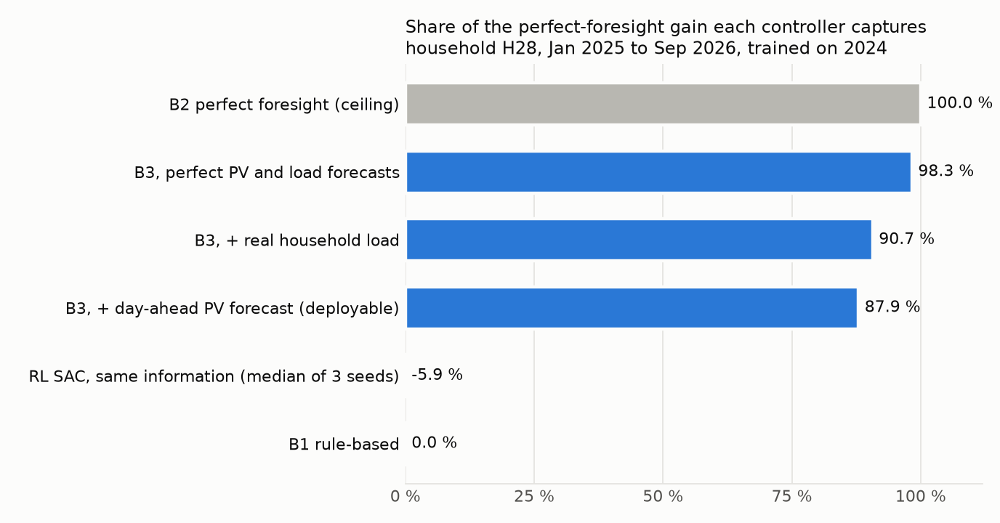
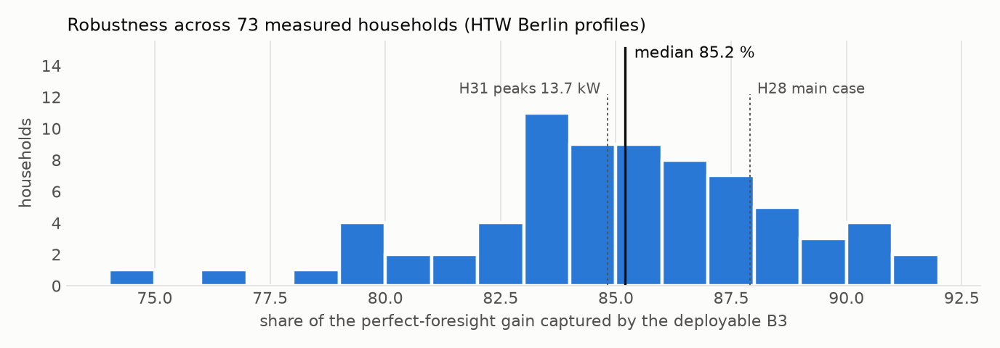
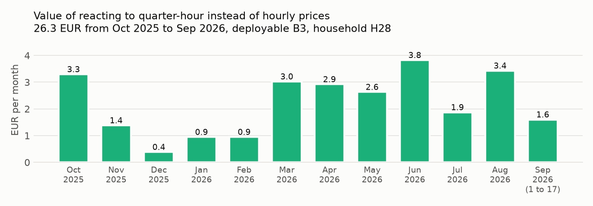
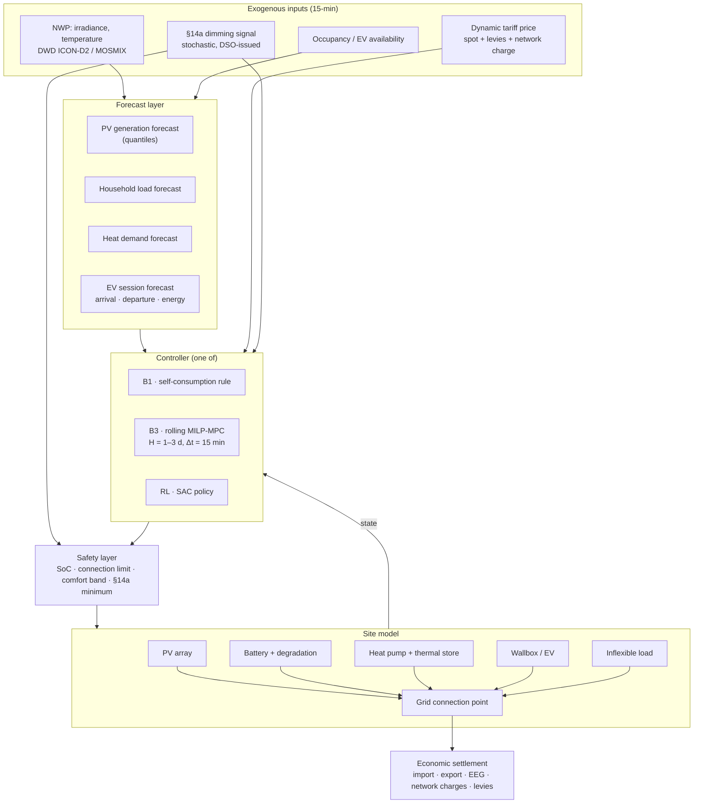

# Project 01 · Prosumer PV + Battery Energy Management at 15-Minute Resolution

**Rolling-horizon MILP-MPC (1–3 day horizon) and a reinforcement learning controller for a
German residential/small-commercial site with PV, battery storage, heat pump and wallbox —
operating under dynamic tariffs (`§41a EnWG`) and grid-orientated control (`§14a EnWG`).**

| | |
|---|---|
| **Status** | **Implemented and evaluated** on 2025/2026 out-of-sample data, 73 measured households |
| **Type** | Extension of the author's M.Sc. thesis ([`muratkus01/optimization`](https://github.com/muratkus01/optimization), tag `thesis-v1.0`) |
| **Method** | Rolling-horizon LP-MPC on a realistic information set · Soft Actor-Critic with a safety layer |
| **Asset** | 8 kWp PV, 9.37 kWh battery, 5.63 kW inverter (the thesis household, Munich) |
| **Resolution** | **15 min**, including the quarter-hour day-ahead market since 2025-10-01 |
| **Horizon** | Until the last published price: 11 to 35 h |

---

## Thesis extension: results

The thesis optimised one household over 2024 at hourly resolution with perfect foresight.
This extension asks what a controller that could actually be deployed achieves, and what the
switch of the EPEX day-ahead market to quarter-hour products on 1 October 2025 is worth.
Every number below comes from a committed script and a committed CSV in `reports/`.

```bash
pip install -e ".[rl,data,dev]"
prosumer build-data                         # 15-min load, PV, PV forecast, prices 2024-2026
prosumer rolling-eval --data <household>    # B1 / B2 / B3 variants, train 2024, test 2025-2026
prosumer household-sweep                    # the deployable B3 for 73 measured households
prosumer quarter-hour-study                 # value of quarter-hour prices after 2025-10-01
prosumer rl-eval                            # SAC on the same information set as B3
```

### Gate 0: the published thesis is reproduced

`tests/test_thesis_reproduction.py` runs the three thesis scenarios (PV only, rule-based,
perfect-foresight MILP over 2024) on this package's own controllers and matches all 25
published yearly figures of each scenario within 0.01 EUR. The retail tariff was recovered
from the published data exactly: `EP_buy = 1.19 * EPEX + 0.1937`,
`EP_sell = max(0, 1.19 * EPEX - 0.01)` EUR/kWh.

**Found while validating:** the thesis PV profile is one hour early. Its source, a company
ERA5 model export, has UTC timestamps and is correct; during data preparation they were
written into the CET column one to one (8778 of 8784 hours identical under that reading).
Correcting it lowers the optimised scenario's annual profit by 2 % (1039.0 to 1018.2 EUR);
the thesis conclusions hold. The thesis data is kept as published so Gate 0 still
reproduces it; everything new uses correctly timed PV.

### Data, 2024 to 2026, 15 minutes

| Input | Source | Check |
|---|---|---|
| Prices | EPEX DE-LU day-ahead, Energy-Charts | 2024 matches the thesis exactly; hourly products until 2025-09-30, quarter-hour after |
| PV | pvlib on Open-Meteo 15-min weather, loss calibrated to the thesis 2024 yield | daily correlation with the thesis PV 0.95; with measured German PV 0.77 (2024), 0.83 (2025), 0.82 (2026), same level as the company data (0.78) |
| PV forecast | the same model on the weather forecast issued a day earlier (Open-Meteo previous runs) | nRMSE 0.30 to 0.38 in daytime, bias within 1.5 % |
| Load | 74 measured households, HTW Berlin (Tjaden et al. 2015), scaled to 3221 kWh/a | one household shows PV behind the meter and is excluded ([screen](reports/htw_pv_screen.csv)) |
| Load forecast | BDEW H0 standard profile with Bavarian holidays | nRMSE 1.03 at 15 min for a single household |

### How much of the perfect-foresight gain does a deployable controller capture?

The controller re-plans every quarter-hour. Day D+1 prices become known at 13:00 on day D,
and the window ends at the last published price. Stored energy at the window end is valued
with a monthly price learned on 2024 from the perfect-foresight LP's shadow prices, so no
information from the test period is used.



For the most typical household (H28, closest to the median of all 73 on five load-shape
features), the deployable B3 captures **87.9 %** of the gain that perfect foresight would
achieve over the rule-based controller, 342 of 389 EUR over 20.5 months. The gap
decomposes cleanly: the price-limited horizon costs about 2 points, the household's load
not following the standard profile about 8, and PV forecast error about 3. Zero
constraint violations in every run.



Across all 73 measured households the deployable B3 captures a **median 85.2 %** (middle
half 83.5 to 87.3 %, range 75.0 to 91.4 %). That is the headline figure; H28 sits above the
median. Households with high peaks capture less: H31, likely with an instantaneous electric
water heater, reaches 97.9 % with perfect forecasts but 84.8 % with the standard-profile
load forecast.

### What is the quarter-hour day-ahead market worth?

On the period after the switch, the same controller either sees the real quarter-hour
prices or their hourly means, and both are settled at the real quarter-hour prices.



Reacting to quarter-hour prices is worth **26.3 EUR** in the first year for the deployable
B3 (22.7 EUR with perfect foresight), about 11 % of the whole optimisation gain. It is
earned mostly from March to October. The standard-profile household gives nearly the same
values (24.9 and 22.3 EUR). An hourly model of the same household, as in the thesis,
overstates the rule-based result by 12.0 EUR, because hourly averaging hides the
mismatch between PV and load inside the hour, and understates the optimised result by
9.2 EUR.

### Does reinforcement learning beat B3?

SAC, trained on 2024 with exactly the information B3 uses (published prices only, the day-ahead PV forecast, the standard-profile load forecast) and tested on the same 20.5 months, captures a **median -5.9 %** of the perfect-foresight gain over 3 seeds (range -7.1 to -1.8 %), against **87.9 %** for the deployable B3 on the same household. The learned policy does not beat B3 here (93.8 points behind). With one training year and a load forecast that is the main source of error for both controllers, the MPC's explicit optimisation over the known price window remains the stronger baseline; this is recorded as a result, not hidden. The safety layer kept violations at 0 (it clipped 77.5 % of the proposed actions); training took about 72 minutes per seed on CPU (500 000 steps). Per-seed results: `reports/rl_eval_H28/`.

### Limitations

- The "actual" weather and the forecast come from the same provider's model family, so the
  PV forecast problem is slightly easier than against measurements (irradiance nRMSE 0.27
  against its own analysis, 0.31 against independent ERA5).
- The measured households are from 2010 (no heat pumps or electric vehicles) and from one
  unknown region; they are replayed on the 2024 to 2026 calendar by weekday and local clock.
- The hourly counterfactual uses the hourly mean of the quarter-hour prices; bidding under
  hourly products would have differed, so the study measures the value of the finer
  signal, not a market counterfactual.
- 2026 ends on 17 September.

---

## 0. Earlier results on four measured weeks (superseded by the section above)

The package in `src/prosumer/` implements Phases 1–4 and the Phase-6 environment of
[`../../docs/08-milp-to-rl-roadmap.md`](../../docs/08-milp-to-rl-roadmap.md). Everything below
was produced by a run of the committed code; nothing is estimated.

```bash
pip install -e ".[rl,dev]"
python -m pytest tests/ -q                                          # 16 passed
python -m prosumer.cli legacy     --data data/raw/legacy/12-18_08_2024.csv
python -m prosumer.cli ladder     --data data/raw/legacy/09-15_12_2024.csv --dt 0.25
python -m prosumer.cli resolution --data data/raw/legacy/09-15_12_2024.csv
python train_rl.py --steps 50000 --seeds 5
```

**Gate 1 — the port is faithful.** Run in `LEGACY_RUN` configuration (hourly, day-by-day,
single price, hard throughput cap), the package reproduces the original thesis MILP's
objective exactly: **8.563975 €**, matching the original `_summary_report.txt` to all six
reported decimals.

**Two properties of the original model, found by testing rather than by reading:**

1. **The LP is degenerate.** The objective is uniquely determined but the dispatch is not —
   whenever prices are flat across consecutive hours, shifting charging between them leaves
   the objective unchanged. The trajectory in the original output file scores exactly the same
   8.563975 € as the one this port finds by a different path. *Consequence: SoC trajectories
   plotted from the original results are one arbitrary choice among ties.* Pricing throughput
   (`c_deg > 0`) instead of capping it breaks the ties and makes the solution unique.
2. **Every day ends at minimum SoC** in the original results — the horizon-end drain (defect
   D4) is not hypothetical, it is visible in the thesis output. `test_original_drains_battery_every_midnight`
   asserts it.

**Benchmark ladder, measured winter week (09–15 Dec 2024), 15 min, 24 h horizon:**

| Controller | Net cost € | Import kWh | Export kWh | Cycles | Violations |
|---|---:|---:|---:|---:|---:|
| B1 rule-based | 2.523 | 10.89 | 46.17 | 4.93 | 0 |
| B2 perfect foresight | 1.584 | 11.21 | 46.94 | 5.32 | 0 |
| B3 rolling MPC | 2.281 | 14.55 | 46.87 | 5.14 | 0 |

B3 recovers **25.8 %** of the B1→B2 headroom, at a mean **69 ms** per decision. The ladder
invariant `B2 ≤ B3` is asserted at runtime.

**Resolution study (RQ1), same week, same tariff, same method:**

| Controller | 15 min € | 60 min € | Bias € | Bias % |
|---|---:|---:|---:|---:|
| B1 rule-based | 2.523 | 3.194 | +0.671 | **+26.6 %** |
| B2 perfect foresight | 1.584 | 1.900 | +0.316 | +19.9 % |
| B3 rolling MPC | 2.281 | 2.456 | +0.175 | +7.7 % |

Peak import rose from 3.66 kW (hourly) to 5.76 kW (15 min) under B2 — the hourly model
**understates the peak power requirement by 58 %**, which is a battery- and connection-sizing
error, not merely an accounting one.

> **Read this result with its caveat.** The measured profiles are hourly, so the 15-minute
> series is upsampled. What is isolated here is therefore the **control**-resolution effect
> (four times as many decision points), not the **data**-resolution effect (true sub-hourly
> variability), and the two push cost in opposite directions. Measured sub-hourly load and PV
> — the HTW Berlin profiles, or metering from the site — are needed to separate them, and
> that is the single most valuable data acquisition for this project.

**A negative result worth recording.** On a PV-rich August week under a *fixed* feed-in
tariff, B3 loses to the price-blind B1 heuristic (−27.11 € vs −27.76 €). With a constant
export price and a site that already imports nothing, there is almost no headroom to
optimise (B1 is within 0.59 € of the perfect-foresight ceiling), and 15 % forecast error is
enough to make price-aware control a liability. **Model predictive control is not free.**

**Also fixed during implementation:** the first terminal-value estimator valued stored energy
at the full retail import price, which made B3 buy from the grid at every horizon end to bank
value it could never realise. The corrected estimator blends import and export prices by the
share of the horizon in which the site is a net importer. This is recorded because it is the
kind of defect that silently weakens a baseline — and a weak baseline is how RL results get
overclaimed.

---

## 1. Background and motivation

The author's M.Sc. thesis studied dispatch of a residential PV-plus-battery system at
**hourly resolution** over a **single-day** optimisation horizon. That configuration is the
standard in the literature, and it has two structural problems that this project sets out to
quantify and remove.

**The hourly resolution problem.** German settlement, imbalance pricing and — since the SDAC
transition — day-ahead trading all operate on a **15-minute market time unit**. Household
load and PV output both vary substantially *within* the hour. An hourly model averages away
exactly the variability that a battery is paid to absorb: the peak power a `§14a` dimming
event or a network-charge peak-price window actually sees, the intra-hour ramp a dynamic
tariff prices, and the short excursions that determine whether a grid connection limit binds.
The hypothesis is that hourly models **systematically overstate** self-consumption and
**understate** both the peak-shaving value and the required power rating of the battery.

**The single-day horizon problem.** A 24-hour horizon with a naive end-of-horizon condition
forces the optimiser to make an arbitrary decision about the battery's terminal state. Under
German conditions — multi-day weather regimes, a heat pump with a thermal store spanning
days, and price patterns that are not diurnally periodic — a 1–3 day horizon with a proper
terminal value function should capture value the 24-hour formulation cannot see.

**Why also RL.** MPC is the right tool for this problem and is expected to be strong. RL is
included because three features of the real problem are outside a MILP's comfort zone:
the `§14a` dimming signal is **stochastic and exogenous** (the site does not know when the
DSO will act), thermal comfort and heat-pump COP are **non-linear**, and battery degradation
is **path-dependent**. Whether that is enough for a learned policy to beat a well-tuned MPC
is the project's central empirical question — and "no" is an acceptable, publishable answer.

---

## 2. Regulatory and market context

Full detail: [`../../docs/01-german-market-regulatory-primer.md`](../../docs/01-german-market-regulatory-primer.md).

| Instrument | How it enters the model |
|-----------|-------------------------|
| **`§14a EnWG`** (in force 1 Jan 2024) | The DSO may dim controllable devices (heat pump, wallbox, battery, A/C above ~4.2 kW) to a guaranteed minimum. Modelled as an **exogenous stochastic interrupt** on the controllable subset, with the module choice (1/2/3) as a configuration parameter affecting the network-charge component |
| **`§41a EnWG`** (from 1 Jan 2025) | Every supplier must offer a **dynamic tariff**. The tariff is the spot price plus supplier margin, taxes, levies and network charges — the price signal the controller optimises against |
| **EEG 2023 feed-in / direct marketing** | Feed-in remuneration for surplus export, with the **negative-price rule** (`§51 EEG`, tightened by the 2025 Solarspitzengesetz for new plants) as a vintage-dependent switch |
| **Feed-in limitation for new small PV** | Without intelligent metering, new small PV faces a 60 %-of-capacity export cap — a direct driver of battery value, and a modelled scenario |
| **MsbG / iMSys / SMGW** | Defines the actuation path: control at 15-minute granularity through the smart meter gateway's CLS channel, not continuous-time actuation |
| **Network charges, levies, VAT** | Determine the retail-vs-export spread that the battery arbitrages; time-variable network charges (`§14a` Module 3) add a second, structurally different price signal |

**The `§14a` module choice is a decision variable in its own right.** Module 1 (flat annual
reduction), Module 2 (percentage reduction on the energy component) and Module 3 (time-variable
network charges, addable to Module 1) reward different operating behaviour. A site that
optimises well under time-variable charges should choose differently from one that does not.
This coupling between a *slow annual tariff decision* and *fast operational control* is
rarely modelled and is one of the project's contributions.

---

## 3. Scope and objectives

### In scope

- A 15-minute, 1–3 day rolling-horizon MILP-MPC energy management system for a German
  prosumer site with PV, battery, heat pump (with thermal store) and non-public wallbox.
- An SAC-based RL controller on an identical physical and economic model, with a safety layer.
- A **quantified resolution study**: 60 min vs. 15 min, same site, same year, same method —
  isolating the bias introduced by hourly modelling.
- A **horizon study**: 24 h vs. 48 h vs. 72 h, with and without a terminal value function.
- Full `§14a` module comparison (1 / 2 / 3) including the induced change in optimal behaviour.
- Sensitivity to plant vintage via the negative-price rule and the feed-in limitation.

### Out of scope

- Aggregation of many sites into a marketable pool → **Project 04**.
- Depot-scale and multi-vehicle charging optimisation → **Project 03**.
- Participation in wholesale or balancing markets as a direct market party.
- Detailed low-voltage power flow — the grid appears as a connection-point limit plus the
  exogenous `§14a` signal; the DSO-side problem is backlog item **B2**.

### Objectives

1. Quantify the modelling error introduced by hourly resolution in prosumer storage studies,
   in € per year and in kW of misestimated power requirement.
2. Determine the marginal value of extending the MPC horizon from 1 to 3 days, and how much
   of that value a well-chosen terminal value function recovers at a 1-day horizon.
3. Establish whether an RL controller beats a tuned MPC when the `§14a` dimming signal is
   stochastic — and characterise the conditions under which it does.
4. Produce a defensible recommendation on `§14a` module selection as a function of site
   configuration.

---

## 4. Research questions and hypotheses

| # | Research question | Hypothesis |
|---|-------------------|-----------|
| RQ1 | How much does hourly modelling bias the estimated economics of a prosumer battery? | H1: Hourly models overstate annual savings and understate the required power rating; the bias grows with PV size relative to load |
| RQ2 | What is the marginal value of a 2–3 day MPC horizon over 24 h? | H2: Positive but modest under a pure spot tariff; substantially larger with a heat pump and thermal store, where multi-day weather regimes matter |
| RQ3 | Does a learned policy beat rolling-horizon MPC under stochastic `§14a` dimming? | H3: It closes part of the B2–B3 gap specifically through anticipatory pre-charging before likely dimming windows; under deterministic conditions MPC is at least as good |
| RQ4 | Which `§14a` module is optimal, for which site? | H4: Module 3 dominates for sites with high controllable-load share and good optimisation; Module 1 dominates for passive sites |
| RQ5 | What does guaranteed constraint satisfaction cost? | H5: A small single-digit percentage of the economic result, in exchange for zero violations |

---

## 5. System architecture



---

## 6. Problem formulation

### 6.1 Rolling-horizon MILP (B2 / B3)

Sets and indices: `t ∈ T` quarter-hours over horizon `H`; `Δt = 0.25 h`.

**Decision variables** — battery charge/discharge power `p_ch(t), p_dis(t) ≥ 0` with binary
mode `z_bat(t)` enforcing mutual exclusion; state of charge `E(t)`; heat pump electrical
power `p_hp(t)` and thermal store energy `Q(t)`; EV charging power `p_ev(t)`; grid import and
export `p_imp(t), p_exp(t) ≥ 0` with binary `z_grid(t)`; curtailment `p_curt(t)`.

**Objective** — minimise net cost over the horizon plus a terminal value term:

```
min  Σ_t [ c_imp(t)·p_imp(t)·Δt  −  c_exp(t)·p_exp(t)·Δt
           +  c_deg·(p_ch(t)+p_dis(t))·Δt
           +  c_disc·|p_hp(t) discomfort slack| ]
     −  V_T(E(T), Q(T))
```

where `c_imp(t)` is the full dynamic retail price (spot + margin + network charge, itself
time-variable under `§14a` Module 3 + levies + electricity tax + VAT), `c_exp(t)` is the
applicable feed-in/market-premium revenue with the negative-price rule applied by vintage,
`c_deg` prices battery throughput, and `V_T` is the fitted terminal value function on storage
states — the component that makes a finite horizon behave sensibly.

**Constraints** — battery energy balance with charge/discharge efficiencies and SoC bounds;
mutual exclusion of charge/discharge and of import/export; thermal store balance with
temperature-dependent COP (piecewise-linear); comfort band on the thermal state with a
penalised slack; EV energy-by-departure requirement with session-dependent availability; grid
connection point balance; connection capacity limits; and, when a `§14a` dimming signal is
active, a cap on the aggregate controllable power at the guaranteed minimum.

Efficiency and COP curves are piecewise-linearised (SOS2) in the MILP and used **unlinearised**
in the simulation model, so the linearisation error is a measurable quantity and one of the
structural openings for the learned policy.

### 6.2 MDP formulation (RL)

| Element | Definition |
|---------|-----------|
| **State** | Battery SoC, thermal store state, EV SoC + connection status + declared departure, time features (quarter-hour of day, day of week, season), rolling price window (past + published forward prices), PV/load/heat forecast quantiles over the next 96 steps (compressed), `§14a` signal state and recent dimming history |
| **Action** | Continuous: battery power setpoint ∈ [−P_max, P_max], heat pump setpoint ∈ [0, P_hp], EV charging power ∈ [0, P_ev] |
| **Transition** | Site model at 15 min with non-linear efficiency and COP, stochastic `§14a` dimming, stochastic load and PV realisations |
| **Reward** | Negative net cost of the step + degradation cost + soft comfort penalty. **No hard-constraint penalties** |
| **Safety layer** | Projection of the proposed action onto the feasible set: SoC bounds, connection capacity, comfort band floor, `§14a` cap. Violations impossible by construction |
| **Episode** | 7 days, random start, with terminal storage states valued by `V_T` |
| **Algorithm** | SAC (continuous actions, sample-efficient, robust to reward scaling); PPO as a cross-check |

Partial observability is genuine here: the dimming signal, occupancy and true thermal state
are not fully observed. The policy is given a short observation history to compensate; a
recurrent variant is an ablation.

---

## 7. Data requirements

| Data | Purpose | Source | Resolution | Status |
|------|---------|--------|-----------|--------|
| Household load profiles | Site demand, realistic sub-hourly variability | **HTW Berlin** 74 measured German household profiles (1 s/1 min) | ≤ 1 min → 15 min | Open, identified |
| BDEW SLP H0/G0 | Reference comparison; the regulatory default | BDEW | 15 min | Open |
| PV generation | Own generation | Measured where available; otherwise PVGIS + DWD irradiance, modelled with `pvlib` | 15 min | Open |
| NWP forecasts | Realistic issue-time forecasts | **DWD ICON-D2 / MOSMIX**; ICON-D2-EPS for quantiles | 15 min – 1 h | Open |
| Day-ahead & intraday prices | Dynamic tariff base | SMARD / ENTSO-E / Energy-Charts | 15 min | Open |
| Dynamic tariff structure | Retail price build-up | aWATTar / Tibber published structure; BNetzA price components | — | Open |
| Network charges | Import cost + `§14a` module effects | DSO published price sheets; BNetzA `§14a` determinations | Annual / time-variable | Open |
| Heat demand & COP | Heat pump operation | **When2Heat**; VDI 4655; manufacturer COP curves | Hourly → 15 min | Open (When2Heat CC BY 4.0) |
| EV session data | Wallbox availability and energy demand | ACN-Data / ElaadNL re-weighted with German MiD/MOP statistics | Per session | Open, with documented substitution |
| Battery parameters | Efficiency, degradation | Manufacturer datasheets + published ageing models | — | Open |
| `§14a` dimming events | The stochastic interrupt | **No public dataset exists.** Synthesised from congestion-hour proxies (residual load, local PV/heat-pump density from MaStR), with the assumed frequency and duration as a reported sensitivity parameter | 15 min | **Gap — modelled, flagged** |

**Principal data gap.** Realised `§14a` dimming events are not published. Rather than assume
them away, the project treats the dimming process as a parameterised stochastic model
(frequency, duration, time-of-day concentration) and reports results across a range of
parameterisations, so the reader can locate their own grid situation on the curve. Obtaining
real DSO dimming logs is the single highest-value data partnership for this project.

---

## 8. Baselines and evaluation

| Rung | Instantiation |
|------|--------------|
| **B0** | Metered site operation where available; otherwise omitted and stated |
| **B1** | Standard self-consumption-maximising home energy management: charge from surplus, discharge to cover load, no price awareness. Validation gate against B0 |
| **B2** | Perfect-foresight MILP over the full evaluation year |
| **B3** | Rolling-horizon MILP-MPC, H ∈ {24, 48, 72} h, re-solved every 15 min, on realistic issue-time forecasts |
| **RL** | SAC with safety layer, identical observations and forecasts to B3 |

**Primary KPI:** annual net electricity cost (€/a). **Headline comparison:** B3-gap closure.
**Secondary:** self-sufficiency, self-consumption rate, peak import/export (kW), battery
equivalent full cycles, constraint violations (expected zero), decision latency.

Mandatory ablations: resolution (60 vs. 15 min), horizon (24/48/72 h), terminal value
function on/off, forecast quality (perfect/realistic/degraded), safety layer on/off, `§14a`
module 1/2/3, plant vintage (negative-price rule variants), and the dimming-frequency sweep.

Protocol: [`../../docs/04-evaluation-protocol.md`](../../docs/04-evaluation-protocol.md).

---

## 9. Deliverables

1. An open, reusable 15-minute German prosumer site simulator (Gymnasium environment) with
   the German tariff, EEG and `§14a` accounting built in — usable by others independently of
   the controllers.
2. A reference MILP-MPC implementation solving with the open HiGHS solver.
3. A trained SAC controller with a safety layer, and a reproducible training pipeline.
4. The resolution-bias study — the project's most transferable result, since it bears on the
   validity of a large existing literature.
5. A `§14a` module selection guide grounded in simulation rather than assertion.
6. A written report suitable for submission as a conference paper.

---

## 10. Work packages and roadmap

| WP | Content | Depends on | Output |
|----|---------|-----------|--------|
| WP1 | Data pipeline: profiles, prices, weather, tariff build-up; DST and resolution handling; unit tests | — | `data/processed` + tests |
| WP2 | Site model (PV, battery + degradation, heat pump + store, EV, connection point) and the settlement module | WP1 | `src/model`, `src/market` |
| WP3 | B1 rule-based controller and **validation gate** against B0/reference | WP2 | Validation report — **gate** |
| WP4 | MILP formulation, B2 perfect foresight, terminal value function fitting | WP2 | `src/baselines` |
| WP5 | B3 rolling-horizon MPC; horizon and re-solve tuning | WP4 | Tuned strong baseline |
| WP6 | Forecast layer with true issue times; quantile PV/load/heat models | WP1 | Immutable forecast store |
| WP7 | Gymnasium environment + safety layer | WP2, WP6 | `src/envs`, `src/safety` |
| WP8 | SAC training, seeds, hyperparameter selection on validation only | WP7 | Trained policies |
| WP9 | Evaluation, ablations, statistics, report | WP5, WP8 | `reports/` |

---

## 11. Risks and limitations

| Risk | Mitigation |
|------|-----------|
| No real `§14a` dimming data | Parameterised stochastic model with a reported sensitivity sweep; explicitly named as a limitation |
| Dutch/Californian EV data used for German behaviour | Session structure fitted from open data, arrival/departure re-weighted with German mobility statistics; effect reported |
| MPC may simply win | Treated as a legitimate and expected outcome; the resolution and horizon studies stand on their own regardless |
| Synthetic household profiles do not represent real variance | HTW Berlin measured profiles used as primary; SLP only as reference comparison |
| Regulatory change during the project | All regulatory rules are configuration parameters; sensitivity to them is a reported result rather than a threat |
| Overfitting to one weather year | Multi-year evaluation with regime-diverse test blocks |

---

## 12. Repository structure

Follows [`../../templates/project-template/`](../../templates/project-template/) — see
[`../../docs/05-tech-stack.md`](../../docs/05-tech-stack.md) for the full layout and
conventions.

---

## 13. Related work and references

- EEG 2023 §§ 20 ff., § 51; EnWG §§ 14a, 41a; MsbG — see
  [`../../docs/01-german-market-regulatory-primer.md`](../../docs/01-german-market-regulatory-primer.md).
- Bundesnetzagentur determinations on `§14a EnWG` grid-orientated control (BK6-22-300 and
  the accompanying network-charge determination).
- HTW Berlin *Stromspeicher-Inspektion* and the associated representative household load
  profile dataset — the German reference point for BTM storage evaluation.
- The MPC-vs-RL comparison literature for building and home energy management, which is where
  this project's methodological contribution (forecast parity, safety layer, honest baseline)
  is aimed.

*A curated bibliography with full citations is maintained in this project's `reports/`
directory as the implementation proceeds.*

---

## 14. Collaboration

The highest-value contributions to this project would be: (a) anonymised DSO logs of actual
`§14a` dimming events, (b) metered German prosumer site data at ≤ 15-minute resolution with a
heat pump and/or wallbox, (c) a review of the MILP formulation against operational practice.
Enquiries via the repository issue tracker.
