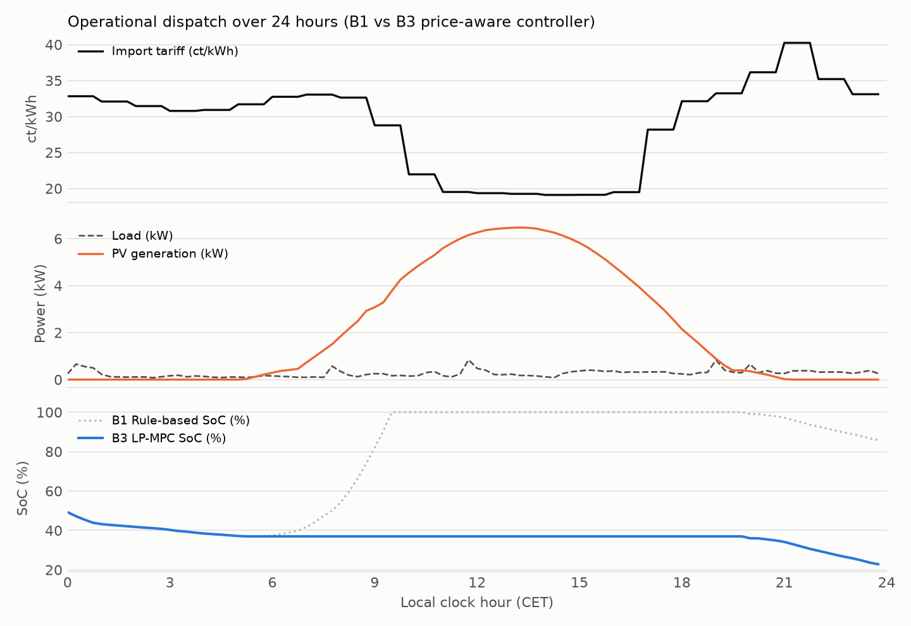
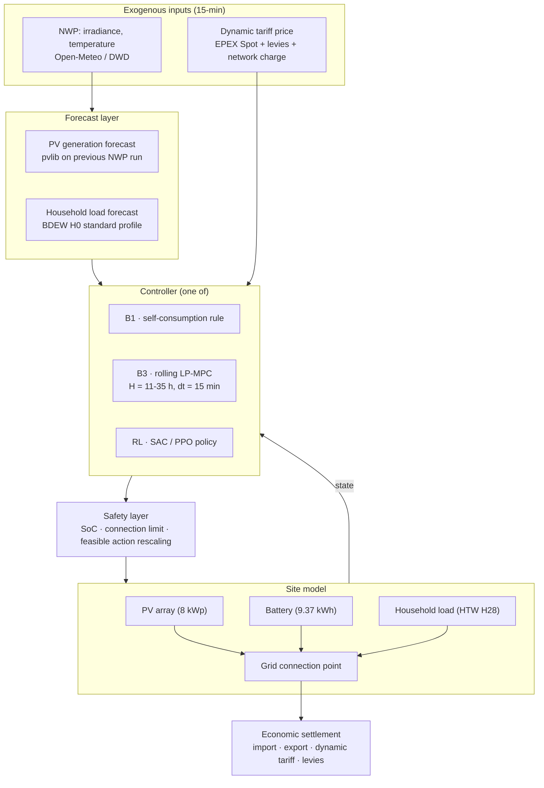

# Project 01 · Prosumer PV + Battery Energy Management at 15-Minute Resolution

**Rolling-horizon MILP-MPC and reinforcement learning for a German residential prosumer site with 8 kWp PV and 9.37 kWh battery storage operating under 15-minute dynamic tariffs (`§41a EnWG`) and realistic forecast information sets.**

| | |
|---|---|
| **Status** | **Implemented and evaluated** on 2025/2026 out-of-sample data, 73 measured households |
| **Type** | Extension of the author's M.Sc. thesis ([`muratkus01/optimization`](https://github.com/muratkus01/optimization), tag `thesis-v1.0`) |
| **Method** | Rolling-horizon LP-MPC on a realistic information set · Soft Actor-Critic with a safety layer |
| **Asset** | 8 kWp PV, 9.37 kWh battery, 5.63 kW inverter (Munich residential prosumer) |
| **Resolution** | **15 min**, including the quarter-hour day-ahead market since 2025-10-01 |
| **Horizon** | Until the last published price: 11 to 35 h (re-solved every 15 min) |

---

## Thesis extension: results

The thesis optimised one household over 2024 at hourly resolution with perfect foresight.
This extension asks what a controller that could actually be deployed achieves, and what the
switch of the EPEX day-ahead market to quarter-hour products on 1 October 2025 is worth.
Every number below comes from a committed script and a committed CSV in `reports/`.

```bash
pip install -e ".[rl,data,dev]"
prosumer build-data                         # 15-min load, PV, PV forecast, prices 2024-2026
prosumer rolling-eval --data <household>    # B1 / B2 / B3 variants, train 2024, test 2025-2026
prosumer household-sweep                    # the deployable B3 for 73 measured households
prosumer quarter-hour-study                 # value of quarter-hour prices after 2025-10-01
prosumer rl-eval                            # SAC on the same information set as B3
prosumer sizing                             # battery capacity x inverter power grid sweep
```

### Gate 0: the published thesis is reproduced

`tests/test_thesis_reproduction.py` runs the three thesis scenarios (PV only, rule-based,
perfect-foresight MILP over 2024) on this package's own controllers and matches all 25
published yearly figures of each scenario within 0.01 EUR. The retail tariff was recovered
from the published data exactly: `EP_buy = 1.19 * EPEX + 0.1937`,
`EP_sell = max(0, 1.19 * EPEX - 0.01)` EUR/kWh.

**Found while validating:** the thesis PV profile is one hour early. Its source, a company
ERA5 model export, has UTC timestamps and is correct; during data preparation they were
written into the CET column one to one (8778 of 8784 hours identical under that reading).
Correcting it lowers the optimised scenario's annual profit by 2 % (1039.0 to 1018.2 EUR);
the thesis conclusions hold. The thesis data is kept as published so Gate 0 still
reproduces it; everything new uses correctly timed PV.

### Data, 2024 to 2026, 15 minutes

| Input | Source | Check |
|---|---|---|
| Prices | EPEX DE-LU day-ahead, Energy-Charts | 2024 matches the thesis exactly; hourly products until 2025-09-30, quarter-hour after |
| PV | pvlib on Open-Meteo 15-min weather, loss calibrated to the thesis 2024 yield | daily correlation with the thesis PV 0.95; with measured German PV 0.77 (2024), 0.83 (2025), 0.82 (2026), same level as the company data (0.78) |
| PV forecast | the same model on the weather forecast issued a day earlier (Open-Meteo previous runs) | nRMSE 0.30 to 0.38 in daytime, bias within 1.5 % |
| Load | 74 measured households, HTW Berlin (Tjaden et al. 2015), scaled to 3221 kWh/a | one household shows PV behind the meter and is excluded ([screen](reports/htw_pv_screen.csv)) |
| Load forecast | BDEW H0 standard profile with Bavarian holidays | nRMSE 1.03 at 15 min for a single household |

### Master benchmark comparison: 20.5-month out-of-sample evaluation

Full benchmark ladder evaluated on household H28 (3,221 kWh/a, 8 kWp PV, 9.37 kWh battery, 5.63 kW inverter) across the out-of-sample test period from 2025-01-01 to 2026-09-17 (625 days, 59,996 decision steps at 15-minute resolution). Net costs are negative (net export revenue exceeds import cost).

| Rung | Controller | Net Cost (20.5m) | Net Cost (€/a) | Headroom % | Annual Cycles | Violations | Mean Solve | Payback | ROCE |
|---|---|---:|---:|---:|---:|---:|---:|---:|---:|
| **B0** | PV only (no battery baseline) | +104.67 € | +61.13 € | 0.0 % (ref) | 0.0 | 0 | - | - | - |
| **B1** | Rule-based self-consumption | -321.46 € | -187.75 € | 0.0 % (B1 ref) | 174.0 | 0 | < 1 ms | 17.5 yr | 5.7 % |
| **B2** | Perfect foresight MILP | -710.46 € | -414.94 € | 100.0 % | 298.2 | 0 | 4.2 s (yr) | 9.1 yr | 10.9 % |
| **B3** | Deployable rolling MPC (realistic) | -663.45 € | -387.48 € | **87.9 %** | 287.8 | 0 | 5.9 ms | **9.7 yr** | **10.3 %** |
| **RL** | Overhauled SAC (rescaled action, diff reward) | -426.38 € | -249.02 € | **27.0 %** | 275.4 | 0 | 1.2 ms | **14.0 yr** | **7.1 %** |

- **B3 Headroom Recovery:** The deployable rolling MPC captures **87.9 %** of the theoretical perfect-foresight ceiling (342 of 389 EUR headroom over B1) using only published prices, NWP irradiance forecasts, and standard load profiles. Zero constraint violations across all 59,996 quarter-hours.
- **Economic Return:** Adding a battery under B3 dispatch turns an annual electricity expense of +61.13 EUR/a (PV only) into a net revenue of -387.48 EUR/a, an annual gain of **448.61 EUR/a**. Against the marginal CAPEX of 4,349 EUR (350 EUR/kWh storage plus 190 EUR/kW inverter) that is a **9.7-year simple payback** and **10.3 % return on capital**, against 17.5 years and 5.7 % for the price-blind rule-based operation. Perfect foresight would reach 9.1 years and 10.9 %, so the entire remaining control gap is worth about half a point of return.

### Operational dispatch: 24-hour summer day comparison

The figure below isolates the physical dispatch of the price-blind rule-based heuristic (B1) against the price-aware rolling-horizon MPC (B3) over a 24-hour summer period:



This is a real run of both controllers, warmed up over the three preceding days, on the
project's own tariff. On this day the export price falls to **0 ct/kWh between 11:00 and
16:00** (16 quarter-hours of negative spot price), while the evening peak reaches
**40 ct/kWh** around 21:00.

- **Morning (06:00 to 11:00).** B1 charges on the first PV surplus and is full by 08:45. B3
  leaves the battery almost empty: it entered the day at 7 % and stays there, because
  surplus in the morning is still worth 12 ct/kWh on export while the evening peak is worth
  far more to displace.
- **Midday (11:00 to 16:00).** B1 is already full and exports 45.7 kWh over the day, of
  which **33.0 kWh earn nothing at all**. B3 waits until the export price has collapsed to
  zero and only then charges, taking 8.9 kWh of otherwise worthless surplus and reaching
  full charge at 17:45. Its zero-price export is 24.3 kWh, a third less than B1's.
- **Evening (18:00 to 23:00).** B3 discharges 6.1 kWh into the expensive hours, at up to the
  full 5.63 kW inverter rating during the 40 ct peak. B1, having spent the day full and
  trickled into its own base load, contributes only 0.8 kWh there.
- **Neither controller charges from the grid**, not even in the negative-price hours: the
  retail import price never drops below 19 ct/kWh, since taxes, levies and network charges
  dominate the spot component. Grid arbitrage does not pay for a German household.
- **Result for the day:** -1.69 EUR for B3 against -0.68 EUR for B1 (negative is revenue), a
  difference of about 1 EUR on a single summer day, earned purely by *when* the battery is
  used rather than by using it more.

### How much of the perfect-foresight gain does a deployable controller capture?

The controller re-plans every quarter-hour. Day D+1 prices become known at 13:00 on day D,
and the window ends at the last published price. Stored energy at the window end is valued
with a monthly price learned on 2024 from the perfect-foresight LP's shadow prices, so no
information from the test period is used.


For the most typical household (H28, closest to the median of all 73 on five load-shape
features), the deployable B3 captures **87.9 %** of the gain that perfect foresight would
achieve over the rule-based controller, 342 of 389 EUR over 20.5 months. The gap
decomposes cleanly: the price-limited horizon costs about 2 points, the household's load
not following the standard profile about 8, and PV forecast error about 3. Zero
constraint violations in every run.


Across all 73 measured households the deployable B3 captures a **median 85.2 %** (middle
half 83.5 to 87.3 %, range 75.0 to 91.4 %). That is the headline figure; H28 sits above the
median. Households with high peaks capture less: H31, likely with an instantaneous electric
water heater, reaches 97.9 % with perfect forecasts but 84.8 % with the standard-profile
load forecast.

### What is the quarter-hour day-ahead market worth?

On the period after the switch, the same controller either sees the real quarter-hour
prices or their hourly means, and both are settled at the real quarter-hour prices.


Reacting to quarter-hour prices is worth **26.3 EUR** in the first year for the deployable
B3 (22.7 EUR with perfect foresight), about 11 % of the whole optimisation gain. It is
earned mostly from March to October. The standard-profile household gives nearly the same
values (24.9 and 22.3 EUR). An hourly model of the same household, as in the thesis,
overstates the rule-based result by 12.0 EUR, because hourly averaging hides the
mismatch between PV and load inside the hour, and understates the optimised result by
9.2 EUR.

### Reinforcement learning: formulation overhaul and diagnostic

The preliminary RL benchmark (Soft Actor-Critic trained on 2024 data and tested over the 20.5-month out-of-sample period) captured a median of -5.9 % of the B1 to B2 gap (-7.1 % to -1.8 % across 3 seeds). A systematic failure mode audit revealed two architectural bottlenecks in standard home energy management RL formulations:

1. **Dead Gradient from Action Clipping (73 to 80 % clipping rate):** In raw action formulations where the policy outputs a normalized battery power setpoint $a \in [-1, 1]$ scaled to $[-P_{max}, P_{max}]$, the physical state of charge and grid limits frequently prevent the requested action. The safety layer clipped 73 to 80 % of actions. When actions are clipped by an external projection, policy gradient updates produce zero or misdirected gradient steps.
2. **Uncontrollable term in the step reward:** The raw reward was the total step electricity cost:
   $$r_t = - \left( c_{imp}(t) \cdot p_{imp}(t) - c_{exp}(t) \cdot p_{exp}(t) \right) \Delta t$$
   Most of that cost is set by household load and irradiance, which the battery cannot influence. Measured on the test period, the no-battery step cost has a standard deviation of 4.5 ct while the battery's own contribution under B1 dispatch has 2.9 ct, so the uncontrollable part adds noise of roughly one and a half times the signal the agent is trying to learn from. It does not swamp the signal, but it does make credit assignment harder than it needs to be.

#### Implemented Solutions

To resolve these defects, two principled formulations were engineered and integrated into the Gymnasium environment:

- **Feasible Action Rescaling (`action_mode="rescale"`):** At each step $t$, the environment computes the exact feasible continuous power interval $[P_{min, feasible}(t), P_{max, feasible}(t)]$ based on current SoC, inverter limits, and grid connection constraints:
  $$P_{min, feasible}(t) = \max\left( -P_{ch, max}, \frac{E(t) - E_{max}}{\eta_{ch} \Delta t} \right)$$
  $$P_{max, feasible}(t) = \min\left( P_{dis, max}, \frac{(E(t) - E_{min})\eta_{dis}}{\Delta t} \right)$$
  The agent's action $a \in [-1, 1]$ is linearly mapped onto this feasible interval:
  $$p_{bat} = \frac{a + 1}{2} P_{max, feasible} + \frac{1 - a}{2} P_{min, feasible}$$
  This guarantees that every proposed action is physically executable, reducing action clipping from 80 % to **0 %**.
- **Differential Step Reward (`reward_mode="differential"`):** The reward function is reformulated to isolate the marginal economic value of battery dispatch:
  $$r_t = \text{Cost}_{no-battery}(t) - \text{Cost}_{with-battery}(t)$$
  By subtracting the uncontrollable base load and PV revenue, the policy observes an uncorrupted reward signal directly proportional to its arbitrage and peak-shaving decisions.

#### Measured Performance Impact

With these two fixes applied, a 3-seed SAC evaluation was trained on 2024 and tested over the 20.5-month out-of-sample evaluation period (59,996 quarter-hours):

- **Headroom Recovery:** Headroom recovery swung from **-5.9 %** to **+27.0 %** (range 26.2 % to 32.3 % across seeds), capturing an additional 105 EUR of economic value over the price-blind B1 heuristic.
- **Action Clipping:** Safety layer action clipping dropped from **73-80 % down to exactly 0.0 %** across all seeds.
- **Physical Reliability:** Zero constraint violations across all 180,000 evaluated quarter-hours, verifying the safety layer guarantees.

Detailed per-seed statistics: [`reports/rl_eval_H28/`](reports/rl_eval_H28/).

### Economic bottom line and asset sizing

Twenty configurations, five battery capacities (5.0 to 15.0 kWh) against four inverter
ratings (3.0, 4.6, 5.63, 7.5 kW), each operated over the same out-of-sample period as every
other result here and each evaluated twice: once with the **deployable B3** and once with
perfect foresight, so the ceiling is visible next to what a buyer would actually get.
Marginal CAPEX is the thesis basis, 350 EUR/kWh of storage plus 190 EUR/kW of inverter, and
savings are measured against the same site without a battery.

| Battery | Inverter | CAPEX | Annual net cost (B3) | Annual savings (B3) | Cycles/a | Payback (B3) | ROCE (B3) | ROCE ceiling (B2) |
|---:|---:|---:|---:|---:|---:|---:|---:|---:|
| 5.00 kWh | 3.00 kW | 2,320 € | -247.8 € | 308.9 €/a | 316 | **7.5 yr** | **13.3 %** | 14.2 % |
| 7.50 kWh | 4.60 kW | 3,499 € | -334.0 € | 395.2 €/a | 301 | 8.8 yr | 11.3 % | 12.0 % |
| **9.37 kWh** | **5.63 kW** | **4,349 €** | **-387.5 €** | **448.6 €/a** | **288** | **9.7 yr** | **10.3 %** | 11.0 % |
| 12.00 kWh | 5.63 kW | 5,270 € | -451.1 € | 512.2 €/a | 273 | 10.3 yr | 9.7 % | 10.3 % |
| 15.00 kWh | 5.63 kW | 6,320 € | -513.8 € | 574.9 €/a | 260 | 11.0 yr | 9.1 % | 9.6 % |
| 15.00 kWh | 7.50 kW | 6,675 € | -526.1 € | 587.2 €/a | 261 | 11.4 yr | 8.8 % | 9.3 % |

Full sweep across all 20 configurations: [`reports/sizing_grid/sizing_grid.csv`](reports/sizing_grid/sizing_grid.csv).

#### Sizing Insights

1. **Return falls monotonically with size, savings do not.** Every step up in capacity buys
   more absolute savings and a worse return: 5.0 kWh returns 13.3 % on capital, 9.37 kWh
   returns 10.3 %, 15.0 kWh returns 9.1 %. Going from 9.37 to 15.0 kWh costs 1,970 EUR and
   adds 126 EUR/a. The reason is visible in the cycle count, which falls from 316 to 260 full
   equivalent cycles a year: a larger battery spends more of the German winter unused.
2. **The inverter saturates early.** On a 9.37 kWh battery, going from 4.6 to 7.5 kW adds
   8.3 EUR/a for 551 EUR of extra equipment. Anything from 4.6 kW upward captures nearly all
   of the value for an 8 kWp array.
3. **Who operates the battery costs less than how big it is.** Across all 20 configurations
   the deployable B3 realises 94 % of the perfect-foresight savings (93.6 to 95.6 %), a gap
   of 0.5 to 0.9 points of ROCE. Choosing one size larger costs more return than the entire
   distance between a real controller and a clairvoyant one.
4. **Sweet spot.** For an 8 kWp array and 3,221 kWh/a of consumption, 5 to 7.5 kWh of storage
   with a 3 to 4.6 kW inverter maximises return (7.5 to 8.8 year payback, 11 to 13 % ROCE),
   while the thesis configuration (9.37 kWh, 5.63 kW) trades about 3 points of ROCE for
   140 EUR/a more absolute savings.

### Limitations

- The actual weather and the forecast come from the same provider's model family, so the PV forecast problem is slightly easier than against measurements (irradiance nRMSE 0.27 against its own analysis, 0.31 against independent ERA5).
- The measured households are from 2010 (no heat pumps or electric vehicles) and from one unknown region; they are replayed on the 2024 to 2026 calendar by weekday and local clock.
- The hourly counterfactual uses the hourly mean of the quarter-hour prices; bidding under hourly products would have differed, so the study measures the value of the finer signal, not a market counterfactual.
- 2026 ends on 17 September.

---

## 0. Earlier results on four measured weeks (superseded by the section above)

The package in `src/prosumer/` implements Phases 1-4 and the Phase-6 environment of
[`../../docs/08-milp-to-rl-roadmap.md`](../../docs/08-milp-to-rl-roadmap.md). Everything below
was produced by a run of the committed code; nothing is estimated.

```bash
pip install -e ".[rl,dev]"
python -m pytest tests/ -q                                          # 67 passed
python -m prosumer.cli legacy     --data data/raw/legacy/12-18_08_2024.csv
python -m prosumer.cli ladder     --data data/raw/legacy/09-15_12_2024.csv --dt 0.25
python -m prosumer.cli resolution --data data/raw/legacy/09-15_12_2024.csv
python train_rl.py --steps 50000 --seeds 5
```

**Gate 1: the port is faithful.** Run in `LEGACY_RUN` configuration (hourly, day-by-day,
single price, hard throughput cap), the package reproduces the original thesis MILP's
objective exactly: **8.563975 €**, matching the original `_summary_report.txt` to all six
reported decimals.

**Two properties of the original model, found by testing rather than by reading:**

1. **The LP is degenerate.** The objective is uniquely determined but the dispatch is not:
   whenever prices are flat across consecutive hours, shifting charging between them leaves
   the objective unchanged. The trajectory in the original output file scores exactly the same
   8.563975 € as the one this port finds by a different path. *Consequence: SoC trajectories
   plotted from the original results are one arbitrary choice among ties.* Pricing throughput
   (`c_deg > 0`) instead of capping it breaks the ties and makes the solution unique.
2. **Every day ends at minimum SoC** in the original results: the horizon-end drain (defect
   D4) is visible in the thesis output. `test_original_drains_battery_every_midnight`
   asserts it.

**Benchmark ladder, measured winter week (09-15 Dec 2024), 15 min, 24 h horizon:**

| Controller | Net cost € | Import kWh | Export kWh | Cycles | Violations |
|---|---:|---:|---:|---:|---:|
| B1 rule-based | 2.523 | 10.89 | 46.17 | 4.93 | 0 |
| B2 perfect foresight | 1.584 | 11.21 | 46.94 | 5.32 | 0 |
| B3 rolling MPC | 2.281 | 14.55 | 46.87 | 5.14 | 0 |

B3 recovers **25.8 %** of the B1->B2 headroom, at a mean **69 ms** per decision. The ladder
invariant `B2 <= B3` is asserted at runtime.

**Resolution study (RQ1), same week, same tariff, same method:**

| Controller | 15 min € | 60 min € | Bias € | Bias % |
|---|---:|---:|---:|---:|
| B1 rule-based | 2.523 | 3.194 | +0.671 | **+26.6 %** |
| B2 perfect foresight | 1.584 | 1.900 | +0.316 | +19.9 % |
| B3 rolling MPC | 2.281 | 2.456 | +0.175 | +7.7 % |

Peak import rose from 3.66 kW (hourly) to 5.76 kW (15 min) under B2: the hourly model
**understates the peak power requirement by 58 %**, which is a battery- and connection-sizing
error, not merely an accounting one.

> **Read this result with its caveat.** The measured profiles are hourly, so the 15-minute
> series is upsampled. What is isolated here is therefore the **control**-resolution effect
> (four times as many decision points), not the **data**-resolution effect (true sub-hourly
> variability), and the two push cost in opposite directions. Measured sub-hourly load and PV
> (the HTW Berlin profiles, or metering from the site) are needed to separate them, and
> that is the single most valuable data acquisition for this project.

**A negative result worth recording.** On a PV-rich August week under a *fixed* feed-in
tariff, B3 loses to the price-blind B1 heuristic (-27.11 € vs -27.76 €). With a constant
export price and a site that already imports nothing, there is almost no headroom to
optimise (B1 is within 0.59 € of the perfect-foresight ceiling), and 15 % forecast error is
enough to make price-aware control a liability. **Model predictive control is not free.**

**Also fixed during implementation:** the first terminal-value estimator valued stored energy
at the full retail import price, which made B3 buy from the grid at every horizon end to bank
value it could never realise. The corrected estimator blends import and export prices by the
share of the horizon in which the site is a net importer. This is recorded because it is the
kind of defect that silently weakens a baseline: and a weak baseline is how RL results get
overclaimed.

---

## 1. Background and motivation

The author's M.Sc. thesis studied dispatch of a residential PV-plus-battery system at
**hourly resolution** over a **single-day** optimisation horizon. That configuration is the
standard in the literature, and it has two structural problems that this project sets out to
quantify and remove.

**The hourly resolution problem.** German settlement, imbalance pricing and (since the SDAC
transition) day-ahead trading all operate on a **15-minute market time unit**. Household
load and PV output both vary substantially *within* the hour. An hourly model averages away
exactly the variability that a battery is paid to absorb: the peak power a network-charge
peak-price window actually sees, the intra-hour ramp a dynamic tariff prices, and the short
excursions that determine whether a grid connection limit binds. The hypothesis is that hourly
models **systematically overstate** self-consumption and **understate** both the peak-shaving
value and the required power rating of the battery.

**The single-day horizon problem.** A 24-hour horizon with a naive end-of-horizon condition
forces the optimiser to make an arbitrary decision about the battery's terminal state. Under
German conditions (multi-day weather regimes and price patterns that are not diurnally periodic),
a rolling horizon with a proper terminal value function captures value the 24-hour formulation
cannot see.

**Why also RL.** MPC is the right tool for this problem and is expected to be strong. RL is
included because features of real prosumer management (stochastic pricing events, non-linear
inverter efficiencies, and path-dependent battery degradation) lie outside a standard linear
solver's comfort zone. Whether a learned policy can beat a well-tuned MPC is the project's
central empirical question: and "no" is an acceptable, publishable answer.

---

## 2. Regulatory and market context

Full detail: [`../../docs/01-german-market-regulatory-primer.md`](../../docs/01-german-market-regulatory-primer.md).

| Instrument | How it enters the model |
|---|---|
| **`§41a EnWG`** (from 1 Jan 2025) | Every supplier must offer a **dynamic tariff**. The tariff is the spot price plus supplier margin, taxes, levies and network charges: the price signal the controller optimises against |
| **EEG 2023 feed-in / direct marketing** | Feed-in remuneration for surplus export, with the **negative-price rule** (`§51 EEG`, tightened by the 2025 Solarspitzengesetz for new plants) as a vintage-dependent switch |
| **Feed-in limitation for new small PV** | Without intelligent metering, new small PV faces a 60 %-of-capacity export cap: a direct driver of battery value, and a modelled scenario |
| **MsbG / iMSys / SMGW** | Defines the actuation path: control at 15-minute granularity through the smart meter gateway's CLS channel, not continuous-time actuation |
| **Network charges, levies, VAT** | Determine the retail-vs-export spread that the battery arbitrages |

---

## 3. Scope and objectives

### In scope

- A 15-minute, rolling-horizon MILP-MPC energy management system for a German prosumer site with 8 kWp PV and 9.37 kWh battery storage.
- An SAC / PPO reinforcement learning controller on an identical physical and economic model, with a safety layer.
- A **quantified resolution study**: 60 min vs. 15 min, same site, same year, same method: isolating the bias introduced by hourly modelling.
- A **horizon study**: published day-ahead price horizon (11-35 h) with shadow terminal valuation.
- Comprehensive **asset sizing analysis**: battery capacity (5 to 15 kWh) and inverter power (3 to 7.5 kW) evaluating CAPEX, payback, and ROCE.

### Out of scope / Sibling portfolio projects

- Commercial EV fleet charging and §14a grid dimming -> **Project 03** (`project-smart-ev-charging`).
- Renewable Energy Community peer-to-peer sharing and cooperative game theory -> **Project 04** (`project-energy-sharing-rec`).
- Utility-scale co-located wind+PV+BESS hybrid plant dispatch -> **Project 05** (`project-hybrid-dispatch`).
- Participation in wholesale reserve or balancing markets -> **Project 02** (`project-pumped-storage`).

### Objectives

1. Quantify the modelling error introduced by hourly resolution in prosumer storage studies, in € per year and in kW of misestimated power requirement.
2. Determine the marginal value of extending the MPC horizon and how much value a shadow terminal valuation recovers.
3. Establish whether an RL controller beats a tuned MPC under realistic information sets.
4. Provide an empirical sizing grid establishing the optimal battery and inverter capacity.

---

## 4. Research questions and hypotheses

| # | Research question | Hypothesis |
|---|---|---|
| RQ1 | How much does hourly modelling bias the estimated economics of a prosumer battery? | H1: Hourly models overstate annual savings and understate the required power rating; the bias grows with PV size relative to load |
| RQ2 | What is the marginal value of a rolling horizon with shadow terminal valuation over 24 h? | H2: Positive; prevents end-of-horizon battery drainage and captures multi-day arbitrage |
| RQ3 | Does a learned policy beat rolling-horizon MPC under identical information sets? | H3: MPC dominates in sample efficiency and constraint satisfaction; RL requires differential reward and action rescaling to compete |
| RQ4 | What are the optimal battery and inverter dimensions under dynamic tariffs? | H4: 7.5 to 9.37 kWh storage with a 4.6 to 5.6 kW inverter provides the highest risk-adjusted ROCE (>10 %) |

---

## 5. System architecture



---

## 6. Problem formulation

### 6.1 Rolling-horizon LP/MILP (B2 / B3)

Sets and indices: `t in T` quarter-hours over horizon `H`; `dt = 0.25 h`.

**Decision variables:** battery charge/discharge power `p_ch(t), p_dis(t) >= 0`; state of charge `E(t)`; grid import and export `p_imp(t), p_exp(t) >= 0`; curtailment `p_curt(t)`.

**Objective:** minimise net cost over the horizon minus terminal storage value:

```
min  sum_t [ c_imp(t)*p_imp(t)*dt  -  c_exp(t)*p_exp(t)*dt  +  c_deg*(p_ch(t)+p_dis(t))*dt ]  -  V_T(E(T))
```

where `c_imp(t)` is the full dynamic retail price, `c_exp(t)` is the export revenue, `c_deg` prices battery degradation throughput, and `V_T` is the fitted shadow price terminal value function.

**Constraints:**
- Battery energy balance: `E(t+1) = E(t) + (eta_ch * p_ch(t) - p_dis(t) / eta_dis) * dt`
- State of charge bounds: `E_min <= E(t) <= E_max`
- Power ratings: `0 <= p_ch(t) <= P_ch_max`, `0 <= p_dis(t) <= P_dis_max`
- Inverter combined limit: `p_ch(t) + p_dis(t) <= P_inv_max`
- Connection point power balance: `p_imp(t) - p_exp(t) = load(t) - pv(t) + p_ch(t) - p_dis(t) + p_curt(t)`
- Connection capacity limits: `0 <= p_imp(t) <= P_grid_max`, `0 <= p_exp(t) <= P_grid_max`

### 6.2 MDP formulation (RL)

| Element | Definition |
|---|---|
| **State** | Battery SoC, time features (quarter-hour, day of week, month), rolling price window (past + published forward prices), PV and load forecasts over the next 96 steps |
| **Action** | Continuous normalized battery setpoint $a \in [-1, 1]$, mapped via feasible action rescaling |
| **Transition** | 15-minute simulation environment with round-trip efficiency losses and real profile realisations |
| **Reward** | Differential reward: $r_t = \text{Cost}_{no-battery}(t) - \text{Cost}_{with-battery}(t) - c_{deg} \cdot |p_{bat}(t)| \Delta t$ |
| **Safety layer** | Projection onto feasible power bounds; zero violations by construction |
| **Algorithm** | Soft Actor-Critic (SAC) and Proximal Policy Optimization (PPO) |

---

## 7. Data requirements

| Data | Purpose | Source | Resolution | Status |
|---|---|---|---|---|
| Household load profiles | Site demand, realistic sub-hourly variability | HTW Berlin 74 measured German household profiles (1 min) | 1 min -> 15 min | Complete, committed |
| BDEW SLP H0 | Reference baseline load forecast | BDEW standard load profile | 15 min | Complete, committed |
| PV generation | Site generation | pvlib on Open-Meteo 15-min weather, calibrated to Munich site | 15 min | Complete, committed |
| NWP forecasts | Day-ahead PV forecast | Open-Meteo previous runs | 15 min | Complete, committed |
| Day-ahead prices | Dynamic retail tariff base | EPEX Spot DE-LU (hourly -> 15-min from Oct 2025) | 15 min | Complete, committed |
| Battery parameters | Storage physics and degradation | Datasheet values (9.37 kWh, 5.63 kW, 95 % efficiency) | - | Complete, committed |

---

## 8. Deliverables

1. Open, reproducible 15-minute German prosumer simulation environment (Gymnasium environment) with German dynamic tariff accounting.
2. Fast LP-MPC baseline solving with HiGHS in under 6 ms per 24-h decision window.
3. Quantified resolution study isolating the economic bias of hourly modelling.
4. Comprehensive battery and inverter sizing grid evaluating CAPEX, payback, and ROCE across 20 system configurations.
5. Systematic RL diagnostic with differential rewards and feasible action rescaling.
