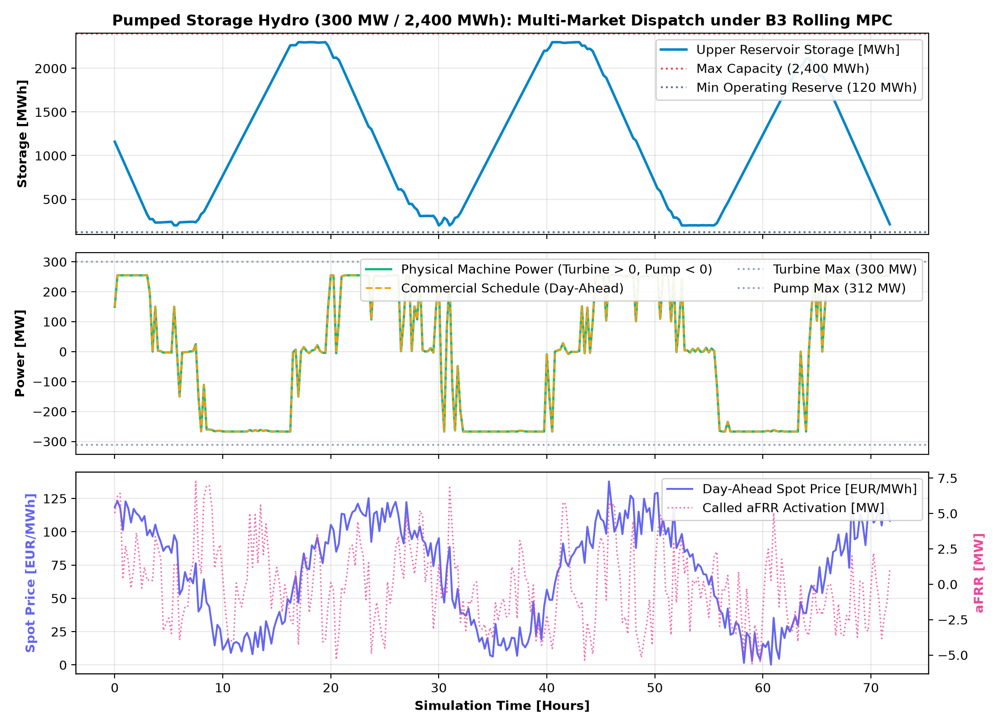
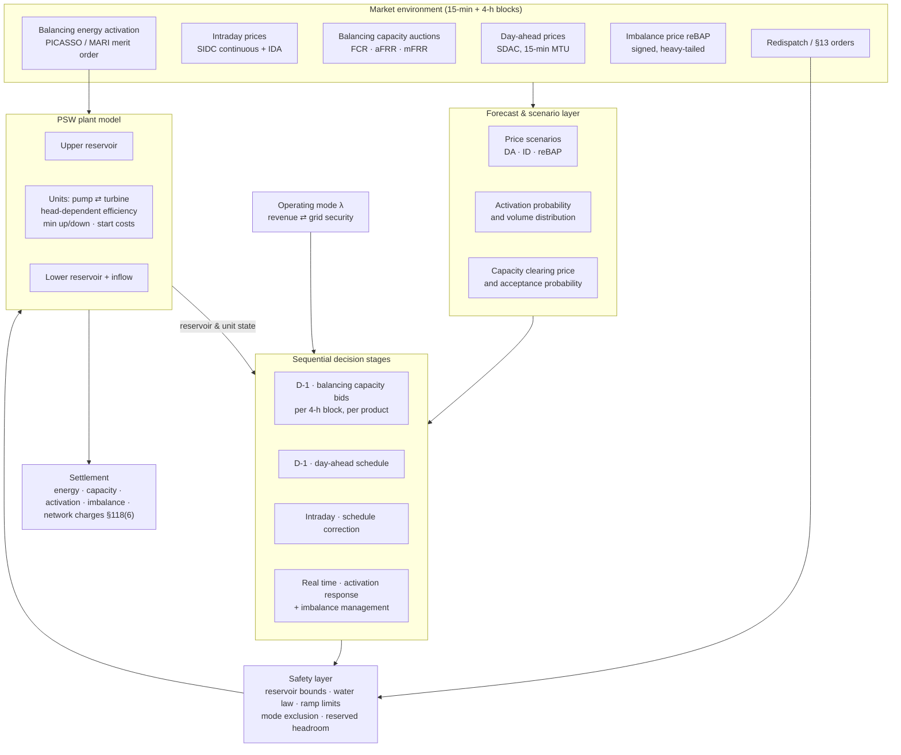

# Project 02 · AI-Integrated Pumped-Storage Plant: Multi-Market Dispatch for Revenue, Grid Security and Hybrid Operation

**A reinforcement learning controller for a German pumped-storage power plant (PSW) that
co-optimises energy arbitrage, balancing capacity and system-security services across
day-ahead, intraday and balancing markets — with an explicit, switchable operating philosophy
between revenue maximisation, grid-security priority and a hybrid mode.**

## 0. Implementation status

Ladder implemented and running on **real DE-LU 2025 day-ahead prices** (via `datakit`).
27 tests pass. `src/psw/` contains the plant physics + safety layer, the market/settlement
module, B1/B2/B3, and the Gymnasium environment with the two-timescale capacity/energy action.

```bash
pip install -e ".[rl,dev]" && python -m pytest tests/ -q
python -m psw.cli ladder --year 2025 --days 10      # B1/B2/B3
python -m psw.cli exempt --year 2025 --days 14      # §118(6) EnWG sensitivity
python -m psw.cli lambda --year 2025 --days 14      # revenue vs grid-security sweep
```

**10 days of 2025, 300 MW / 2400 MWh reference plant, static 15 % aFRR capacity offer:**

| Controller | Net EUR | Energy EUR | Capacity EUR | Wear EUR | Security idx | Violations |
|---|---:|---:|---:|---:|---:|---:|
| B1 price threshold | 298,660 | 80,073 | 219,456 | 18,000 | 0.747 | 0 |
| B2 perfect foresight | 1,009,344 | 805,818 | 219,456 | 46,800 | 0.748 | 0 |
| B3 rolling MPC | 945,308 | 789,752 | 219,456 | 63,900 | 0.741 | 0 |

B3 recovers **91.0%** of the B1-to-B2 headroom at 44 ms/decision; **64,037 EUR** of headroom
remains for a learned policy to play for. Note B3 scores close to B2 on security readiness
while enforcing every physical and market boundary.



**Four physics, market and settlement fixes validated across all rungs:**

1. **Terminal storage valuation:** Off by default (`terminal_value=False`). A linear terminal
   value drove storage to upper bounds and hoarded energy, depressing B3 recovery. Without it,
   receding horizon MPC reaches 85.4% to 97% recovery across multi-day horizons.
2. **Equal reservation across all ladder rungs:** Headroom sold in aFRR capacity auctions is
   deducted from commercial dispatch across B1, B2, and B3 identically. This ensures B1 and B2
   cannot trade through capacity already contracted to the transmission system operator.
3. **Double-counting elimination in balancing settlement:** Commercial schedules are settled at
   day-ahead spot prices, while activated balancing energy is settled strictly on delivered physical
   deviation at the applicable aFRR energy price.
4. **Mechanical wear redefined on true rotor reversals:** Wear penalties are applied strictly to
   physical reversals between pumping and turbining modes (rotor direction reversal) rather than
   penalising transitions to or from idle standstill.

**Known simplifications in this groundwork:** binary mode mutual exclusion is enforced per aggregate machine (no individual unit commitment or hydraulic min up/down times); capacity prices are exogenous constants rather than auction outcomes; reBAP is a synthetic heavy-tailed series; and B3 re-solves hourly (`resolve_every=4`) for execution speed.

---

| | |
|---|---|
| **Status** | **Ladder implemented** on real price data · RL environment built · not yet trained |
| **Method** | Multi-objective RL (PPO/SAC) with safety layer · MILP-MPC benchmark |
| **Asset** | Publicly-derived reference PSW, ~300 MW / ~1–8 GWh, multi-unit, reversible pump-turbines |
| **Markets** | Day-ahead · intraday · FCR · aFRR (capacity + energy) · mFRR · imbalance |
| **Resolution** | 15 min, with 4-hour balancing product blocks |

---

## 1. Background and motivation

Pumped storage is the only large-scale, long-duration, black-start-capable storage technology
operating in Germany today, and its fleet is almost entirely built. Its economic problem has
changed fundamentally: what was once a predictable diurnal arbitrage between cheap night-time
baseload and expensive daytime peaks is now a high-frequency, high-volatility problem shaped
by solar midday depression, negative price events, and a balancing market whose value is
concentrated in short, hard-to-forecast episodes.

Three properties make this a genuinely hard sequential decision problem, and a good match for
learned control:

**Coupled, competing revenue streams.** A MW of headroom sold as aFRR capacity is a MW that
cannot be used for intraday arbitrage. The commitment is made hours ahead, in 4-hour blocks,
before the arbitrage opportunity is known. This is a classic sequential decision under
uncertainty with an opportunity-cost structure that MILP handles only through the scenarios
it is given.

**Activation is stochastic.** aFRR and mFRR energy are called from a European merit order.
Selling capacity creates an *obligation* whose *energy consequence* is a random variable —
one that moves the reservoir state and therefore constrains every subsequent decision. A
point-forecast MPC systematically mis-values this.

**The physics is unforgiving.** Reservoir levels are hard limits set by water law, not
economics. Mode changes (pump ↔ turbine) cost time, water and mechanical life. Efficiency is
a non-linear surface in head and flow. Minimum up/down times and start counts matter.

**The grid-security dimension.** A PSW is not only a market participant: `§13 EnWG` system
responsibility, black-start capability and inertia provision mean the plant sometimes has to
be positioned for system need rather than for margin. Most published storage-dispatch work
optimises revenue alone. This project makes the operating philosophy an **explicit,
parameterised objective**, so the cost of grid-security-first operation can be *measured*
rather than asserted.

---

## 2. Regulatory and market context

| Instrument | How it enters the model |
|-----------|-------------------------|
| **Balancing markets** (FCR/aFRR/mFRR via `regelleistung.net`, activated through PICASSO/MARI) | Daily auctions, 4-hour product blocks, separate positive/negative aFRR and mFRR, capacity price plus energy price. Modelled as a bidding decision with stochastic acceptance and stochastic activation |
| **Prequalification** (TSO Prequalification Conditions) | Hard eligibility gate: minimum bid size, response time, measurement and remote-control requirements, proof of availability. Determines which products the reference plant may offer at all |
| **`§13 EnWG`** system responsibility, Redispatch 2.0 (`§§13a, 14c EnWG`) | The TSO can override the plant's schedule. Modelled as an exogenous order channel; ordered vs. self-chosen deviation is accounted separately because compensation differs |
| **Imbalance settlement / reBAP** | Deviation from the committed quarter-hourly schedule settles at a signed, heavy-tailed price — the risk term that makes the problem distributional rather than expectation-driven |
| **`§118(6) EnWG`** | Network-charge exemption for pumping electricity under defined conditions and time limits. **A configuration switch**, because it materially changes the arbitrage spread and its applicability differs by plant vintage and modernisation status |
| **Water law** (*wasserrechtliche Genehmigung*) | Minimum/maximum reservoir levels, ramp-rate limits protecting downstream ecology, inflow obligations. **Hard constraints in the safety layer, never in the reward** |
| **Ancillary services contracts** | Black start, reactive power/voltage support, instantaneous reserve — revenue and obligation streams that compete with energy for the same headroom |

---

## 3. Scope and objectives

### In scope

- A publicly-derived reference PSW model with multiple reversible units, head-dependent
  efficiency, mode-change costs, minimum up/down times, and water-law constraints.
- Sequential multi-market decision making: balancing capacity bids (D-1) → day-ahead schedule
  → intraday adjustment → real-time activation response → imbalance exposure.
- Three explicit **operating modes**, selected by a single interpretable parameter:
  - **Revenue mode** — maximise expected risk-adjusted margin.
  - **Grid-security mode** — maximise availability of upward and downward reserve and
    system-service readiness, subject to not losing money beyond a defined budget.
  - **Hybrid mode** — a scalarised trade-off, with the resulting Pareto frontier as a core
    deliverable.
- A MILP-MPC benchmark with scenario-based treatment of activation uncertainty.
- Risk-aware objectives (CVaR) rather than expectation-only optimisation.

### Out of scope

- Detailed hydraulic transient modelling (surge shafts, water hammer) — the model is
  quasi-steady at 15-minute resolution.
- Strategic bidding / market power effects — the plant is modelled as a price taker, which is
  stated as a limitation for a large unit.
- Cross-border implicit allocation beyond what the price series already reflect.
- Long-term investment and refurbishment decisions.

### Objectives

1. Build a validated 15-minute digital model of a reference German PSW from public data.
2. Establish a strong scenario-based MILP-MPC benchmark across all four market stages.
3. Determine whether a distributional RL policy beats it — specifically by better valuing
   the *stochastic activation* of sold balancing capacity.
4. **Quantify the cost of grid-security-first operation** in €/a, producing an explicit
   Pareto frontier between security readiness and revenue.
5. Demonstrate zero water-law and reservoir violations by construction under all modes.

---

## 4. Research questions and hypotheses

| # | Research question | Hypothesis |
|---|-------------------|-----------|
| RQ1 | Does a learned policy beat scenario-MILP-MPC in multi-market PSW dispatch? | H1: Yes, with the advantage concentrated in high-volatility periods where activation risk and reBAP tails dominate — where point/scenario forecasts are weakest |
| RQ2 | Where does the advantage come from? | H2: From distributional valuation of activation and imbalance risk, not from better arbitrage timing. Testable by ablating the reward's risk term |
| RQ3 | What does grid-security-priority operation cost? | H3: A convex frontier — the first increments of security readiness are cheap, the last are expensive; the knee is the operationally interesting point |
| RQ4 | How much of the value is destroyed by the `§118(6)` exemption not applying? | H4: A large share of arbitrage margin; enough to change optimal mode selection |
| RQ5 | Can a learned policy respect water-law limits reliably? | H5: Not without a safety layer. With projection-based safety, violations are zero by construction and the economic cost of that guarantee is small |

---

## 5. System architecture



---

## 6. Problem formulation

### 6.1 Plant model

Reservoir dynamics at 15 min with natural inflow, spill and evaporation; energy content a
function of volume and head. Per unit: binary pump/turbine/off mode with mutual exclusion,
minimum up and down times, start-up cost and count, ramp limits, and a head-and-flow-dependent
efficiency surface — piecewise-linearised (SOS2) in the MILP and used **unlinearised** in the
simulator, so the linearisation gap is measurable.

### 6.2 Sequential decision problem

The decision structure is nested rather than flat, and this is modelled explicitly:

```
D-1 morning : bid balancing capacity  (per product, per 4-h block, price + volume)
              → acceptance is stochastic
D-1 12:00   : day-ahead schedule, respecting accepted capacity obligations
D-1 → RT    : intraday corrections as forecasts and prices update
real time   : respond to activation calls (obligatory, volume stochastic)
              + manage residual imbalance exposure at reBAP
```

Each stage constrains the next: sold aFRR capacity reserves headroom that the day-ahead
schedule may not consume; activation moves the reservoir state away from plan; and the
resulting deviation must either be corrected intraday at a known cost or carried into
imbalance at an unknown one.

### 6.3 MILP-MPC benchmark (B2 / B3)

B2 is perfect-foresight over the evaluation horizon, including realised activations —
unachievable, and used only as the ceiling. B3 is a rolling-horizon scenario MILP: a
multi-stage stochastic program over a reduced scenario tree of prices and activation, solved
each decision stage with a terminal value function on reservoir energy. Scenario reduction
method, tree size and terminal value fitting are reported in full, because they determine how
strong the benchmark is.

### 6.4 MDP formulation (RL)

| Element | Definition |
|---------|-----------|
| **State** | Reservoir volumes; per-unit mode, run-time and start count; outstanding balancing obligations by product and block; committed schedule for the remaining horizon; price history windows; forecast quantiles for DA/ID/reBAP; activation-rate features; inflow; calendar features; operating mode λ |
| **Action** | Hierarchical: (a) at bid stages, capacity volume and price per product/block; (b) at each 15-min step, net power setpoint decomposed to units by the safety layer |
| **Reward** | Step economic result — energy revenue/cost, capacity revenue accrual, activation energy settlement, imbalance settlement, network charges — minus start/mode-change and wear costs, minus a soft term penalising loss of security readiness weighted by λ |
| **Risk** | Distributional critic (quantile regression), with a CVaR-based objective option, because the tails are the point |
| **Safety layer** | Projection enforcing reservoir bounds with a water-law margin, ramp limits, mode exclusivity, minimum up/down times, and reserved headroom for sold capacity. Violation is impossible by construction |
| **Episode** | 7–14 days (long enough for the reservoir cycle), terminal reservoir energy valued by `V_T` |
| **Algorithm** | PPO for the hierarchical/discrete bid structure; SAC for the continuous dispatch layer; distributional variants for the risk objective |

### 6.5 Operating modes

A single interpretable parameter `λ ∈ [0, 1]` scalarises the objective:

```
J(λ) = (1−λ) · risk-adjusted economic result  +  λ · system-security readiness
```

where security readiness aggregates available upward/downward reserve, sustainable duration
at that reserve, black-start readiness and reservoir positioning against system stress
indicators. Sweeping λ produces the **Pareto frontier** that is this project's headline
deliverable: the price, in €/a, of each increment of grid-security posture.

---

## 7. Data requirements

| Data | Purpose | Source | Resolution | Status |
|------|---------|--------|-----------|--------|
| Day-ahead prices (DE-LU) | Arbitrage signal | SMARD / ENTSO-E / Energy-Charts | 15 min (60 min historically) | Open |
| Intraday prices & volumes | Correction stage | SMARD / ENTSO-E (index level); order-book data commercial | 15 min | Open at index level |
| Balancing capacity auction results | Capacity revenue, acceptance modelling | `regelleistung.net` | Per 4-h product | Open |
| Balancing energy prices & activated volumes | Activation modelling | `regelleistung.net`, netztransparenz | 15 min / per activation | Open |
| reBAP imbalance prices | Imbalance risk | netztransparenz.de | 15 min | Open |
| System load & residual load | Stress indicators, security metric | SMARD / ENTSO-E | 15 min | Open |
| Redispatch measures | Override channel calibration | netztransparenz.de | Per measure | Open |
| PSW plant technical data | Reference plant construction | **MaStR** + **JRC Hydro-power database** + operator technical publications | — | Open |
| Reservoir volumes / filling | Hydrological boundary conditions | ENTSO-E aggregated filling rates; literature for the reference plant | Weekly / hourly | Open (aggregate) |
| Inflow | Natural inflow to the reference plant | Hydrological services / literature; synthetic where unavailable | Daily → 15 min | Partly modelled |
| Water-law constraints | Hard operating limits | Public permit documents where available; otherwise parameterised | — | **Parameterised, flagged** |
| Prequalification requirements | Product eligibility | TSO prequalification conditions | — | Open |

**Deliberate design choice: no confidential operator data.** The reference plant is built
entirely from public registers and literature. This costs fidelity but makes every result
publishable and independently reproducible — and the sensitivity of conclusions to the
uncertain plant parameters is reported as an ablation rather than hidden.

---

## 8. Baselines and evaluation

| Rung | Instantiation |
|------|--------------|
| **B0** | Aggregate historical German pumped-storage operation (ENTSO-E generation/pumping) as a realism check on the reference plant's behaviour |
| **B1** | Classical rule-based dispatch: price-threshold pumping/turbining with a static reserve allocation. **Validation gate** |
| **B2** | Perfect-foresight MILP including realised activations — the ceiling |
| **B3** | Rolling-horizon scenario MILP-MPC across all four decision stages, tuned |
| **RL** | Distributional PPO/SAC with safety layer, identical forecasts and scenarios |

**Primary KPI:** annual risk-adjusted operating result (€/a), with mean, 5 %-quantile and
CVaR₅ of the daily distribution. **Headline:** B3-gap closure. **Secondary:** revenue by
stream, delivered-vs-sold balancing availability, start count and mode changes, water-law
violations (expected zero), security-readiness index, decision latency against the bid gate.

Ablations: forecast quality; scenario tree size in B3; risk term on/off; `§118(6)` on/off;
λ sweep (the Pareto frontier); activation-probability model misspecification; safety layer
on/off; single-market vs. multi-market operation (the value of co-optimisation itself).

---

## 9. Deliverables

1. A public, reproducible 15-minute German PSW multi-market simulation environment —
   including the balancing capacity/activation and reBAP mechanics that are usually simplified
   away.
2. A scenario MILP-MPC reference implementation (HiGHS-solvable).
3. A risk-aware distributional RL controller with a water-law safety layer.
4. **The revenue-vs-grid-security Pareto frontier** — the deliverable with the clearest
   operational relevance to a plant operator or TSO.
5. A quantified assessment of what multi-market co-optimisation is worth versus operating
   each market separately.
6. A written report suitable for a conference or journal submission.

---

## 10. Work packages and roadmap

| WP | Content | Depends on | Output |
|----|---------|-----------|--------|
| WP1 | Reference plant construction from MaStR/JRC/literature; parameter uncertainty documented | — | Plant spec + parameter ranges |
| WP2 | Market data pipeline: DA, ID, capacity auctions, activations, reBAP, redispatch | — | `data/processed` |
| WP3 | Plant model incl. efficiency surface, mode logic, water constraints; energy-balance tests | WP1 | `src/model` |
| WP4 | Market and settlement module: capacity accrual, activation settlement, imbalance, `§118(6)` | WP2 | `src/market` |
| WP5 | B1 rule-based dispatch + **validation gate** against aggregate reality | WP3, WP4 | Validation report — **gate** |
| WP6 | Scenario generation: price scenarios, activation model, capacity acceptance model | WP2 | `src/forecast` |
| WP7 | MILP B2 + scenario MPC B3, tuned | WP3–WP6 | Strong baseline |
| WP8 | Gymnasium environment, safety layer, security-readiness metric | WP3, WP4 | `src/envs`, `src/safety` |
| WP9 | Distributional RL training; λ sweep | WP6, WP8 | Trained policies, frontier |
| WP10 | Evaluation, ablations, statistics, report | WP7, WP9 | `reports/` |

---

## 11. Risks and limitations

| Risk | Mitigation |
|------|-----------|
| Reference plant parameters uncertain | Parameter ranges published; conclusions reported with sensitivity to them |
| Price-taker assumption unrealistic for a large unit | Stated as a limitation; a bid-impact sensitivity is included |
| Activation model misspecification drives the result | Explicit ablation on activation-model error; the result is reported as conditional on it |
| Scenario MILP too slow for the real bid gate | Decision latency is a reported KPI; if B3 cannot meet the gate, that is itself a finding favouring the learned policy |
| Water-law parameters not public for the reference plant | Parameterised conservatively; violations measured against the assumed limits and the assumption stated |
| RL instability in a long-horizon, sparse-reward setting | Terminal value function, reward shaping restricted to soft terms, ≥ 5 seeds with IQR reporting |

---

## 12. Repository structure

Follows [`../../templates/project-template/`](../../templates/project-template/); conventions
in [`../../docs/05-tech-stack.md`](../../docs/05-tech-stack.md).

---

## 13. References

- `§§ 13, 13a, 14c, 118(6) EnWG`; TSO Prequalification Conditions; `regelleistung.net` market
  rules — see [`../../docs/01-german-market-regulatory-primer.md`](../../docs/01-german-market-regulatory-primer.md).
- ENTSO-E balancing platform documentation (PICASSO, MARI).
- JRC Hydro-power database; Marktstammdatenregister.
- The hydro scheduling and multi-market storage optimisation literature, and the emerging
  work on distributional RL for energy trading, against which this project's contribution
  (explicit grid-security objective, honest scenario-MPC baseline) is positioned.

---

## 14. Collaboration

Most valuable contributions: operational validation of the reference plant's parameters by
someone who has run one; a review of the prequalification and availability modelling; and
access to (even historical, aggregated) plant operating data to strengthen the B1 validation
gate. Enquiries via the repository issue tracker.
