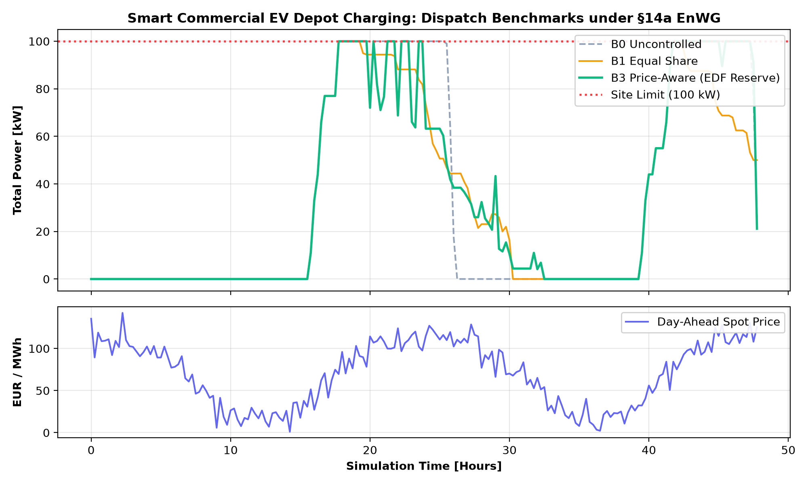
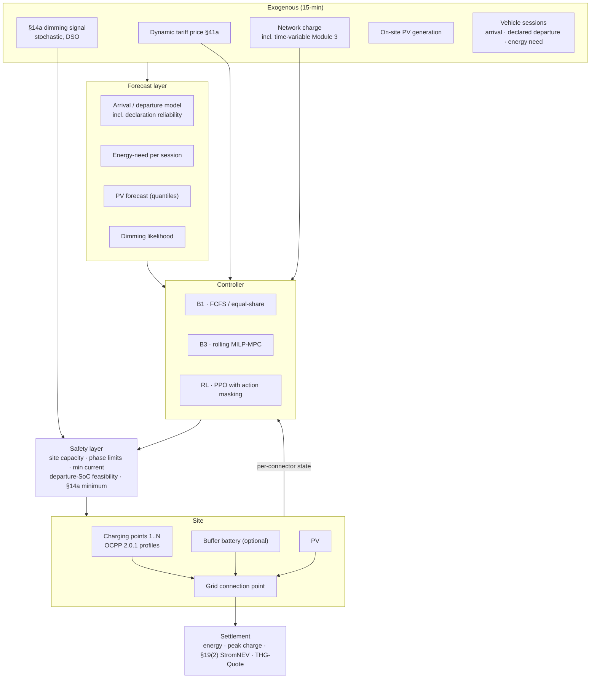

# Project 03 · Smart EV Charging, Load Sharing and Grid-Orientated Control under `§14a EnWG`

**A constrained reinforcement learning charging controller for German depot, workplace and
apartment-block charging hubs — allocating limited connection capacity across many vehicles
under dynamic tariffs, `§14a EnWG` dimming, peak-charge exposure and hard departure
commitments.**

## 0. Implementation status

Session generator, tariff (including all three `§14a` modules), the safety layer with an
**EDF feasibility reserve**, and B0/B1/B3 implemented and running on real DE-LU 2025 prices.
20 tests pass.

```bash
pip install -e ".[dev]" && python -m pytest tests/ -q
python -m evc.cli ladder     --archetype depot
python -m evc.cli modules    --archetype depot     # §14a module comparison
python -m evc.cli dimming    --archetype depot     # cost vs dimming frequency
python -m evc.cli archetypes                       # depot / workplace / apartment
```

**Depot archetype, 40 connectors, 250 kW site limit, 14 days of 2025:**

| Controller | Net cost € | Energy kWh | Peak kW | THG € | Missed | Fairness |
|---|---:|---:|---:|---:|---:|---:|
| B0 uncontrolled | 5,623.19 | 28,263 | 250.0 | 1,695.81 | **0** | 0.99 |
| B1 equal share | 5,571.55 | 28,201 | 250.0 | 1,692.08 | **0** | 0.99 |
| B3 price greedy | **5,391.28** | 28,172 | 250.0 | 1,690.30 | **0** | 0.99 |



Every declared departure is met on every rung, and the price-aware controller is cheapest,
4.1% below uncontrolled charging. The run header reports site utilisation against the
*deliverable charging window* (71%, "feasible") rather than against the clock, because a site
can have ample daily energy capacity and still be infeasible if all the dwell time is at night.

**The technical core: the EDF feasibility reserve.** The obvious safety layer, checking each
connector's own minimum required power, is insufficient, and the failure mode is instructive.
A set of vehicles can be *individually* comfortable and *collectively* impossible: three cars
each needing 40 kWh in two hours each require 20 kW, comfortably under a 22 kW connector, but
together demand 60 kW from a 44 kW site. The per-connector test sees nothing wrong until it is
far too late.

The correct condition is the classical earliest-deadline-first test: for every horizon `h`,
`Σ_{deadline ≤ h} E_i ≤ limit · h · Δt`, which yields a floor on total power now. The first
version of this project lacked it, and the price-aware controller consequently deferred
charging into a corner it could not escape, **missing more departures (108) than doing nothing
at all (53)**.

**How the last misses were eliminated.** With the reserve in place, 18 to 19 misses remained,
and this README previously blamed "zero-slack sessions". That explanation was wrong. The
misses were identical across every controller, which pointed away from scheduling, and two
causes turned up:

1. **Truncation at the end of the simulated window.** A depot car arriving at 16:30 on the
   final day would naturally leave the next morning; the generator cut its stay at the last
   simulated step and squeezed its energy into seven hours. Several such cars then demanded
   full power at once. These sessions are now **right-censored**: simulated, drawing power,
   keeping their natural deadline, and never scored, because their outcome is unobserved.
2. **Minimum current undid the reserve.** A car past its *declared* departure but still plugged
   in has a per-connector requirement of zero, so the "off or at least 6 A" rule switched off
   the small top-up the aggregate floor had just assigned it, and shedding treated it as
   optional. Power the floor requires is now protected from both.

Both have regression tests. The general lesson: a miss count that does not change across
controllers is a property of the *environment*, not of the controllers, and deserves
suspicion before interpretation.

**Not yet built:** the peak-tracking MILP (B2/B3 proper — the current B3 is a documented greedy
stand-in), the RL policy with a permutation-invariant set encoder, and the fitted ACN-Data /
ElaadNL session distributions. Sessions are currently synthesised from archetype parameters.

---

| | |
|---|---|
| **Status** | **Safety layer + B0/B1/B3 implemented** · MILP and RL policy not yet built |
| **Method** | Constrained RL (PPO with action masking) + projection safety layer · MILP-MPC benchmark |
| **Asset** | 10–100 non-public charging points, 50 kW–1 MW connection, optional on-site PV and buffer battery |
| **Resolution** | 15 min |
| **Interfaces** | OCPP 2.0.1 (charge point) · EEBUS / SMGW-CLS (`§14a` control) |

---

## 1. Background and motivation

Charging infrastructure is where the energy transition's electricity and mobility sides
collide, and where grid capacity binds first. A depot with 40 vehicles and 11 kW charge points
has 440 kW of connected load against a grid connection that is typically a fraction of that.
The question is never "can we charge?" but "**who charges, when, and at what power**" — a
resource allocation problem with hard individual deadlines, a shared capacity constraint, and
now a regulator-mandated interrupt.

Three things make the German setting specifically interesting:

**`§14a EnWG` makes dimming a design assumption, not an edge case.** Since 1 January 2024,
non-public charging points above roughly 4.2 kW are controllable consumption devices: the DSO
may reduce them, guaranteeing only a minimum power, in exchange for a reduced network charge.
A depot operator therefore chooses a network-charge module (Modules 1/2/3), accepts a
stochastic curtailment right, and must *still* get every vehicle to its departure SoC. A
naive scheduler that treats dimming as an anomaly will miss departures.

**The cost function is not just energy.** Under dynamic tariffs (`§41a EnWG`) the energy price
varies quarter-hourly; network charges may be time-variable under `§14a` Module 3; a
peak-power charge (and, for larger sites, `§19(2) StromNEV` atypical-network-use arrangements)
prices the single worst quarter-hour of the year; and **THG-Quote** revenue attaches to the
charged electricity. These four terms pull in different directions, and the optimal policy is
not obvious.

**The problem is combinatorial and high-dimensional but has strong structure.** With N
vehicles each having arrival, departure, energy requirement and charging curve, a MILP grows
quickly, while the *decision* is highly repetitive and shaped by recurring site patterns. This
is precisely the profile where a learned policy can plausibly beat MPC — not on solution
quality per instance, but on **decision latency and on latent behavioural structure** (which
declared departure times are reliable, which vehicles return early, how the site behaves on a
Monday).

---

## 2. Regulatory and market context

| Instrument | How it enters the model |
|-----------|-------------------------|
| **`§14a EnWG`** | Non-public charging points are controllable consumption devices. The DSO may dim to a guaranteed minimum. Module 1 (flat network-charge reduction), Module 2 (energy-component reduction), Module 3 (time-variable network charges) are **selectable configurations** with different optimal behaviour |
| **`§41a EnWG`** dynamic tariffs | Quarter-hourly energy price signal, available day-ahead |
| **Network charges & peak pricing** | Capacity/peak component prices the annual maximum quarter-hour; `§19(2) StromNEV` atypical network use offers reduced charges for demonstrably off-peak-shifted load — a strong shaping incentive for depots |
| **THG-Quote** | Greenhouse-gas quota revenue per kWh charged — a real revenue line that rewards *charging more*, in tension with peak shaving. Included as an objective term |
| **Ladesäulenverordnung (LSV)** | Applies to *public* charging. This project targets **non-public** depot/workplace/apartment charging, which is outside LSV — stated explicitly to keep the compliance framing correct |
| **AFIR** (EU 2023/1804) | Relevant for public infrastructure; noted as out of scope but modelled as a boundary condition where a site has mixed public/non-public points |
| **Eichrecht** (calibration law) | Billing-relevant measurement must be verifiable — constrains what the controller may bill members/employees for (relevant where charging is re-billed) |
| **OCPP 2.0.1 / EEBUS** | The actuation vocabulary: smart charging profiles, per-connector limits, minimum currents. Determines action granularity and latency |
| **Building/connection limits** | Grid connection capacity and, for apartment blocks, the shared house connection (*Hausanschluss*) — the binding physical constraint |

---

## 3. Scope and objectives

### In scope

- Three site archetypes, sharing one model: **commercial depot** (fleet, predictable
  departures, high utilisation), **workplace** (long dwell, flexible, PV-correlated), and
  **apartment block** (overnight, shared house connection, individual billing).
- Dynamic load management: per-connector power allocation under a site capacity limit, with
  phase-level constraints and minimum-current limits.
- `§14a` dimming as a stochastic exogenous interrupt, plus module selection as a decision.
- Multi-term objective: energy cost, peak/capacity charge, THG revenue, departure-SoC
  fulfilment, and fairness across users.
- Optional on-site PV and buffer battery.
- A constrained RL controller with guaranteed feasibility, benchmarked against MILP-MPC.

### Out of scope

- Public charging, roaming, ad-hoc payment and LSV compliance.
- Vehicle-to-grid (V2G) — deliberately excluded because German regulatory and metering
  treatment of bidirectional charging is not settled enough for a defensible economic model;
  the environment is designed so V2G can be added later as a signed action.
- Battery degradation of the *vehicle* — modelled only as a soft constraint on high C-rates.
- Distribution network power flow beyond the connection point (backlog item **B2**).

### Objectives

1. Quantify the cost of `§14a` compliance for each site archetype — how much a guaranteed
   dimming right costs an optimised site, against the network-charge reduction it buys.
2. Determine the optimal `§14a` module per archetype, and how sensitive that choice is to
   dimming frequency.
3. Establish whether a constrained learned policy beats MILP-MPC — expected primarily via
   decision latency at scale and via learned behavioural structure (unreliable declared
   departures).
4. Deliver **zero missed departures** and **zero capacity violations** by construction, and
   measure what that guarantee costs.
5. Characterise the fairness/efficiency trade-off in shared-capacity allocation.

---

## 4. Research questions and hypotheses

| # | Research question | Hypothesis |
|---|-------------------|-----------|
| RQ1 | What does `§14a` grid-orientated control cost an optimised charging site? | H1: For depots with slack dwell time, close to zero — the reduced network charge dominates. For high-utilisation depots, the dimming right binds and Module 1 becomes preferable to Module 3 |
| RQ2 | Does constrained RL beat MILP-MPC here? | H2: Not on per-instance solution quality, where MPC is near-optimal, but on decision latency at N > ~50 connectors and on exploiting learned departure-time unreliability |
| RQ3 | How should declared departure times be treated? | H3: Declared times are systematically pessimistic; a policy that learns the site's distribution outperforms one that takes declarations literally — but only if the safety layer still guarantees the declared deadline |
| RQ4 | How do the four objective terms interact? | H4: THG revenue and peak charges are directly opposed; the optimal policy is peak-limited, not energy-limited, above a site-specific utilisation threshold |
| RQ5 | Can fairness be imposed cheaply? | H5: Proportional-fairness allocation costs little relative to a pure cost-minimising allocation, and materially improves worst-user outcomes |

---

## 5. System architecture



---

## 6. Problem formulation

### 6.1 MILP (B2 / B3)

For each vehicle session `v` with arrival `a_v`, declared departure `d_v`, required energy
`E_v` and maximum charging power `P_v(SoC)`:

**Objective** — minimise
```
Σ_t [ c_energy(t)·p_grid(t)·Δt + c_net,var(t)·p_grid(t)·Δt ]      energy + variable network charge
  + c_peak · max_t p_grid(t)                                       peak/capacity charge
  − r_thg · Σ_v E_v,delivered                                      THG-Quote revenue
  + Σ_v c_unmet · (E_v − E_v,delivered)⁺                           unmet-departure penalty (soft in MILP,
                                                                   hard in the safety layer)
```

**Constraints** — per-session energy accumulation between arrival and departure; per-connector
power bounds with minimum charging current (a semi-continuous variable: either zero or above
the minimum — this is what makes the problem genuinely integer); site power balance including
PV and buffer battery; **site capacity limit** and per-phase limits; and, when dimming is
active, an aggregate cap on controllable power at the `§14a` guaranteed minimum.

The peak term makes the problem non-separable across the whole billing period, which is why
B3 needs a peak-tracking state variable rather than a naive horizon-local formulation — a
detail frequently missed, and one that would otherwise leave a weak baseline.

### 6.2 MDP formulation (RL)

| Element | Definition |
|---------|-----------|
| **State** | Per-connector: occupancy, SoC, energy still required, time to declared departure, max power. Site: current load, PV, running peak, remaining capacity headroom. Market: price window (realised + forward), network-charge state. Regulatory: `§14a` signal, recent dimming history. Calendar features |
| **Observation encoding** | Permutation-invariant set encoder (deep-sets / attention) over connectors, so one policy generalises across site sizes and connector counts — a key design decision for transferability |
| **Action** | Per-connector power level, continuous in [0, P_max] but masked to {0} ∪ [P_min, P_max] to respect minimum charging current |
| **Reward** | Negative energy + network cost of the step, minus incremental peak cost when a new peak is set, plus THG revenue, minus soft fairness and switching penalties. **Departure fulfilment is not a reward term** — it is enforced |
| **Safety layer** | A small LP/QP projecting the proposed allocation onto the feasible set: site and phase capacity, minimum currents, `§14a` cap, and a **feasibility-preserving reserve** guaranteeing every connected vehicle can still reach its declared SoC by its declared departure. If the site is genuinely infeasible, a documented, auditable priority rule applies |
| **Episode** | 7 days (to expose weekly patterns and the peak dynamic), with the running peak carried in state |
| **Algorithm** | PPO with action masking; SAC as a continuous-control cross-check |

The **feasibility-preserving reserve** is the technical core: at every step the layer checks
that a feasible completion exists for all connected vehicles, and constrains the action set to
those that preserve it. This is what converts "the agent usually meets departures" into "the
agent cannot miss one" — the difference between a demo and a deployable controller.

---

## 7. Data requirements

| Data | Purpose | Source | Resolution | Status |
|------|---------|--------|-----------|--------|
| EV charging sessions | Arrivals, dwell times, energy per session | **ACN-Data** (Caltech, ~50k workplace sessions), **ElaadNL** open datasets | Per session | Open |
| German mobility statistics | Re-weighting arrival/departure/energy to German behaviour | **MiD**, **MOP** (scientific-use files) | Trip level | On request |
| Fleet/depot duty cycles | Depot archetype | Published logistics duty-cycle studies; synthetic generator calibrated to them | Per vehicle-day | Partly synthetic |
| Vehicle charging curves | Power limits vs. SoC | Public measurement databases, manufacturer specifications | — | Open |
| Day-ahead / dynamic tariff prices | Energy cost signal | SMARD / ENTSO-E / Energy-Charts; aWATTar structure | 15 min | Open |
| Network charge sheets | Peak charge, energy component, `§14a` modules, time-variable windows | DSO published price sheets; BNetzA determinations | Annual | Open |
| THG-Quote prices | Revenue term | Published market quotes | Annual/quarterly | Open |
| PV generation | On-site generation | DWD + `pvlib`; PVGIS | 15 min | Open |
| `§14a` dimming events | The interrupt | **No public dataset.** Parameterised stochastic model; frequency/duration reported as a sensitivity sweep | 15 min | **Gap — modelled, flagged** |
| Site electrical topology | Phase and capacity constraints | Site archetype definitions built from LSV/VDE-AR-N connection guidance | — | Constructed |

**Validity threat, stated plainly.** Charging behaviour is cultural and site-specific;
ACN-Data is a Californian campus and ElaadNL is Dutch. The project fits *structure* (session
energy distributions, dwell-time shapes, arrival clustering) from these datasets and
re-weights the arrival/departure marginals with German mobility statistics. The substitution,
and a sensitivity analysis over the re-weighting, are reported as a limitation rather than
buried.

---

## 8. Baselines and evaluation

| Rung | Instantiation |
|------|--------------|
| **B0** | Uncontrolled charging (charge at maximum on arrival) — the status quo at most sites, and the commercially relevant reference |
| **B1** | Static load management: equal share of available capacity, FCFS priority. **Validation gate** against measured site behaviour where available |
| **B2** | Perfect-foresight MILP over the billing period (knows all arrivals, departures and true energy needs) |
| **B3** | Rolling-horizon MILP-MPC with peak-tracking state, realistic session forecasts, re-solved every 15 min |
| **RL** | PPO with set encoder, action masking and feasibility-preserving safety layer |

**Primary KPI:** total annual site cost (energy + network + peak) net of THG revenue.
**Hard constraints:** missed departures (must be 0), capacity violations (must be 0).
**Secondary:** peak demand (kW), self-consumption where PV present, fairness (Jain index and
worst-user delivered-energy ratio), switching events per connector, decision latency vs. site
size N.

Ablations: `§14a` module 1/2/3; dimming frequency sweep; declared-departure reliability;
site size N ∈ {10, 25, 50, 100} (the latency and scaling claim); forecast quality; safety
layer on/off; objective-term ablation; with/without buffer battery and PV.

---

## 9. Deliverables

1. A reusable, permutation-invariant German charging-hub environment (Gymnasium) with correct
   `§14a`, network-charge, peak-charge and THG accounting.
2. A MILP-MPC reference with correct peak-charge treatment — itself a contribution, since
   horizon-local formulations get this wrong.
3. A constrained RL controller with a **provable** feasibility guarantee on departures.
4. A `§14a` module recommendation per site archetype, with the dimming-frequency sensitivity.
5. A latency-vs-site-size scaling study — the practical argument for learned control here.
6. An OCPP 2.0.1-shaped control interface specification, so the controller maps onto real
   hardware rather than an abstraction.

---

## 10. Work packages and roadmap

| WP | Content | Depends on | Output |
|----|---------|-----------|--------|
| WP1 | Session data pipeline; German re-weighting; three site archetypes | — | `data/processed`, archetype specs |
| WP2 | Site model: connectors, phases, capacity, PV, buffer battery, OCPP-shaped actuation | WP1 | `src/model` |
| WP3 | Tariff & settlement module: energy, network charges incl. Modules 1–3, peak, `§19(2)`, THG | — | `src/market` |
| WP4 | B0 uncontrolled + B1 static load management + **validation gate** | WP2, WP3 | Validation report — **gate** |
| WP5 | MILP with peak-tracking; B2 perfect foresight | WP2, WP3 | `src/baselines` |
| WP6 | B3 rolling MPC, tuned; latency profiling vs. N | WP5 | Strong baseline |
| WP7 | Session/arrival forecast models incl. declaration-reliability model | WP1 | `src/forecast` |
| WP8 | Gymnasium env, set encoder, action masking, feasibility-preserving safety layer | WP2, WP7 | `src/envs`, `src/safety` |
| WP9 | PPO training, seeds, transfer across site sizes | WP8 | Trained policies |
| WP10 | Evaluation, ablations, scaling study, report | WP6, WP9 | `reports/` |

---

## 11. Risks and limitations

| Risk | Mitigation |
|------|-----------|
| Non-German session data | Structure fitted from open data, marginals re-weighted with German statistics; sensitivity reported |
| No real `§14a` dimming data | Parameterised model with a sweep; the result is reported as a function of dimming intensity |
| MPC may match RL on quality | Expected. The claim is latency and behavioural structure, and both are measured explicitly rather than asserted |
| Feasibility guarantee may be over-conservative | The cost of the guarantee is a reported KPI; a relaxed variant is included as an ablation |
| Site archetypes may not represent real sites | Archetypes documented in full and parameterised; a real-site validation is the top collaboration priority |
| V2G omission limits relevance | Environment designed with signed actions so V2G can be added when the regulatory treatment settles |

---

## 12. Repository structure

Follows [`../../templates/project-template/`](../../templates/project-template/); conventions
in [`../../docs/05-tech-stack.md`](../../docs/05-tech-stack.md).

---

## 13. References

- `§14a EnWG` and the Bundesnetzagentur determinations on grid-orientated control and the
  associated network-charge reduction; `§41a EnWG`; `§19(2) StromNEV`; LSV; AFIR
  (EU 2023/1804) — see [`../../docs/01-german-market-regulatory-primer.md`](../../docs/01-german-market-regulatory-primer.md).
- OCPP 2.0.1 smart charging profiles; EEBUS SPINE/SHIP for `§14a` device control.
- ACN-Data (Caltech Adaptive Charging Network) and ElaadNL open charging datasets.
- The adaptive charging network and online scheduling literature, against which the
  contribution here is the German regulatory envelope and the hard feasibility guarantee.

---

## 14. Collaboration

Most valuable contributions: measured session data from a German depot or apartment-block
site; DSO dimming logs; and a review of the OCPP control-path assumptions by someone
operating charge-point management software in production. Enquiries via the issue tracker.
