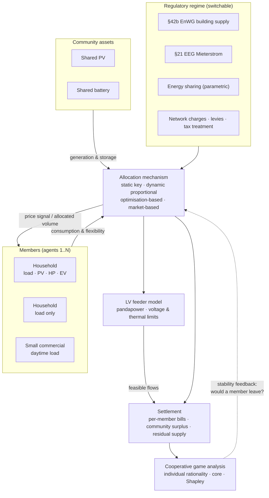

# Project 04 · Energy Sharing and Allocation in Renewable Energy Communities

**Multi-agent reinforcement learning and mechanism design for allocating shared renewable
generation, storage and flexibility across the members of a German energy community — under
`§42b EnWG` collective building supply, `§21 EEG` Mieterstrom, and the energy-sharing rules
being transposed from RED II.**

## 0. Implementation status

Community profiles, four allocation mechanisms, four legal regimes, settlement with
per-member bills, and individual-rationality/stability checks implemented. 19 tests pass.

```bash
pip install -e ".[dev]" && python -m pytest tests/ -q
python -m rec.cli mechanisms   # the four allocation families
python -m rec.cli regimes      # individual / Mieterstrom / §42b / energy sharing
python -m rec.cli policy       # RQ5: charges on shared energy — the decisive parameter
python -m rec.cli correlation  # how much benefit is a profile-generator artefact
```

**The headline result — RQ5, network charges on shared energy** (20 members, 14 days):

| Shared network charge €/kWh | Community cost € | vs individual € | Members worse off | Min saving € |
|---:|---:|---:|---:|---:|
| 0.000 | 1,426.64 | +584.35 | 0 | +0.88 |
| 0.010 | 1,460.23 | +550.76 | 0 | +0.53 |
| 0.020 | 1,493.81 | +517.18 | 0 | +0.18 |
| **0.030** | 1,527.39 | +483.59 | **20** | −3.52 |
| 0.050 | 1,594.56 | +416.43 | 20 | −17.58 |
| 0.085 | 1,712.11 | +298.88 | 20 | −42.20 |

There is a **cliff between 0.02 and 0.03 €/kWh**. Below it every member gains; above it *every
single member* is worse off than on individual supply — while the community-level column still
reports a healthy saving. Both numbers are correct: the community total includes export
revenue accruing to the *operator*, whereas members pay their own bills. Above the threshold
the community only holds together if that surplus is explicitly redistributed, which is
precisely the mechanism-design question this project exists to ask. **A study reporting only
the community total would conclude energy sharing works at 0.085 €/kWh. It does not.**

**Mechanisms differ in distribution, not in aggregate** — under obedient members. With one
shared generation pool and no binding per-member constraint, energy shared in a step is
`min(generation, total consumption)`, a function of the aggregate alone; the mechanism only
moves money between members. The four families produce Gini coefficients from 0.458
(static key) to 0.540 (market) on identical totals. This is the clean baseline against which
the *obedience gap* — how much survives individually-rational members — will be measured.

**A design trap found by testing:** if the internal price sits too low relative to the
feed-in tariff, the community is better off **exporting than sharing**. At the `§42b` defaults
(shared 0.238, grid 0.286, export 0.0786 €/kWh) sharing saves only 0.048 €/kWh, so the static
key — which shares *less* and exports more — beats the adaptive mechanisms on community cost.
The internal price is a decision variable, not a constant.

> **Limitation, asserted in the test suite so it cannot be quietly forgotten.** The
> inter-member correlation parameter currently changes neither the total nor the distribution
> materially, because member benefit is dominated by member *size* (1,800–25,000 kWh/a) and
> inter-member variation is modelled as multiplicative noise around a shared diurnal shape.
> Real heterogeneity is in the *shape* — shift workers, empty daytime flats, a bakery starting
> at 04:00 — and that does change overlap with PV. Until per-member shapes are fitted from the
> measured HTW Berlin profiles, any claim about the *size* of the community benefit from this
> generator is indicative only. `test_correlation_moves_the_distribution_not_the_total` will
> fail loudly the day that changes.

**Not yet built:** the PettingZoo multi-agent environment with individually-rational members
(the obedience gap, H3), cooperative game analysis (core membership, Shapley estimation), and
the pandapower LV feeder model — the current feeder check is a transformer-level flow limit.

---

| | |
|---|---|
| **Status** | **Mechanisms + regimes + settlement implemented** · multi-agent RL and game analysis not yet built |
| **Method** | Cooperative multi-agent RL (PettingZoo) + allocation mechanism comparison + cooperative game theory |
| **Actors** | 20–200 members: households, small commercial, shared PV, shared battery, heat pumps, wallboxes |
| **Resolution** | 15 min |
| **Key question** | Not "how much can a community save?" but "**how should the savings be allocated, and does the allocation rule change the physics?**" |

---

## 1. Background and motivation

Energy communities are usually evaluated on a single number: the collective self-consumption
rate, or the aggregate saving relative to individual supply. That framing hides the two
questions that actually determine whether a community works.

**First: the allocation rule is not neutral.** How shared PV output is attributed to members
determines each member's *price signal*, and therefore their behaviour. A static allocation
key gives members no incentive to shift load into surplus hours. A dynamic proportional key
rewards consumption whenever the community is in surplus — including when that is collectively
useless. An optimisation-based allocation can be collectively efficient but arbitrary from an
individual member's point of view, and may be unstable in the game-theoretic sense: a member
who is worse off than they would be alone will leave. **The allocation rule feeds back into
the physical operation of the community**, which is exactly the coupling that single-number
evaluations miss.

**Second: the legal form determines what is possible.** Germany offers several distinct
routes — Mieterstrom under `§21(3) EEG`, collective building supply under `§42b EnWG`
(introduced by *Solarpaket I* in 2024), citizen energy companies under `§3 Nr. 15 EEG` — and
broader energy sharing across the public grid has been the subject of successive EnWG
amendment drafts transposing RED II Article 22 and IEMD Article 16. Each route implies
different metering, supplier obligations, levy treatment and network-charge exposure.

This project is therefore designed to be **robust to the legal outcome**: it implements
several candidate legal/allocation regimes on the same physical and behavioural substrate and
compares them, so the results remain valid whichever variant is finally in force.

---

## 2. Regulatory context

| Route | Legal basis | Modelled characteristics |
|-------|-------------|--------------------------|
| **Individual supply** (reference) | — | Each member independently supplied; PV self-consumption only behind their own meter |
| **Mieterstrom** | `§21(3) EEG` | Landlord-operated supply to tenants in the same building, Mieterstrom surcharge, full supplier obligations, on-site generation only |
| **Gemeinschaftliche Gebäudeversorgung** | `§42b EnWG` (*Solarpaket I*, 2024) | Lighter-weight building-level sharing without full supplier obligations; allocation of on-site generation among building units |
| **Energy sharing across the grid** | RED II Art. 22 / IEMD Art. 16; German transposition via EnWG amendments | Members at different connection points share generation; **modelled parametrically** over the plausible design space (network-charge treatment, levy treatment, geographic scope, allocation timing) because the enacted detail is decisive and was still in motion |
| **Bürgerenergiegesellschaft** | `§3 Nr. 15 EEG` | Privileged status, tendering exemptions under conditions — relevant to community-owned generation assets |

**Design consequence.** Everything regulatory is a configuration switch: whether network
charges apply to shared energy, whether levies and electricity tax are due, whether allocation
is settled per quarter-hour or per billing period, and whether the community may span multiple
connection points. Sensitivity to these switches is a **primary result**, not a caveat — this
is the deliverable most useful to a policymaker.

---

## 3. Scope and objectives

### In scope

- A 15-minute community model: individual member loads, shared and individually-owned PV, a
  shared battery, controllable devices (heat pumps, wallboxes) under `§14a EnWG`.
- **Four allocation mechanism families**, evaluated on identical physics:
  1. **Static keys** — fixed shares by ownership, consumption or unit size.
  2. **Dynamic proportional** — pro-rata by instantaneous consumption within each quarter-hour.
  3. **Optimisation-based** — a central optimiser allocating to maximise collective welfare,
     with the surplus redistributed by a chosen rule.
  4. **Market-based** — an internal price (peer-to-peer or a community clearing price) to
     which members respond.
- **Cooperative game analysis** of the resulting payoff allocations: individual rationality,
  stability (core membership), and comparison with Shapley-value and nucleolus benchmarks.
- **Cooperative multi-agent RL** where members are individually rational agents responding to
  the price signal the mechanism gives them — the feedback loop above.
- Grid-awareness: a low-voltage feeder model so that "shared" energy respects real network
  limits rather than being a pure accounting exercise.

### Out of scope

- Blockchain-based settlement. The technical settlement layer is not the research question,
  and the accounting can be done with a database.
- Detailed billing-system and metering-code implementation.
- Community formation, governance and financing structures (relevant, but not a modelling
  problem).
- Cross-community trading.

### Objectives

1. Quantify the collective benefit of each legal route relative to individual supply, under
   consistent physical and behavioural assumptions.
2. Show, and measure, how the **allocation rule changes the physical operation** of the
   community — the coupling that single-number studies miss.
3. Determine which mechanisms produce **stable** allocations (no member better off leaving)
   and how much collective efficiency stability costs.
4. Establish whether decentralised learned response outperforms centralised optimisation when
   members are individually rational rather than obedient.
5. Deliver a policy-facing sensitivity analysis over the energy-sharing design parameters
   still open in German transposition.

---

## 4. Research questions and hypotheses

| # | Research question | Hypothesis |
|---|-------------------|-----------|
| RQ1 | How much does the allocation rule change *physical* community operation, not just the split of benefits? | H1: Materially. Dynamic proportional allocation induces consumption at times that are collectively wasteful; market-based allocation aligns individual and collective incentives best |
| RQ2 | Which mechanisms produce stable (core) allocations? | H2: Optimisation-based allocation with Shapley-style redistribution is stable but computationally heavy and hard to explain; simple proportional rules are explainable but frequently leave at least one member worse off than going alone |
| RQ3 | Does the collective benefit survive individually-rational behaviour? | H3: A substantial share of the "potential" benefit reported in the literature assumes obedient members and does not survive; the gap is the project's headline number |
| RQ4 | Do network constraints bind? | H4: In dense LV feeders with shared PV and heat pumps, yes — and accounting-only studies therefore overstate feasible sharing |
| RQ5 | How sensitive is everything to the network-charge and levy treatment of shared energy? | H5: Decisive. The viability of grid-spanning energy sharing is essentially a function of this single policy choice |

---

## 5. System architecture



The dashed feedback edge is the point of the project: mechanisms are evaluated not only on
efficiency but on whether the community they produce is one that holds together.

---

## 6. Problem formulation

### 6.1 Allocation mechanisms

For each quarter-hour `t`, shared generation `G(t)` must be allocated across members `i` with
consumption `c_i(t)`, producing allocated volumes `α_i(t)` with `Σ_i α_i(t) ≤ G(t)`.

| Mechanism | Rule | Incentive property |
|-----------|------|--------------------|
| **Static key** | `α_i(t) = k_i · G(t)`, `k_i` fixed by ownership/size | No temporal incentive; simple, explainable, common in practice |
| **Dynamic proportional** | `α_i(t) = G(t) · c_i(t) / Σ_j c_j(t)` | Rewards consuming during surplus — including collectively useless consumption |
| **Optimisation-based** | Central welfare-maximising allocation, surplus redistributed by a chosen rule | Efficient; individually opaque; stability depends on the redistribution rule |
| **Market-based** | Internal clearing price `p(t)`; members bid demand curves | Aligns incentives if the price is right; requires members (or their agents) to bid |

### 6.2 Member agent problem

Each member solves their own cost-minimisation over their own flexibility (battery, heat
pump, wallbox, shiftable load), given the price/allocation signal the mechanism produces and
their own comfort constraints. **Members are individually rational, not obedient** — this is
the crucial modelling choice, and it is what separates this project from the standard
community-optimisation study.

### 6.3 Multi-agent MDP

| Element | Definition |
|---------|-----------|
| **Agents** | One per member with flexibility, plus a community operator agent controlling the shared battery |
| **State (per member)** | Own load forecast, own device states, allocated volume history, internal price signal, calendar features, own `§14a` status |
| **Action** | Own device setpoints (heat pump, wallbox, home battery); under the market mechanism, additionally a demand bid |
| **Reward** | Own net bill for the step (individual rationality by construction), plus own comfort penalties |
| **Global constraint** | LV network limits enforced centrally by the safety layer; the mechanism may not allocate what the feeder cannot carry |
| **Training** | Centralised training with decentralised execution (CTDE); PettingZoo API |
| **Evaluation** | Both collective welfare and the **per-member distribution** — including the worst-off member, which is what determines whether the community survives |

### 6.4 Cooperative game analysis

For a community `N`, the value `v(S)` of each coalition `S ⊆ N` is computed by optimising that
coalition alone. From this: check **individual rationality** (`x_i ≥ v({i})` for all members),
test **core membership** of the realised allocation, and compare against the **Shapley value**
and, where computable, the **nucleolus**. For large `N` the full characteristic function is
intractable, so sampling-based Shapley estimation and coalition-structure restrictions
(building- or feeder-level sub-coalitions, which are the realistic exit options anyway) are
used, with the approximation error reported.

---

## 7. Data requirements

| Data | Purpose | Source | Resolution | Status |
|------|---------|--------|-----------|--------|
| Individual household loads | Member heterogeneity — the driver of sharing value | **HTW Berlin** 74 measured German profiles; synthetic expansion preserving inter-member correlation | ≤ 1 min → 15 min | Open |
| Small commercial loads | Complementary daytime profiles | BDEW SLP G0–G6; measured where available | 15 min | Open |
| PV generation | Shared and individual generation | DWD + `pvlib`; PVGIS | 15 min | Open |
| Heat demand & COP | Heat-pump flexibility | **When2Heat**; VDI 4655 | Hourly → 15 min | Open (CC BY 4.0) |
| EV sessions | Wallbox flexibility | ACN-Data / ElaadNL re-weighted with German mobility data (shared with Project 03) | Per session | Open |
| Prices | Residual supply and internal pricing reference | SMARD / ENTSO-E; dynamic tariff structure | 15 min | Open |
| Network charges, levies, tax | Regime comparison — the decisive parameters | DSO price sheets; BNetzA; EEG/StromStG levy rules | Annual | Open |
| Mieterstrom surcharge | `§21 EEG` route | Published EEG values | Annual | Open |
| LV network topology | Physical feasibility of sharing | **SimBench** German LV benchmark networks; pandapower | — | Open |
| Building/unit structure | Community composition archetypes | Census/building statistics; constructed archetypes | — | Constructed |

**Correlation matters more than realism here.** A community's value comes from the
*complementarity* of its members' profiles. Synthetic profiles that are independent draws
overstate that complementarity badly. The synthesis procedure therefore preserves the
empirical inter-household correlation structure from the measured HTW profiles, and the
sensitivity of results to that correlation is an explicit ablation.

---

## 8. Baselines and evaluation

| Rung | Instantiation |
|------|--------------|
| **B0** | Individual supply — every member separately supplied, PV self-consumption behind their own meter |
| **B1** | Static-key sharing with passive members (no behavioural response). **Validation gate** and the realistic status quo |
| **B2** | Perfect-foresight central optimisation of the entire community as a single entity — the collective ceiling, ignoring individual rationality |
| **B3** | Rolling-horizon central MPC with realistic forecasts, obedient members |
| **MARL** | Individually-rational learning agents responding to each mechanism |

**Primary KPIs:** collective annual cost (€/a) and, equally weighted in reporting, the
**per-member distribution** — median, worst-off member, and the count of members worse off
than under individual supply. **Physical:** collective self-consumption and self-sufficiency,
shared-battery cycles, network constraint violations (must be 0), curtailment.
**Game-theoretic:** individual rationality satisfied (yes/no per member), core membership,
distance from the Shapley allocation.

Ablations: mechanism family (the central comparison); legal regime (`§42b` / Mieterstrom /
parametric energy sharing); network-charge and levy treatment of shared energy; member
obedience (obedient vs. individually rational — the H3 test); community size and composition;
inter-member load correlation; network constraints on/off; `§14a` module choice.

---

## 9. Deliverables

1. An open German energy-community simulator with the four allocation mechanism families,
   switchable legal regimes and an LV network layer — reusable independently of the RL work.
2. A quantified comparison of allocation mechanisms on **both** efficiency and stability.
3. The **obedience gap**: how much of the community benefit reported in the literature
   survives individually-rational members.
4. A policy-facing sensitivity analysis over the open German energy-sharing design parameters
   — the deliverable most directly useful outside academia.
5. A practical recommendation on mechanism choice for community operators, trading off
   efficiency, stability and explainability.

---

## 10. Work packages and roadmap

| WP | Content | Depends on | Output |
|----|---------|-----------|--------|
| WP1 | Member profile synthesis preserving empirical correlation; community archetypes | — | `data/processed`, archetypes |
| WP2 | Community physical model: members, shared PV/battery, devices; LV feeder via pandapower | WP1 | `src/model` |
| WP3 | Regulatory/settlement module: `§42b`, Mieterstrom, parametric energy sharing, charges & levies | — | `src/market` |
| WP4 | The four allocation mechanisms behind one interface | WP3 | `src/mechanisms` |
| WP5 | B0 individual supply, B1 static-key passive sharing + **validation gate** | WP2, WP3 | Validation report — **gate** |
| WP6 | B2 perfect-foresight central optimisation, B3 central MPC | WP2, WP4 | `src/baselines` |
| WP7 | PettingZoo multi-agent environment + central network safety layer | WP2, WP4 | `src/envs`, `src/safety` |
| WP8 | CTDE multi-agent training across mechanisms | WP7 | Trained agents |
| WP9 | Cooperative game analysis: coalition values, IR, core, Shapley estimation | WP6, WP8 | `src/game` |
| WP10 | Evaluation, policy sensitivity analysis, report | WP8, WP9 | `reports/` |

---

## 11. Risks and limitations

| Risk | Mitigation |
|------|-----------|
| The legal framework for energy sharing changes | The regime is parametric by design; sensitivity to it is a headline result rather than a threat |
| Synthetic member profiles overstate complementarity | Correlation structure preserved from measured profiles; sensitivity to correlation is an explicit ablation |
| Real members are neither obedient nor perfectly rational | Both extremes are modelled and reported as bounds; behavioural realism is named as the principal open limitation |
| MARL non-stationarity and training instability | CTDE, ≥ 5 seeds with IQR reporting, and centralised MPC as an upper reference throughout |
| Shapley computation intractable at scale | Sampling-based estimation with reported error; realistic coalition structures rather than all 2^N |
| SimBench networks are synthetic | Results stated as conditional on the network; multiple feeders used to show the range |

---

## 12. Repository structure

Follows [`../../templates/project-template/`](../../templates/project-template/), with an
additional `src/mechanisms/` and `src/game/`. Conventions in
[`../../docs/05-tech-stack.md`](../../docs/05-tech-stack.md).

---

## 13. References

- RED II (EU 2018/2001) Art. 22; IEMD (EU 2019/944) Art. 16; `§42b EnWG`; `§21(3) EEG`;
  `§3 Nr. 15 EEG` — see [`../../docs/01-german-market-regulatory-primer.md`](../../docs/01-german-market-regulatory-primer.md).
- SimBench German benchmark distribution networks; pandapower.
- The energy-community and peer-to-peer trading literature, and cooperative game theory
  applied to energy coalitions — against which this project's contribution is the explicit
  coupling between allocation rule, individual rationality and physical operation.

---

## 14. Collaboration

Most valuable contributions: measured data from an operating German energy community or
Mieterstrom project (especially member-level, ≤ 15-minute); a review of the `§42b` settlement
modelling by someone who has implemented it; and LV feeder data with measurements. Enquiries
via the issue tracker.
