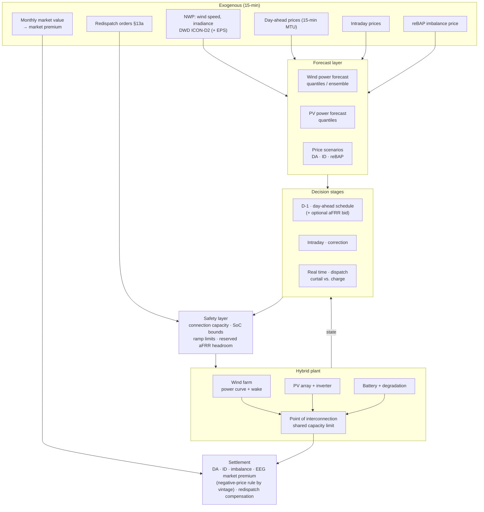

# Project 05 · Utility-Scale Hybrid Wind + PV + Battery Plant Dispatch

**Dispatch optimisation for a co-located wind, PV and battery plant sharing one grid
connection point in Germany — under EEG direct marketing, the negative-price rule, Redispatch
2.0 obligations and a binding connection capacity limit. Evaluated across the full benchmark
ladder B0 → B3 and against a learned policy.**

| | |
|---|---|
| **Status** | Design dossier complete · implementation not started |
| **Method** | Full benchmark ladder (B0–B3) + PPO/SAC with safety layer |
| **Asset** | ~50 MW wind + ~30 MW PV + ~20 MW / 40 MWh battery behind a ~60 MW connection |
| **Markets** | Day-ahead · intraday · imbalance · optional aFRR · EEG market premium |
| **Resolution** | 15 min |

---

## 1. Background and motivation

Co-location is the dominant new build pattern in Germany: wind and PV behind a shared grid
connection point, increasingly with a battery. The economics are driven by a fact that
single-technology analyses cannot capture — the connection capacity is deliberately
**undersized** relative to the sum of the nameplate ratings, because wind and PV peaks rarely
coincide. That undersizing is the source of both the value and the difficulty.

The resulting control problem has four interacting features:

**A shared, binding connection constraint.** When wind and PV do peak together, something must
give: curtail, or charge the battery. The choice depends on price, state of charge, forecast
and remuneration regime — and it recurs thousands of times a year.

**A discontinuous revenue function.** Under EEG direct marketing the plant earns the market
price plus the market premium — except during negative prices, where the premium is suspended
under `§51 EEG` as tightened by the 2025 Solarspitzengesetz for new plants. The optimal action
in a negative-price quarter-hour is qualitatively different from the optimum a minute earlier,
and depends on the plant's commissioning vintage.

**Forecast error is the dominant risk.** The plant commits a quarter-hourly schedule day-ahead
and is exposed to reBAP on the deviation. With ~80 MW of weather-driven capacity, forecast
error, not arbitrage skill, sets the variance of the result. This is where the battery earns
much of its keep — and where a distributional policy should beat a point-forecast MPC.

**The schedule can be overridden.** Under Redispatch 2.0 the plant is subject to
network-operator instruction. The controller must distinguish ordered from self-chosen
curtailment because they settle differently, and must remain feasible after an override.

**Relationship to the author's other work.** This project is the *generic, public-data*
utility-scale counterpart to the applied industrial thesis work; it uses no company data and
is designed so every result is publishable and reproducible from open sources.

---

## 2. Regulatory and market context

| Instrument | How it enters the model |
|-----------|-------------------------|
| **EEG direct marketing** (`§§20 ff. EEG`) | Revenue = market price + market premium (applicable value − monthly market value). The premium's monthly reference makes the objective non-separable across the month — a detail the MILP must handle correctly |
| **Negative-price rule** (`§51 EEG`, tightened by the 2025 Solarspitzengesetz for new plants) | Premium suspended in negative-price periods; for new plants, per negative quarter-hour, with the remuneration period extended instead. **A vintage switch in the model**, and the reason curtailment becomes rational rather than merely tolerated |
| **Remote controllability** (`§9 EEG`) | Network operator can reduce feed-in and read actual output — the technical basis of the override channel |
| **Redispatch 2.0** (`§§13a, 14c EnWG`) | Plants ≥ 100 kW are subject to redispatch; planning data and forecasts are a regulatory obligation. Ordered curtailment is compensated and accounted separately from self-chosen curtailment |
| **Grid connection capacity** | The hard constraint that defines the co-location problem. Flexible connection agreements (capping feed-in in exchange for faster/cheaper connection) are modelled as a configuration variant |
| **Imbalance settlement / reBAP** | The dominant risk term for a weather-driven portfolio |
| **Balancing markets** | Optional aFRR participation by the battery, subject to prequalification and to reserving headroom that then cannot be used for curtailment avoidance |
| **Storage regulatory treatment** | Whether the battery may charge from the grid or only from co-located generation materially changes both the optimisation and the EEG treatment. **A switchable configuration**, because the answer determines the business case |

---

## 3. Scope and objectives

### In scope

- A 15-minute co-located hybrid plant model: wind turbines with power curves and wake losses,
  PV with an inverter model, a battery with efficiency and degradation, and a shared
  connection point.
- Full benchmark ladder: B0 historical, B1 rule-based, B2 perfect foresight, B3 rolling MPC,
  plus a learned policy.
- Day-ahead scheduling, intraday correction and imbalance exposure, with the EEG market
  premium correctly modelled including its monthly reference.
- Curtailment decisions distinguishing self-chosen from ordered.
- Battery sizing and connection-capacity sizing sensitivity — the design question a developer
  actually asks.
- Optional aFRR participation and its opportunity cost against curtailment avoidance.

### Out of scope

- Wake-steering and turbine-level control (backlog item **B3**).
- Grid connection studies and detailed power quality.
- PPA structuring and hedging strategy (a natural extension, noted).
- Long-term investment appraisal beyond the sizing sensitivity above.

### Objectives

1. Quantify the value of co-location plus storage against separate operation of the same
   assets, under German rules.
2. Determine the optimal degree of connection undersizing, and how it shifts with battery size
   and with the negative-price regime.
3. Establish how much of the battery's value comes from **forecast-error management** versus
   **arbitrage** versus **curtailment avoidance** — a decomposition rarely reported, and the
   one that matters for sizing.
4. Test whether a distributional learned policy beats a tuned MPC where the imbalance tail
   dominates.
5. Quantify the economic effect of the negative-price rule tightening, by plant vintage.

---

## 4. Research questions and hypotheses

| # | Research question | Hypothesis |
|---|-------------------|-----------|
| RQ1 | Where does the battery's value in a hybrid plant actually come from? | H1: Forecast-error management and curtailment avoidance dominate pure arbitrage at realistic German connection ratios; the ordering reverses only at high connection headroom |
| RQ2 | What is the optimal connection-capacity ratio? | H2: Well below the sum of nameplates, with the optimum shifting **upward** as the negative-price rule tightens (curtailment becomes cheap, so firm export capacity is worth less) |
| RQ3 | Does a learned policy beat rolling MPC? | H3: Yes, modestly, and specifically in high-forecast-error periods, by managing imbalance-tail risk that a point-forecast MPC ignores |
| RQ4 | What does the tightened negative-price rule cost a new plant relative to an old one? | H4: Material, and partly recoverable by storage — quantifying "partly" is the deliverable |
| RQ5 | Is aFRR participation worth it for the battery? | H5: Only when the connection is not the binding constraint; where curtailment risk is high, reserved headroom is too expensive |

---

## 5. System architecture



---

## 6. Problem formulation

### 6.1 Plant model

Wind: turbine power curve with air-density correction and a wake model at farm level,
driven by NWP wind speed with a fitted bias correction. PV: plane-of-array irradiance,
temperature-dependent module model and inverter clipping (`pvlib`). Battery: charge/discharge
efficiency, SoC bounds, C-rate limits, and throughput-plus-rainflow degradation priced at a
configurable €/kWh. Point of interconnection: a hard export limit and, where relevant, an
import limit governing whether the battery may charge from the grid.

### 6.2 MILP (B2 / B3)

**Objective** — maximise
```
Σ_t [ π_DA(t)·s_DA(t)·Δt                       day-ahead schedule revenue
      + π_ID(t)·s_ID(t)·Δt                     intraday adjustment
      − π_reBAP(t)·(g(t) − s(t))·Δt            imbalance settlement (signed)
      + MP(t)·g_EEG(t)·Δt                      market premium, suspended when π_DA(t) < 0
                                               per the applicable vintage rule
      − c_deg·(p_ch(t)+p_dis(t))·Δt ]          degradation
```
subject to: generation availability `g_wind(t) ≤ ĝ_wind(t)`, `g_pv(t) ≤ ĝ_pv(t)` with explicit
curtailment variables; battery energy balance and mutual exclusion of charge/discharge; **the
point-of-interconnection export limit**; ramp limits; reserved headroom where aFRR capacity is
sold; and a terminal value function on SoC.

The market premium's dependence on the **monthly** market value couples the whole month, so
the rolling-horizon formulation carries a month-to-date accumulator as a state variable rather
than treating each horizon independently — a correctness detail that a naive B3 would get
wrong, weakening the baseline.

### 6.3 MDP formulation (RL)

| Element | Definition |
|---------|-----------|
| **State** | Battery SoC; committed schedule for the remaining horizon; realised generation; wind/PV forecast quantiles over the horizon (and their spread — the uncertainty signal); price forecasts for DA/ID/reBAP; month-to-date market-value accumulator; redispatch state; calendar features |
| **Action** | Battery power setpoint; curtailment level per technology; intraday trade volume; optional aFRR capacity offer at the bid gate |
| **Reward** | Step economic result including the correct premium treatment, minus degradation. **No hard-constraint penalties** |
| **Risk** | Distributional critic; CVaR option on the daily result — the imbalance tail is the whole point |
| **Safety layer** | Projection enforcing the export limit, SoC bounds, ramp limits, aFRR headroom reservation and any active redispatch order. Violations impossible by construction |
| **Episode** | 14–30 days, so the monthly premium coupling is visible within an episode |
| **Algorithm** | SAC for continuous dispatch; PPO where the aFRR bid decision is discretised |

---

## 7. Data requirements

| Data | Purpose | Source | Resolution | Status |
|------|---------|--------|-----------|--------|
| Wind speed & direction (NWP + reanalysis) | Wind generation and its forecast | **DWD ICON-D2 / ICON-EU**, ICON-D2-EPS for quantiles; ERA5 for long history | 15 min – 1 h | Open |
| Irradiance & temperature | PV generation | DWD; PVGIS; ERA5 | 15 min – 1 h | Open |
| Turbine power curves | Wind conversion | Manufacturer curves / open turbine databases | — | Open |
| Reference plant configuration | Asset definition | **MaStR** (real German co-located sites, capacities, locations, vintages) | — | Open |
| Day-ahead & intraday prices | Revenue | SMARD / ENTSO-E / Energy-Charts | 15 min | Open |
| reBAP | Imbalance settlement | netztransparenz.de | 15 min | Open |
| Monthly market values & applicable values | EEG market premium | netztransparenz.de / BNetzA published values | Monthly | Open |
| Redispatch measures | Override channel calibration | netztransparenz.de | Per measure | Open |
| Balancing capacity prices | Optional aFRR revenue | `regelleistung.net` | Per 4-h product | Open |
| Battery parameters | Storage model | Manufacturer data + published ageing models | — | Open |
| Realised plant generation | B0/B1 validation | ENTSO-E / SMARD aggregate by technology; site-level only with an operator partner | 15 min | Aggregate open; **site-level is the gap** |

**Validation strategy without site data.** With no site-level metered generation, the B1
validation gate is run against *aggregate* German wind and PV generation: the modelled fleet,
driven by the same NWP, must reproduce the national aggregate profile within stated tolerance.
This validates the weather-to-power chain, which is the dominant error source, while the
plant-specific configuration remains a documented assumption.

---

## 8. Baselines and evaluation

| Rung | Instantiation |
|------|--------------|
| **B0** | Realised operation of an equivalent unhybridised portfolio: wind and PV marketed separately with no storage, at the same site and year |
| **B1** | Standard commercial practice: day-ahead schedule from a point forecast, battery on a simple curtailment-avoidance rule, no intraday optimisation. **Validation gate** |
| **B2** | Perfect-foresight MILP over the evaluation period |
| **B3** | Rolling-horizon MILP-MPC with month-to-date premium accumulator, realistic issue-time forecasts, re-solved every 15 min, tuned |
| **RL** | Distributional SAC/PPO with safety layer, identical forecasts |

**Primary KPI:** annual net revenue (€/a), with mean, 5 %-quantile and CVaR₅ of the daily
distribution. **Headline:** B3-gap closure. **Secondary:** revenue decomposition (DA / ID /
imbalance / premium / aFRR), curtailed energy split into self-chosen and ordered, imbalance
volume and cost, battery equivalent full cycles, connection-limit violations (must be 0).

Ablations: connection capacity ratio sweep (the sizing question); battery size sweep;
negative-price rule by vintage; forecast quality (perfect / realistic / degraded / ensemble
vs. point — this is the H3 test); aFRR participation on/off; grid-charging permitted or not;
storage degradation cost; safety layer on/off.

The **value decomposition** (RQ1) is obtained by re-running the optimal policy with individual
value sources disabled — no imbalance exposure, no curtailment risk, no arbitrage — and
attributing the differences.

---

## 9. Deliverables

1. An open 15-minute German hybrid-plant environment with correct EEG market-premium
   mechanics — including the negative-price vintage switch and the monthly market-value
   coupling, both of which are usually simplified away.
2. A benchmark-ladder implementation (B0–B3) that is reusable for any co-located plant study.
3. A distributional RL controller with a connection-capacity safety layer.
4. The **battery value decomposition** — forecast-error management vs. curtailment avoidance
   vs. arbitrage — which is the result a developer sizing a hybrid plant actually needs.
5. A connection-sizing sensitivity study under the current and previous negative-price regimes.
6. A written report suitable for conference submission.

---

## 10. Work packages and roadmap

| WP | Content | Depends on | Output |
|----|---------|-----------|--------|
| WP1 | Weather-to-power chain: NWP ingestion, wind and PV conversion, bias correction | — | `src/model`, validation vs. aggregate |
| WP2 | Market data pipeline: DA, ID, reBAP, market values, redispatch, balancing | — | `data/processed` |
| WP3 | Plant model incl. battery, degradation, point of interconnection | WP1 | `src/model` |
| WP4 | Settlement module: EEG premium with vintage switch and monthly accumulator, imbalance, redispatch compensation | WP2 | `src/market` |
| WP5 | B0 + B1 + **validation gate** against aggregate generation | WP1, WP3, WP4 | Validation report — **gate** |
| WP6 | Probabilistic wind/PV forecast layer with true issue times (shared with Project 06) | WP1 | `src/forecast` |
| WP7 | MILP B2 + B3 rolling MPC with month-to-date coupling, tuned | WP3, WP4, WP6 | Strong baseline |
| WP8 | Gymnasium environment + safety layer | WP3, WP6 | `src/envs`, `src/safety` |
| WP9 | Distributional RL training, seeds | WP8 | Trained policies |
| WP10 | Evaluation, sizing sweeps, value decomposition, report | WP7, WP9 | `reports/` |

---

## 11. Risks and limitations

| Risk | Mitigation |
|------|-----------|
| No site-level generation data for validation | Weather-to-power chain validated against national aggregate; plant configuration documented as an assumption and swept |
| Price-taker assumption | Reasonable at this plant size; stated explicitly |
| Intraday modelled at index level, not order book | Liquidity and spread modelled parametrically; the sensitivity to that parameterisation is reported |
| MPC may win | Legitimate outcome; the sizing and value-decomposition results are method-independent and stand regardless |
| Regulatory vintage rules complex and evolving | Encoded as explicit switches; the comparison across vintages is a headline result rather than a risk |
| Wake and power-curve modelling error | Bias correction fitted and reported; sensitivity to the wake model included |

---

## 12. Repository structure

Follows [`../../templates/project-template/`](../../templates/project-template/); conventions
in [`../../docs/05-tech-stack.md`](../../docs/05-tech-stack.md). The forecast layer is shared
with [Project 06](../06-probabilistic-forecast-to-bid/).

---

## 13. References

- EEG 2023 `§§9, 20 ff., 51`; the 2025 Solarspitzengesetz amendments; `§§13a, 14c EnWG`
  (Redispatch 2.0) — see [`../../docs/01-german-market-regulatory-primer.md`](../../docs/01-german-market-regulatory-primer.md).
- Marktstammdatenregister; netztransparenz.de published market values.
- `pvlib`, open turbine power-curve databases, DWD ICON model documentation.
- The hybrid/co-located plant dispatch literature, against which the contribution here is the
  correct German remuneration mechanics and the battery value decomposition.

---

## 14. Collaboration

Most valuable contributions: site-level metered generation and schedule/imbalance data from a
German co-located plant (even historical), which would convert the B1 gate from an aggregate
check into a true site validation; and a review of the market-premium settlement modelling by
a direct marketer. Enquiries via the issue tracker.
