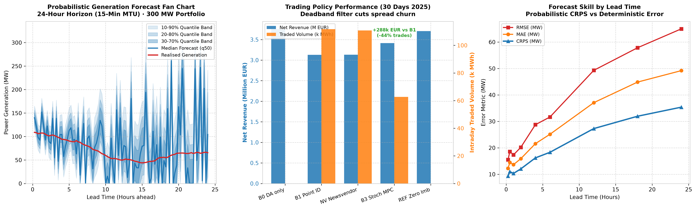
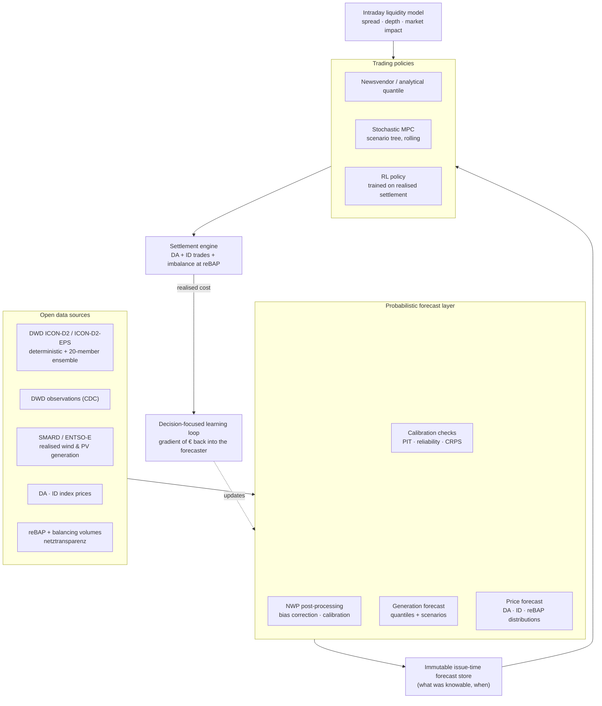

# Project 06 · Probabilistic Forecast-to-Bid for Intraday Trading and Imbalance Management

**Distributional forecasting of renewable generation and prices, coupled to a trading policy
through decision-focused learning — for a balance responsible party managing a German
renewable portfolio across the day-ahead, intraday and imbalance stages at 15-minute
resolution.**

## 0. Implementation status

Forecast store, probabilistic scoring and the trading-policy layer implemented and running on
**real German 15-minute wind + PV generation and DE-LU day-ahead prices**. 18 tests pass.
Installs from `numpy` + `pandas` alone (the normal quantile function is vendored), so the
benchmark is trivially reproducible.

```bash
pip install -e ".[dev]" && python -m pytest tests/ -q
python -m f2b.cli policies  --year 2025 --days 30
python -m f2b.cli forecast  --year 2025 --days 30
python -m f2b.cli liquidity --year 2025 --days 30
```

**Forecast quality by lead time** (300 MW portfolio, 30 days of 2025):

| Lead h | MAE MW | RMSE MW | CRPS | Calibration err |
|---:|---:|---:|---:|---:|
| 0.25 | 12.3 | 15.5 | 9.3 | 0.022 |
| 1 | 13.7 | 17.4 | 10.4 | 0.021 |
| 6 | 25.3 | 31.9 | 18.5 | 0.032 |
| 24 | 49.6 | 65.3 | 35.7 | 0.062 |

**Trading policies** (30 days of 2025, 43,212 MWh produced, 3 €/MWh half-spread):

| Policy | Net € | €/MWh | Imbalance MWh | Traded MWh | ID cost € |
|---|---:|---:|---:|---:|---:|
| B0 day-ahead only | 3,919,163 | 90.70 | 35,070 | 0 | 0 |
| B1 point intraday | 3,287,532 | 76.08 | 10,453 | 112,453 | 635,078 |
| NV newsvendor quantile | 3,293,141 | 76.21 | 10,416 | 111,554 | 629,223 |
| **B3 stochastic MPC** | **3,576,029** | **82.76** | **7,805** | **63,212** | **341,409** |
| REF zero imbalance | 3,870,860 | 89.58 | 0 | 0 | 0 |
| CEIL perfect speculation | 9,205,043 | 213.02 | 108,839 | 0 | 0 |

B3's deadband beats always-chasing-the-mean by **+288,497 €** while trading 44 % less volume:
the mechanism is refusing to pay a spread for forecast revisions that are small relative to
the remaining uncertainty.



**Three errors found and fixed during implementation**, all of the kind that quietly
invalidates a result:

1. **"Perfect foresight" was not an upper bound.** Committing the realised generation gives
   zero imbalance, but imbalance settlement is *signed* — deviating in the system-helping
   direction is paid. B0 beats the zero-imbalance reference by luck alone.
   The rung is now labelled `REF zero imbalance`, and a genuine `CEIL perfect speculation`
   ceiling was added, with the caveat that no BRP may legally pursue it.
2. **The calibration metric was structurally biased.** Binning the PIT against a uniform
   histogram cannot work when the quantile set spans only 0.1–0.9: ~20 % of realisations
   necessarily land outside and pile up at the endpoints. It reported ≈0.06 for a *perfectly*
   calibrated forecast at every lead time — the constancy is what gave it away. Replaced with
   reliability, `mean |empirical coverage − nominal level|`.
3. **A test fixture used a stateful module-level RNG**, so the forecast store was built from
   one realisation of "the truth" and scored against a different one. This is indistinguishable
   from a badly miscalibrated model from the outside.

**Known simplification:** forecasts are generated by perturbing the realised series with
lead-dependent autocorrelated noise rather than by a real NWP-driven model. The store's
*architecture* (issue-time keying, shared by all policies, with a CI look-ahead audit that
returns 0 violations) is the transferable part; swapping in DWD ICON-D2-EPS changes only
`build_store`.

---

| | |
|---|---|
| **Status** | **Forecast store + policy layer implemented** on real 2025 data · RL policy not yet trained |
| **Method** | Probabilistic forecasting (quantile/distributional NN) + decision-focused learning + RL trading policy |
| **Actor** | Balance responsible party / virtual power plant with a wind + PV portfolio |
| **Markets** | SDAC day-ahead (15-min MTU) · SIDC continuous intraday + IDA auctions · imbalance (reBAP) |
| **Role in portfolio** | The **shared uncertainty engine** — supplies scenarios and quantiles to Projects 01, 02, 05 |

---

## 1. Background and motivation

Forecasting in energy is almost always evaluated with the wrong loss function. A model is
trained to minimise RMSE, reported with a MAE, and then handed to a trading desk whose actual
cost function is wildly asymmetric: being short in a scarcity quarter-hour can cost several
hundred €/MWh, while being long in the same quarter-hour may cost little — or, when the
imbalance price is negative and the deviation helps the system, actually **earn** money. A
forecast improvement that does not change a decision is worth exactly zero, and a forecast
that is worse by RMSE can be better by profit.

This project takes the decision as the object of study:

**Distributional, not point.** The trading decision depends on the full predictive
distribution — specifically on its tails — not on the conditional mean. Ensemble NWP
(DWD ICON-D2-EPS) provides a physically-grounded uncertainty source that statistical
post-processing can calibrate.

**Decision-focused learning.** Rather than training a forecaster and then optimising against
it, the forecast model is trained through the downstream optimisation, so its loss is the
realised trading cost. This is where the theoretical gain is, and it is directly testable
against the conventional two-stage pipeline.

**Sequential, not one-shot.** The BRP decides repeatedly: commit day-ahead, then correct
continuously in intraday as forecasts improve and liquidity changes, then accept residual
imbalance. Each correction has a cost (spread, market impact) and a benefit (reduced
imbalance risk). That is a sequential decision problem under a moving information set — an RL
problem in the proper sense, not an RL problem by fashion.

**The German context sharpens it.** Fifteen-minute MTU across all stages, a single signed
reBAP that can reward system-helping imbalance, and a portfolio whose error is dominated by
weather. This is one of the cleanest real instances of "predict, then decide" in the energy
sector, and it runs entirely on open data.

---

## 2. Market context

| Element | How it enters the model |
|---------|-------------------------|
| **SDAC day-ahead**, 15-min MTU | The initial commitment, closing D-1 12:00 CET |
| **IDA1/IDA2/IDA3** intraday auctions | Discrete correction opportunities with auction-clearing (not order-book) execution |
| **SIDC continuous intraday** | Continuous correction until gate closure (~5 min before delivery, cross-border earlier). Modelled with a parametric liquidity/spread model, since order-book data is commercial |
| **Imbalance settlement / reBAP** | A single signed price per quarter-hour, published ex post, heavy-tailed and occasionally rewarding deviation in the system-helping direction. **This asymmetry is the entire decision problem** |
| **Balancing group obligations** | The BRP must submit schedules and is liable for deviations; schedule change deadlines constrain when corrections are possible |
| **`§13a EnWG` redispatch** | Ordered curtailment changes the portfolio position exogenously and must be reflected in the schedule |

---

## 3. Scope and objectives

### In scope

- Probabilistic generation forecasting for a German wind + PV portfolio at 15-minute
  resolution, horizons from 15 minutes to 48 hours, with **true issue times** (NWP run
  availability and latency respected exactly).
- Probabilistic price forecasting: day-ahead, intraday index, and **reBAP** — the last being
  the hardest and the most valuable.
- Three trading policy families, compared on the same forecasts:
  1. **Newsvendor / analytical** — the classical quantile-based solution under an asymmetric cost.
  2. **Stochastic MPC** — scenario-based rolling optimisation over the correction stages.
  3. **RL policy** — learned directly on realised settlement outcomes.
- **Decision-focused learning**: train the forecaster through the decision, compare against
  the conventional two-stage pipeline.
- A parametric intraday liquidity and market-impact model, with explicit sensitivity.

### Out of scope

- Order-book-level microstructure and execution algorithms (requires commercial data).
- Cross-border implicit trading beyond what the price series reflect.
- Strategic bidding / market power.
- Physical asset control — that is Projects 01, 02, 05, which consume this project's outputs.

### Objectives

1. Build a calibrated probabilistic forecasting stack for German wind, PV and prices on fully
   open data — reusable by the rest of the portfolio.
2. Quantify the gap between **statistical** forecast quality (CRPS) and **decision** value (€),
   demonstrating explicitly that they are not the same ranking.
3. Test whether decision-focused learning beats the standard two-stage pipeline, and by how
   much.
4. Determine whether an RL trading policy beats stochastic MPC, and where the difference lies.
5. Publish an open, reproducible forecast-to-bid benchmark for the German market — a piece of
   public infrastructure the field currently lacks.

---

## 4. Research questions and hypotheses

| # | Research question | Hypothesis |
|---|-------------------|-----------|
| RQ1 | How well does statistical forecast quality predict decision value? | H1: Weakly. Models ranked identically by CRPS differ materially in € because the decision depends on specific tail regions, not on average calibration |
| RQ2 | Does decision-focused learning beat the two-stage pipeline? | H2: Yes, with the gain concentrated in the tails; the mechanism is implicit reweighting of training emphasis toward high-cost quarter-hours |
| RQ3 | Does an RL trading policy beat stochastic MPC? | H3: Modestly, mainly through learned liquidity/timing structure in the intraday correction sequence that a scenario MPC does not represent |
| RQ4 | How predictable is reBAP, and does predicting it help? | H4: Poorly predictable in level, but its *sign and tail probability* are predictable enough to change decisions and add value |
| RQ5 | How much of the result depends on the liquidity assumption? | H5: Substantially — which is why the parametric liquidity model is swept rather than fixed, and reported as a bound |

---

## 5. System architecture



The **immutable issue-time forecast store** is the architectural centrepiece. Every forecast
is materialised once, tagged with its true issue time, and every policy reads from it. This
makes look-ahead bias structurally impossible rather than a matter of care — and it is the
component the other projects in this portfolio import.

---

## 6. Problem formulation

### 6.1 The decision

For each delivery quarter-hour `t`, the BRP holds a position `s(t)` built up across stages
`k = 0 (day-ahead), 1..K (intraday corrections)`. Realised generation `g(t)` is revealed at
delivery. The realised cost is

```
C(t) = − π_DA(t)·s_0(t)·Δt                                    day-ahead revenue
       − Σ_k [ π_ID,k(t)·Δs_k(t) − impact(Δs_k(t)) ]·Δt        intraday corrections, with cost of trading
       − π_reBAP(t)·( g(t) − s_K(t) )·Δt                       imbalance settlement, signed
```

The controller chooses each `Δs_k(t)` knowing only the information available at stage `k`.

### 6.2 Analytical benchmark (newsvendor)

Under a simplified two-price imbalance structure the optimal position is a **quantile** of the
predictive generation distribution, with the quantile level set by the ratio of shortage cost
to surplus cost. This provides an interpretable, theoretically grounded reference — and a
sharp test: if a learned policy cannot beat the correct quantile of a well-calibrated forecast,
the added complexity is not earning its keep.

### 6.3 Stochastic MPC

At each correction stage, solve over a scenario tree of generation, intraday prices and reBAP,
minimising expected cost (or CVaR), applying only the current-stage trade and re-solving as
new information arrives. Scenario generation, reduction and tree size are reported in full.

### 6.4 MDP formulation (RL)

| Element | Definition |
|---------|-----------|
| **State** | Current position by delivery quarter-hour; time to gate closure; generation forecast quantiles and their recent revision history (revision magnitude is a strong uncertainty signal); price forecasts and realised price path; ensemble spread; liquidity state; calendar and regime features |
| **Action** | Trade volume per delivery quarter-hour at the current stage (continuous, signed) |
| **Reward** | Realised settlement result for closed positions, with imbalance realised at delivery |
| **Risk** | Distributional critic; CVaR objective option — a BRP cares about the tail, not only the mean |
| **Episode** | One delivery day, with all correction stages |
| **Algorithm** | SAC, with a distributional critic; PPO as a cross-check |

### 6.5 Decision-focused learning

The forecast model's parameters are trained with the **realised trading cost** as the loss,
differentiating through the decision. For the analytical quantile policy the decision is
differentiable in closed form; for the optimisation-based policy, differentiable-optimisation
techniques (implicit differentiation through the KKT conditions of a smoothed problem) are
used. The two-stage pipeline — train on CRPS, then optimise — is the baseline this must beat.

---

## 7. Data requirements

**This project runs entirely on open data.** That is a deliberate design constraint, so the
benchmark it produces can be reproduced by anyone.

| Data | Purpose | Source | Resolution | Status |
|------|---------|--------|-----------|--------|
| ICON-D2 / ICON-EU deterministic NWP | Generation forecast features | **DWD Open Data** | 15 min – 1 h, hourly runs | Open |
| **ICON-D2-EPS ensemble** | The physical uncertainty source | DWD Open Data | 20 members | Open |
| DWD observations (CDC) | Post-processing and verification | DWD | 10 min – 1 h | Open |
| Realised wind & PV generation | Forecast target | SMARD / ENTSO-E | 15 min | Open |
| Installed capacity by technology & region | Normalisation, fleet weighting | MaStR / SMARD | — | Open |
| Day-ahead prices | Stage-0 revenue | SMARD / ENTSO-E / Energy-Charts | 15 min | Open |
| Intraday index prices & volumes | Correction stage pricing and liquidity calibration | SMARD / ENTSO-E | 15 min | Open (index level) |
| **reBAP** | Imbalance settlement — the core signal | netztransparenz.de | 15 min | Open |
| Balancing activation volumes | reBAP driver features | netztransparenz / regelleistung.net | 15 min | Open |
| Cross-border flows, load, residual load | Price and imbalance features | ENTSO-E / SMARD | 15 min | Open |
| Order-book intraday data | Would improve the liquidity model | EPEX SPOT | Tick | **Commercial — deliberately not a dependency**; liquidity is parameterised and swept instead |

**The one real gap** is intraday order-book depth. Rather than assume frictionless trading —
which would flatter every policy and invalidate the comparison — the project uses a parametric
spread-and-impact model calibrated to public volume and index-price data, and reports all
results across a range of liquidity assumptions as an explicit bound.

---

## 8. Baselines and evaluation

### Forecast layer

Baselines: climatology, persistence, raw NWP without post-processing, and a standard
quantile-regression model. Metrics: **CRPS**, pinball loss per quantile, PIT histogram and
reliability diagram (calibration), Winkler score, and skill scores against both climatology
and persistence. Sharpness reported only jointly with calibration.

### Decision layer

| Rung | Instantiation |
|------|--------------|
| **B0** | Day-ahead only: commit the point forecast, take whatever imbalance results |
| **B1** | Point-forecast intraday correction: trade to the updated mean forecast. **The standard industry practice, and the validation gate** |
| **B2** | Perfect-foresight trading — the ceiling |
| **B3** | Stochastic MPC on calibrated scenarios, tuned |
| **Analytical** | Newsvendor quantile position from the calibrated predictive distribution |
| **RL** | Distributional SAC on realised settlement |
| **DFL** | Decision-focused forecaster + each of the above policies |

**Primary KPI:** realised portfolio cost (€/MWh produced), with mean, 5 %-quantile and CVaR₅
of the daily distribution. **Headline:** B3-gap closure, plus the **CRPS-vs-€ rank
correlation** — the direct test of RQ1, and the project's most transferable finding.
**Secondary:** imbalance volume and cost, trading volume and cost, position revision count,
decision latency against gate closure.

Ablations: forecast model family; ensemble vs. purely statistical uncertainty; decision-focused
vs. two-stage; policy family; liquidity assumption sweep; risk term on/off; reBAP forecast
on/off (the H4 test); horizon and correction-stage frequency.

---

## 9. Deliverables

1. **An open, reproducible German forecast-to-bid benchmark** — data pipeline, issue-time
   forecast store, settlement engine and baselines — usable by other researchers. This is the
   deliverable with the widest reach beyond this portfolio.
2. A calibrated probabilistic wind/PV/price forecasting stack, consumed by Projects 01, 02
   and 05.
3. A quantified answer to "does CRPS predict €?" — with the rank correlation and the
   conditions under which the two rankings diverge.
4. A decision-focused learning implementation and its measured gain over the two-stage
   pipeline.
5. A distributional RL trading policy and its comparison against stochastic MPC and the
   analytical quantile solution.

---

## 10. Work packages and roadmap

| WP | Content | Depends on | Output |
|----|---------|-----------|--------|
| WP1 | Data pipeline: NWP archive ingestion, generation, prices, reBAP; DST and resolution-regime handling | — | `data/processed` |
| WP2 | **Issue-time forecast store** — the anti-look-ahead architecture | WP1 | `src/forecast/store` |
| WP3 | Generation forecast models: post-processed ensemble, quantile NN, distributional NN; calibration diagnostics | WP2 | Calibrated forecasts |
| WP4 | Price and reBAP distributional forecasts | WP2 | Price scenarios |
| WP5 | Settlement engine + parametric liquidity/impact model | WP1 | `src/market` |
| WP6 | B0/B1 policies + **validation gate** against realised aggregate imbalance behaviour | WP3, WP5 | Validation report — **gate** |
| WP7 | Analytical newsvendor policy; B2 perfect foresight; B3 stochastic MPC | WP3–WP5 | Baselines |
| WP8 | Gymnasium trading environment | WP5 | `src/envs` |
| WP9 | Distributional RL training | WP8 | Trained policies |
| WP10 | Decision-focused learning loop | WP3, WP7 | DFL forecaster |
| WP11 | Evaluation, CRPS-vs-€ study, liquidity sweep, benchmark release | WP7, WP9, WP10 | `reports/`, public benchmark |

---

## 11. Risks and limitations

| Risk | Mitigation |
|------|-----------|
| No order-book data → liquidity is assumed | Parametric model, swept; all results reported as a function of the liquidity assumption rather than at a single point |
| NWP archive retrieval is large and operationally fiddly | Start with a limited region and one year; scale after the pipeline is proven |
| reBAP may be close to unpredictable | RQ4 is posed so that a negative answer is informative; the sign/tail formulation is a weaker and more plausible claim than level prediction |
| Decision-focused learning can be unstable | Smoothed/regularised decision layer; the two-stage pipeline retained as a fallback and as the honest comparison |
| Market impact of a small portfolio is negligible in reality | Portfolio size swept; the impact term matters only above a stated size, which is reported |
| Regime change (2021–2023 price shocks) | Regime-diverse test blocks; results reported per regime rather than pooled into a misleading average |

---

## 12. Repository structure

Follows [`../../templates/project-template/`](../../templates/project-template/); conventions
in [`../../docs/05-tech-stack.md`](../../docs/05-tech-stack.md). `src/forecast/` is published
as an importable package, since Projects 01, 02 and 05 depend on it.

---

## 13. References

- DWD ICON model and ICON-D2-EPS documentation; DWD Open Data access terms (GeoNutzV).
- ENTSO-E balancing and imbalance settlement harmonisation; German reBAP methodology as
  published by the TSOs on netztransparenz.de.
- The probabilistic energy forecasting literature (CRPS, quantile regression, ensemble
  post-processing) and the decision-focused / "smart predict-then-optimise" learning
  literature — the two strands this project connects in a German market setting.
- See [`../../docs/01-german-market-regulatory-primer.md`](../../docs/01-german-market-regulatory-primer.md)
  for the market mechanics.

---

## 14. Collaboration

Most valuable contributions: historical intraday order-book or execution data (even
aggregated) to replace the parametric liquidity model; realised BRP schedule and imbalance
data for a true B1 validation; and independent verification of the calibration diagnostics.
Enquiries via the issue tracker.
